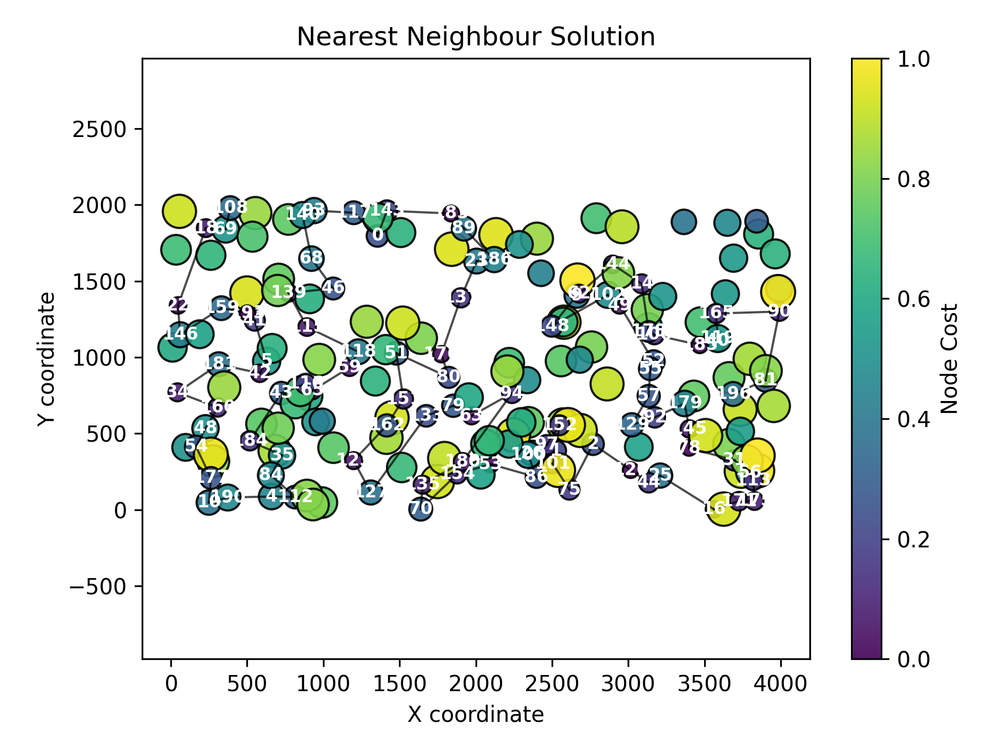

# Assignment 1 - Greedy heuristic

### Problem descirption
We are given three columns of integers with a row for each node. The first two columns contain x
and y coordinates of the node positions in a plane. The third column contains node costs. The goal is
to select exactly 50% of the nodes (if the number of nodes is odd we round the number of nodes to
be selected up) and form a Hamiltonian cycle (closed path) through this set of nodes such that the
sum of the total length of the path plus the total cost of the selected nodes is minimized.
The distances between nodes are calculated as Euclidean distances rounded mathematically to
integer values. The distance matrix should be calculated just after reading an instance and then only
the distance matrix (no nodes coordinates) should be accessed by optimization methods to allow
instances defined only by distance matrices.

## Methods

### Random solution

#### Pseudocode
``` pseudocode
    solution <- []
    if dataSize % 2 not equal 0 then dataSize = dataSize + 1
    numberOfNodesToVisit <- dataSize / 2
    while size of solution < numberOfNodesToVisit:
        randomNode <- random integer in [0, dataSize)
        if randomNode not in currentSolution:
            append randomNode to currentSolution
        end if
    end while
```

#### Results

| Best score | Worst score | Average score |
| --- | --- | --- |
| 231391 | 292542 | 263102 |

Best found solution:

```
86 6 59 8 34 156 74 91 182 103 127 163 153 168 148 44 164 185 18 194 70 97 176 116 120 54 10 146 111 72 154 31 132 50 184 100 95 93 7 82 1 90 183 191 19 126 63 197 166 198 94 79 181 22 23 53 139 11 137 138 57 5 15 162 41 161 151 117 51 46 48 28 55 109 133 21 65 42 29 47 145 125 196 130 121 40 12 0 69 78 108 123 81 101 129 62 66 140 99 113
```


### Nearest neighbour considering adding the node onlyt at the end of the current path

#### Pseudocode
```
    procedure GET_BEST_NEAREST_NEIGHBOUR(currentNode, unvisitedNodes, distanceMatrix, costVector)
        bestNode ← -1
        bestScore ← +∞

        for each node in unvisitedNodes do
            score ← distanceMatrix[currentNode][node] + costVector[node]
            if score < bestScore then
                bestScore ← score
                bestNode ← node
            end if
        end for

        return bestNode
    end procedure

    procedure NEAREST_NEIGHBOUR_SOLUTION_ONLY_AT_END(distanceMatrix, costVector, dataSize)
        set random seed to current time

        if dataSize is odd then
            increment dataSize by 1
        end if

        numberOfNodesToVisit ← dataSize / 2
        currentSolution ← empty list
        startingNode ← random integer in [0, dataSize)
        append startingNode to currentSolution

        unvisitedNodes ← all nodes except startingNode

        while size of currentSolution < numberOfNodesToVisit:
            nextNode ← GET_BEST_NEAREST_NEIGHBOUR(currentSolution.last, unvisitedNodes, distanceMatrix, costVector)

            if nextNode = −1 then
                break
            end if

            append nextNode to currentSolution
            remove nextNode from unvisitedNodes
        end while
    end procedure
```

#### Results

| Best score | Worst score | Average score |
| --- | --- | --- |
| 81598 | 88112 | 83234.5 |

Best found solution:

```
154 180 53 63 176 80 151 59 65 116 42 193 41 139 115 46 0 183 143 117 93 18 22 34 160 184 123 135 70 127 162 133 79 94 97 101 1 152 120 78 145 185 40 165 90 81 113 175 171 16 31 44 92 57 106 49 144 62 14 178 52 55 129 2 75 86 26 100 121 148 137 23 186 89 114 15 9 102 138 21 164 7 95 39 27 196 179 25 82 167 124 51 118 43 149 131 112 4 177 54
```


### Nearest neighbor considering adding the node at all possible position, i.e. at the end, at the beginning, or at any place inside the current path


#### Pseudocode
```
procedure NEAREST_NEIGHBOUR_SOLUTION(distanceMatrix, nodeCostVector, numberOfNodes, numberOfSolutionsPerStart = 200)
    if numberOfNodes <= 0 then
        return
    end if

    if numberOfNodes is even then
        nodesToVisit ← numberOfNodes / 2
    else
        nodesToVisit ← (numberOfNodes + 1) / 2
    end if

    initialize random generator rng
    totalRuns ← numberOfSolutionsPerStart * numberOfNodes

    totalSum ← 0
    bestObjective ← +∞
    worstObjective ← −∞
    bestSolution ← empty list

    for run from 1 to totalRuns do
        startNode ← random integer in [0, numberOfNodes)
        routeNodes ← list containing startNode
        isNodeUsed ← boolean array of size numberOfNodes initialized to false
        isNodeUsed[startNode] ← true

        while size(routeNodes) < nodesToVisit do
            bestObjectiveDelta ← +∞
            candidates ← empty list

            for candidateNode from 0 to numberOfNodes − 1 do
                if isNodeUsed[candidateNode] then
                    continue
                end if

                for insertionPosition from 0 to size(routeNodes) do
                    if insertionPosition == 0 then
                        predecessor ← NONE
                    else
                        predecessor ← routeNodes[insertionPosition − 1]
                    end if

                    if insertionPosition == size(routeNodes) then
                        successor ← NONE
                    else
                        successor ← routeNodes[insertionPosition]
                    end if

                    addedDistance ← 0
                    if predecessor != NONE then addedDistance ← addedDistance + distanceMatrix[predecessor][candidateNode] end if
                    if successor != NONE then addedDistance ← addedDistance + distanceMatrix[candidateNode][successor] end if

                    removedDistance ← 0
                    if predecessor != NONE and successor != NONE then
                        removedDistance ← distanceMatrix[predecessor][successor]
                    end if

                    objectiveDelta ← nodeCostVector[candidateNode] + (addedDistance − removedDistance)

                    if objectiveDelta < bestObjectiveDelta then
                        bestObjectiveDelta ← objectiveDelta
                        candidates ← list containing pair(insertionPosition, candidateNode)
                    else if objectiveDelta == bestObjectiveDelta then
                        append pair(insertionPosition, candidateNode) to candidates
                    end if
                end for
            end for

            if candidates is empty then
                break
            end if

            chosenPair ← uniformly random choice from candidates using rng
            chosenInsertion ← chosenPair.insertionPosition
            chosenCandidate ← chosenPair.candidateNode

            insert chosenCandidate into routeNodes at position chosenInsertion
            isNodeUsed[chosenCandidate] ← true
        end while

        objectiveValue ← EVALUATE_SOLUTION(routeNodes, distanceMatrix, nodeCostVector)
        totalSum ← totalSum + objectiveValue

        if objectiveValue < bestObjective then
            bestObjective ← objectiveValue
            bestSolution ← copy of routeNodes
        end if

        if objectiveValue > worstObjective then
            worstObjective ← objectiveValue
        end if
    end for

    averageObjective ← totalSum / totalRuns
    print "min =", bestObjective, " max =", worstObjective, " avg =", averageObjective
    print "Best solution:", bestSolution
end procedure

procedure EVALUATE_SOLUTION(routeNodes, distanceMatrix, nodeCostVector)
    totalCost ← 0
    for i from 0 to size(routeNodes) − 1 do
        totalCost ← totalCost + nodeCostVector[routeNodes[i]]
        if i > 0 then
            totalCost ← totalCost + distanceMatrix[routeNodes[i − 1]][routeNodes[i]]
        end if
    end for
    return totalCost
end procedure
```

#### Results

| Best score | Worst score | Average score |
| --- | --- | --- |
| 69941 | 73650 | 71071.2 |

Best found solution:

```
196 81 90 165 119 40 185 106 178 14 144 62 9 148 102 49 52 55 57 129 92 179 145 78 31 56 113 175 171 16 25 44 120 2 75 101 1 152 97 26 100 86 53 154 70 135 180 94 63 79 133 127 123 162 151 51 80 176 137 23 186 89 183 143 0 117 93 140 68 46 139 115 118 59 65 116 43 184 35 84 112 4 190 10 177 54 48 160 34 181 42 5 41 193 159 146 22 18 69 108 
```



### Greedy solution

#### Pseudocode
``` pseudocode
    procedure FULLY_GREEDY_SOLUTION(distanceMatrix, nodeCostVector, numberOfNodes, numberOfSolutionsPerStart = 200)
    if numberOfNodes <= 0 then return

    nodesToVisit ← if numberOfNodes is even then numberOfNodes / 2 else (numberOfNodes + 1) / 2
    initialize random generator rng
    define secondNodeDist uniform int in [0, numberOfNodes - 1]

    totalSum ← 0
    bestObjective ← +∞
    worstObjective ← −∞
    bestSolution ← empty list
    bestScore ← +∞

    for startNode from 0 to numberOfNodes - 1 do
        for run from 1 to numberOfSolutionsPerStart do
            cycle ← empty list (reserve nodesToVisit)
            used ← boolean array sized numberOfNodes initialized to false

            append startNode to cycle
            used[startNode] ← true

            if nodesToVisit > 1 then
                second ← random integer from secondNodeDist
                while used[second] do
                    second ← random integer from secondNodeDist
                end while
                append second to cycle
                used[second] ← true
            end if

            while size(cycle) < nodesToVisit do
                bestDelta ← +∞
                candidates ← empty list of pairs(insertPosition, node)

                for node from 0 to numberOfNodes - 1 do
                    if used[node] then continue
                    for i from 0 to size(cycle) - 1 do
                        pred ← cycle[i]
                        succ ← cycle[(i + 1) mod size(cycle)]
                        added ← distanceMatrix[pred][node] + distanceMatrix[node][succ]
                        removed ← distanceMatrix[pred][succ]
                        delta ← nodeCostVector[node] + (added - removed)

                        if delta < bestDelta then
                            bestDelta ← delta
                            candidates ← list containing pair(i + 1, node)
                        else if delta == bestDelta then
                            append pair(i + 1, node) to candidates
                        end if
                    end for
                end for

                if candidates is empty then break

                chosen ← uniformly random element from candidates using rng
                insertPos ← chosen.insertPosition mod (size(cycle) + 1)
                chosenNode ← chosen.node
                insert chosenNode into cycle at position insertPos
                used[chosenNode] ← true
            end while

            score ← 0
            if cycle not empty then
                for i from 0 to size(cycle) - 1 do
                    score ← score + nodeCostVector[cycle[i]]
                    score ← score + distanceMatrix[cycle[i]][cycle[(i + 1) mod size(cycle)]]
                end for
            end if

            totalSum ← totalSum + score
            if score < bestObjective then bestObjective ← score
            if score > worstObjective then worstObjective ← score
            if score < bestScore then bestScore ← score; bestSolution ← copy of cycle
        end for
    end for

    average ← totalSum / (numberOfNodes * numberOfSolutionsPerStart)
end procedure
```

#### Results

| Best score | Worst score | Average score |
| --- | --- | --- |
| 70285 | 76228 | 72694.4|

Best found solution:

```
40 119 185 52 55 57 129 92 179 145 78 31 56 113 175 171 16 25 44 120 2 75 86 100 26 101 1 97 152 124 94 63 53 180 154 135 70 127 123 112 4 84 35 184 190 10 177 54 48 160 34 181 146 22 18 108 69 159 193 41 139 68 46 115 5 42 43 116 65 59 118 51 162 151 133 79 80 176 137 0 117 143 183 89 23 186 15 148 9 62 102 144 14 49 178 106 165 90 81 196
```


all the best paths were evaluated using our own checker in python:
--- path_random ---
Length: 100, Max index: 198, Inferred nodes: 199
Duplicates: None
Out of range indices: None
Missing indices count: 100
Missing indices (first 20): [2, 3, 4, 9, 13, 14, 16, 17, 20, 24, 25, 26, 27, 30, 32, 33, 35, 36, 37, 38] ...

--- path_neigbour_end ---
Length: 100, Max index: 196, Inferred nodes: 197
Duplicates: None
Out of range indices: None
Missing indices count: 100
Missing indices (first 20): [3, 5, 6, 8, 10, 11, 12, 13, 17, 19, 20, 24, 28, 29, 30, 32, 33, 35, 36, 37] ...

--- path_neighbour ---
Length: 100, Max index: 196, Inferred nodes: 197
Duplicates: None
Out of range indices: None
Missing indices count: 100
Missing indices (first 20): [3, 6, 7, 8, 11, 12, 13, 15, 17, 19, 20, 21, 24, 27, 28, 29, 30, 32, 33, 36] ...

--- path_greedy ---
Length: 100, Max index: 196, Inferred nodes: 197
Duplicates: None
Out of range indices: None
Missing indices count: 100
Missing indices (first 20): [3, 6, 7, 8, 11, 12, 13, 17, 19, 20, 21, 24, 27, 28, 29, 30, 32, 33, 36, 37] ...

### Link to the source code (Github repository - directory Assignment 1)

[Assignment 1 - Greedy Heuristic](https://github.com/Strajkerr/EvolutionaryComputing/tree/main/Assignment_1)