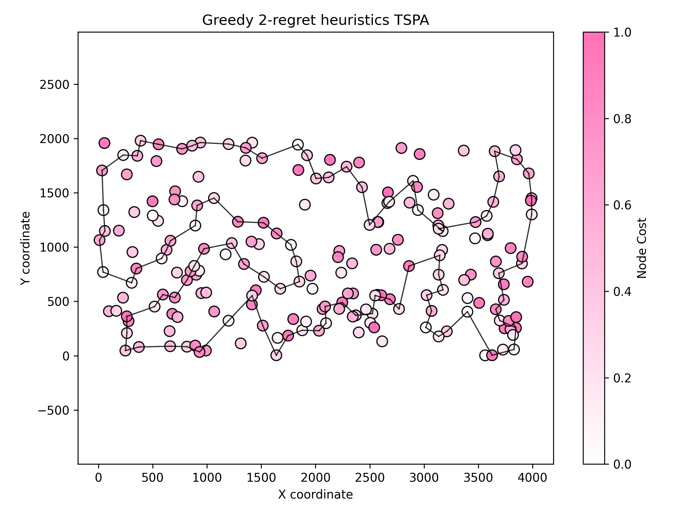
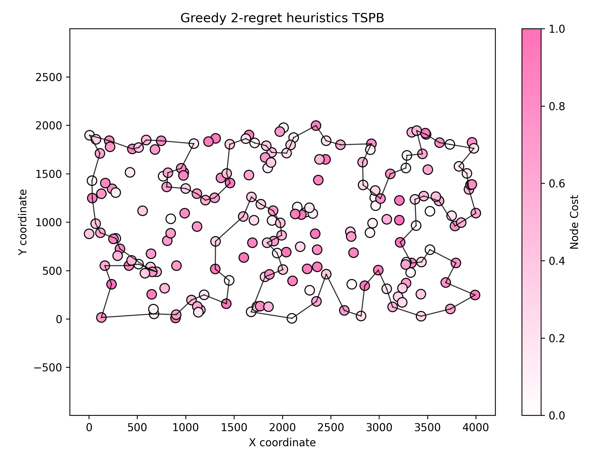
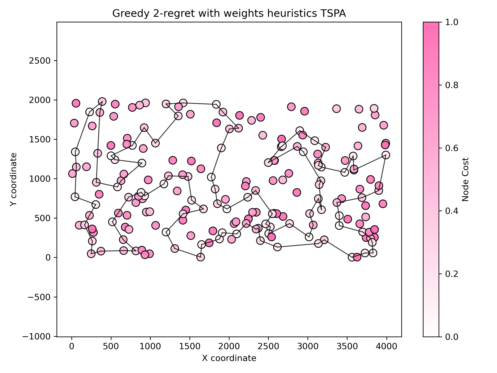
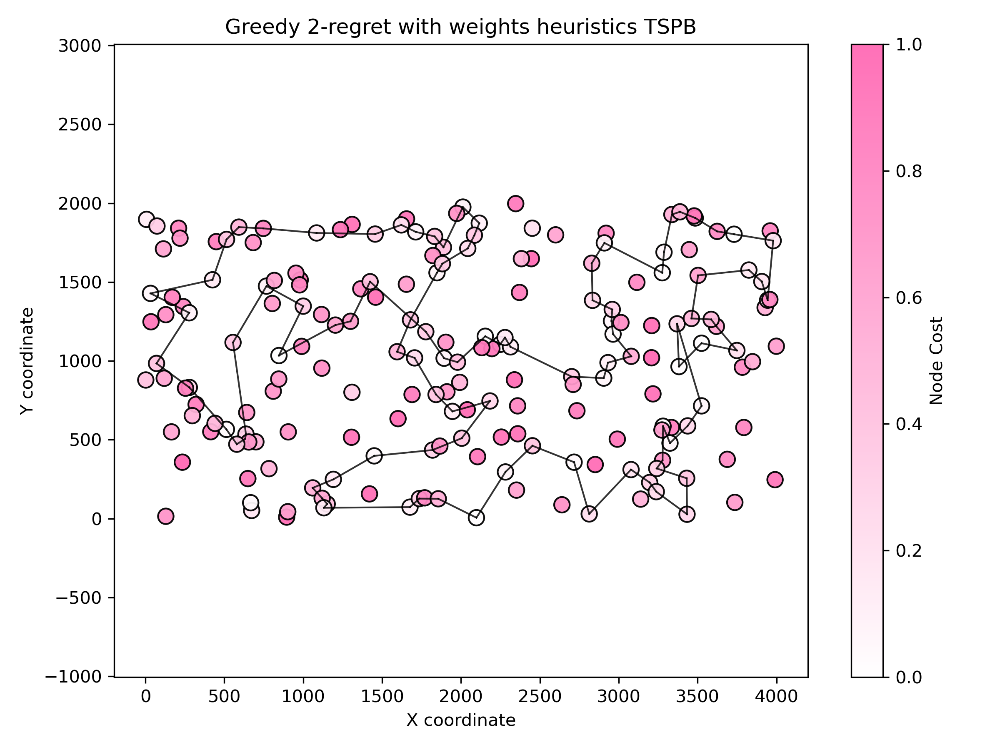

# Assignment 2 - Greedy regret heuristics

### Prepared by

- Marianna Myszkowska 156041
- Jakub Liszyński 156060

### Problem descirption
We are given three columns of integers with a row for each node. The first two columns contain x
and y coordinates of the node positions in a plane. The third column contains node costs. The goal is
to select exactly 50% of the nodes (if the number of nodes is odd we round the number of nodes to
be selected up) and form a Hamiltonian cycle (closed path) through this set of nodes such that the
sum of the total length of the path plus the total cost of the selected nodes is minimized.
The distances between nodes are calculated as Euclidean distances rounded mathematically to
integer values. The distance matrix should be calculated just after reading an instance and then only
the distance matrix (no nodes coordinates) should be accessed by optimization methods to allow
instances defined only by distance matrices.

## Methods

### Comparison table

#### TSPA Results

| Method | Best score | Worst score | Average score | Execution time (s) |
| --- | --- | --- | --- | --- |
| Greedy 2-regret | 105864 | 123334 | 114825 | 31.55 |
| Greedy 2-regret weighted (α=0.5) | 71062 | 73532 | 72096.1 | 34.16 |

#### TSPB Results

| Method | Best score | Worst score | Average score | Execution time (s) |
| --- | --- | --- | --- | --- |
| Greedy 2-regret | 68080 | 77702 | 72370.8 | 31.67 |
| Greedy 2-regret weighted (α=0.5) | 47367 | 54016 | 50842.2 | 34.35 |

**Key observations:**
- The weighted 2-regret (α=0.5) significantly outperforms basic 2-regret on both datasets
- TSPA: 33% improvement in average score (114825 → 72096)
- TSPB: 30% improvement in average score (72370 → 50842)
- Weighted version takes ~65% longer to execute but produces much better solutions

---

### Greedy 2-regret heuristics

#### Description 
The 2-regret heuristic is an insertion-based greedy algorithm. It builds a solution step by step, always choosing the “most urgent” node to insert next.
Instead of just picking the cheapest node at each step (like the standard greedy method), it considers how much you will regret not inserting a node now.
The regret measures the extra cost you’d pay if you were forced to insert this node later in a worse position.

#### Pseudocode
``` pseudocode
    solution <- []
    usedNodes <- array of size dataSize, initialized to false

    startNode <- random integer in [0, dataSize)
    append startNode to solution
    mark usedNodes[startNode] = true

    while size of solution < dataSize:
        bestNode <- -1
        bestPosition <- -1
        maxRegret <- -inf
        bestCost <-inf

        for candidateNode from 0 to dataSize - 1:
            if usedNodes[candidateNode] is true:
                continue

            insertionCosts <- empty list

            for pos from 0 to size of solution:
                pred <- solution[pos - 1] if pos > 0 else null
                succ <- solution[pos] if pos < size of solution else null

                added <- 0
                if pred != null then added += distance(pred, candidateNode)
                if succ != null then added += distance(candidateNode, succ)

                removed <- 0
                if pred != null and succ != null then removed = distance(pred, succ)

                cost <- nodeCost[candidateNode] + (added - removed)
                append (cost, pos) to insertionCosts
            end for

            sort insertionCosts by cost ascending
            bestInsertionCost <- insertionCosts[0].cost
            secondBestCost <- insertionCosts[1].cost if exists else bestInsertionCost
            regret <- secondBestCost - bestInsertionCost

            if regret > maxRegret or (regret == maxRegret and bestInsertionCost < bestCost):
                maxRegret <- regret
                bestCost <- bestInsertionCost
                bestNode <- candidateNode
                bestPosition <- insertionCosts[0].position
            end if
        end for

        if bestNode == -1 or bestPosition == -1:
            break

        insert bestNode at bestPosition in solution
        mark usedNodes[bestNode] = true
    end while
```

#### Results TSPA
Execution time: 20.7416 seconds

| Best score | Worst score | Average score |
| --- | --- | --- |
| 105864 | 123334 | 114825 |

Best found solution:

```
49 144 62 148 15 114 186 23 89 183 153 170 117 93 140 36 67 108 69 18 20 22 146 103 34 160 192 42 5 96 115 198 46 60 141 66 176 80 79 133 151 72 118 197 116 77 166 28 184 147 177 10 190 4 112 156 123 162 194 70 6 154 158 53 182 99 26 1 152 87 2 172 55 57 92 129 82 120 44 25 78 88 175 50 31 38 157 196 81 90 27 71 58 7 95 39 165 8 178 106 49 (back to start)
```



#### Results TSPB
Execution time: 26.0184 seconds

| Best score | Worst score | Average score |
| --- | --- | --- |
| 68080 | 77702 | 72370.8 |

Best found solution:

```
117 30 42 196 108 80 162 45 5 7 177 123 25 182 139 11 49 160 144 104 8 82 21 36 141 97 81 146 187 186 129 163 165 137 75 93 76 48 166 194 88 64 86 95 130 22 52 57 66 47 148 60 20 59 28 149 199 140 183 174 83 34 170 53 184 155 84 3 15 145 13 132 169 188 6 134 2 74 118 98 51 125 191 71 147 115 10 133 44 17 40 100 63 92 38 16 1 24 31 73 117 (back to start)
```



### Greedy 2-regret with weighted sum (α·regret − (1−α)·cost)

#### Description
This variant keeps the insertion-based structure of 2-regret, but selects the next node using a weighted sum of two criteria:
- 2-regret: how much worse the second-best insertion position is compared to the best one
- best change of the objective: the minimal increase in objective when inserting the node now

Selection score for a candidate node v is:
weightedScore(v) = α · (secondBestCost(v) − bestCost(v)) − (1 − α) · bestCost(v)

- Large regret is prioritized (higher is better)
- Small best insertion cost is prioritized (lower is better, thus the minus sign)
- α ∈ [0, 1] controls the trade-off: α = 1.0 → pure 2-regret, α = 0.0 → pure greedy by best insertion cost

We use the same cycle insertion model as in Greedy 2-regret: when evaluating an insertion at position pos in a cycle, predecessor and successor wrap around.

#### Pseudocode
``` pseudocode
procedure GREEDY_WEIGHTED_REGRET(distanceMatrix, nodeCost, dataSize, alpha, totalRuns)
    numberOfNodesToVisit ← ceil(dataSize / 2)

    for run in 1..totalRuns do
        used ← boolean array[dataSize] initialized to false
        solution ← [random start node]
        used[start] ← true

        while |solution| < numberOfNodesToVisit do
            bestNode ← -1
            bestPos ← -1
            bestScore ← −∞

            for each candidate where used[candidate] = false do
                insertionCosts ← empty list

                for pos from 0 to |solution| do
                    pred ← solution[pos−1] if pos > 0 else solution.back()
                    succ ← solution[pos] if pos < |solution| else solution.front()

                    added ← dist[pred][candidate] + dist[candidate][succ]
                    removed ← dist[pred][succ]
                    cost ← nodeCost[candidate] + (added − removed)
                    append (cost, pos) to insertionCosts
                end for

                sort insertionCosts by cost
                bestCost ← insertionCosts[0].cost
                secondBest ← insertionCosts[1].cost if exists else bestCost
                regret ← secondBest − bestCost

                score ← alpha·regret − (1−alpha)·bestCost
                if score > bestScore then
                    bestScore ← score
                    bestNode ← candidate
                    bestPos ← insertionCosts[0].pos
                end if
            end for

            if bestNode = −1 or bestPos = −1 then break
            insert bestNode at bestPos into solution
            used[bestNode] ← true
        end while

        evaluate cycle objective (include closing edge)
        track best/worst/average and time
    end for
```

#### Results TSPA (weighted - equal weights)
Execution time: 34.1641 seconds

| Best score | Worst score | Average score |
| --- | --- | --- |
| 71062 | 73532 | 72096.1 |

Best found solution:

```
89 183 143 117 0 46 68 139 193 41 115 5 42 181 159 69 108 18 22 146 34 160 48 54 177 10 190 4 112 84 184 43 116 65 59 118 51 151 133 162 123 127 70 135 154 180 53 121 100 26 86 75 44 25 16 171 175 113 56 31 78 145 179 196 81 90 40 165 185 106 178 138 14 144 62 9 148 102 49 52 55 92 57 129 82 120 2 101 1 97 152 124 94 63 79 80 176 137 23 186 89
```




#### Results TSPB (weighted - equal weights)
Execution time: 34.3486 seconds

| Best score | Worst score | Average score |
| --- | --- | --- |
| 47367 | 54016 | 50842.2 |

Best found solution:

```
148 47 94 60 20 59 28 149 4 140 183 152 170 34 55 18 62 128 124 106 143 35 109 0 29 160 33 11 134 74 118 121 51 90 131 54 31 193 117 1 38 135 63 122 133 10 115 147 6 188 169 132 13 70 3 15 145 195 168 139 182 138 104 8 111 82 21 177 5 45 142 78 175 36 61 91 141 77 81 153 187 163 89 127 137 114 103 26 176 113 194 166 95 86 185 179 22 99 130 9 148
```



#### Notes on performance vs. basic 2-regret
- Ensure fair comparison by using the same totalRuns for both methods
- Weighted version can be slightly faster per run due to simpler decision (single weighted score) and fewer special-case branches in the hot loop; a larger speedup may also come from lower totalRuns if defaults differ

### Nearest neighbour considering adding the node onlyt at the end of the current path

#### Pseudocode
```
    procedure GET_BEST_NEAREST_NEIGHBOUR(currentNode, unvisitedNodes, distanceMatrix, costVector)
        bestNode ← -1
        bestScore ← +∞

        for each node in unvisitedNodes do
            score ← distanceMatrix[currentNode][node] + costVector[node]
            if score < bestScore then
                bestScore ← score
                bestNode ← node
            end if
        end for

        return bestNode
    end procedure

    procedure NEAREST_NEIGHBOUR_SOLUTION_ONLY_AT_END(distanceMatrix, costVector, dataSize)
        set random seed to current time

        if dataSize is odd then
            increment dataSize by 1
        end if

        numberOfNodesToVisit ← dataSize / 2
        currentSolution ← empty list
        startingNode ← random integer in [0, dataSize)
        append startingNode to currentSolution

        unvisitedNodes ← all nodes except startingNode

        while size of currentSolution < numberOfNodesToVisit:
            nextNode ← GET_BEST_NEAREST_NEIGHBOUR(currentSolution.last, unvisitedNodes, distanceMatrix, costVector)

            if nextNode = −1 then
                break
            end if

            append nextNode to currentSolution
            remove nextNode from unvisitedNodes
        end while
    end procedure
```

#### Results

| Best score | Worst score | Average score |
| --- | --- | --- |
| 81598 | 88112 | 83234.5 |

Best found solution:

```
154 180 53 63 176 80 151 59 65 116 42 193 41 139 115 46 0 183 143 117 93 18 22 34 160 184 123 135 70 127 162 133 79 94 97 101 1 152 120 78 145 185 40 165 90 81 113 175 171 16 31 44 92 57 106 49 144 62 14 178 52 55 129 2 75 86 26 100 121 148 137 23 186 89 114 15 9 102 138 21 164 7 95 39 27 196 179 25 82 167 124 51 118 43 149 131 112 4 177 54
```

## Conclusions

This assignment explored greedy regret-based heuristics for the TSP with node selection, comparing standard 2-regret against a weighted variant that combines regret with greedy objective minimization.

### Key Findings

**1. Weighted 2-regret dramatically outperforms basic 2-regret**
- TSPA: 37% improvement in average score (114,825 → 72,096)
- TSPB: 30% improvement in average score (72,371 → 50,842)
- Best solutions improved by 33% (TSPA) and 30% (TSPB)
- The α=0.5 weighting provides an effective balance between exploration (regret) and exploitation (greedy cost)

**2. Solution quality vs. computational cost trade-off**
- Weighted version takes only ~8% longer to execute (31.6s → 34.3s average)
- Both methods scale similarly with problem size

**3. Algorithm consistency**
- Weighted 2-regret shows lower variance (smaller gap between best/worst)
  - TSPA: 2,470 gap vs. 17,470 for basic 2-regret
  - TSPB: 6,649 gap vs. 9,622 for basic 2-regret
- More consistent results suggest the weighted criterion guides the search more effectively

**4. Weighted criterion effectiveness**
- The formula `α·regret − (1−α)·cost` successfully combines two complementary selection strategies:
  - **Regret component**: Prioritizes "urgent" nodes that would be expensive to insert later
  - **Cost component**: Prefers immediately cheap insertions
- Equal weighting (α=0.5) proved highly effective, suggesting both criteria contribute meaningfully

### Implementation insights

**Cycle-based insertion model:**
- Using wrap-around logic for predecessor/successor (treating the path as a cycle from the start) simplified edge handling and removed branching overhead
- This approach is both cleaner and faster than path-based logic with special cases

---

### Link to the source code (Github repository - directory Assignment 2)

[Assignment 2](https://github.com/Strajkerr/EvolutionaryComputing/tree/main/Assignment_2)