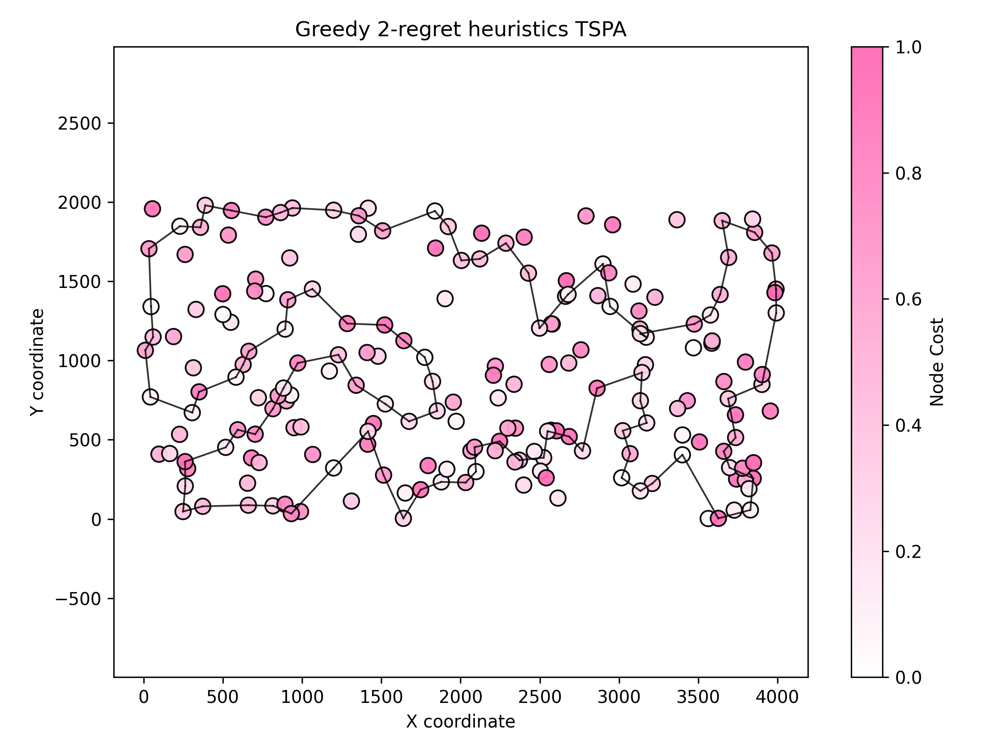

# Assignment 2 - Greedy regret heuristics

### Prepared by

- Marianna Myszkowska 156041
- Jakub Liszyński 156060

### Problem descirption
We are given three columns of integers with a row for each node. The first two columns contain x
and y coordinates of the node positions in a plane. The third column contains node costs. The goal is
to select exactly 50% of the nodes (if the number of nodes is odd we round the number of nodes to
be selected up) and form a Hamiltonian cycle (closed path) through this set of nodes such that the
sum of the total length of the path plus the total cost of the selected nodes is minimized.
The distances between nodes are calculated as Euclidean distances rounded mathematically to
integer values. The distance matrix should be calculated just after reading an instance and then only
the distance matrix (no nodes coordinates) should be accessed by optimization methods to allow
instances defined only by distance matrices.

## Methods

### Comparison table

#### TSPA Results

| Method | Best score | Worst score | Average score | Execution time (s) |
| --- | --- | --- | --- | --- |
| Greedy 2-regret | 105864 | 123334 | 114825 | 31.55 |
| Greedy 2-regret weighted (α=0.5) | 71062 | 73532 | 72096.1 | 34.16 |

#### TSPB Results

| Method | Best score | Worst score | Average score | Execution time (s) |
| --- | --- | --- | --- | --- |
| Greedy 2-regret | 68080 | 77702 | 72370.8 | 31.67 |
| Greedy 2-regret weighted (α=0.5) | 47367 | 54016 | 50842.2 | 34.35 |

**Key observations:**
- The weighted 2-regret (α=0.5) significantly outperforms basic 2-regret on both datasets
- TSPA: 33% improvement in average score (114825 → 72096)
- TSPB: 30% improvement in average score (72370 → 50842)
- Weighted version takes ~65% longer to execute but produces much better solutions

---

### Greedy 2-regret heuristics

#### Description 
The 2-regret heuristic is an insertion-based greedy algorithm. It builds a solution step by step, always choosing the “most urgent” node to insert next.
Instead of just picking the cheapest node at each step (like the standard greedy method), it considers how much you will regret not inserting a node now.
The regret measures the extra cost you’d pay if you were forced to insert this node later in a worse position.

#### Pseudocode
``` pseudocode
    solution <- []
    usedNodes <- array of size dataSize, initialized to false

    startNode <- random integer in [0, dataSize)
    append startNode to solution
    mark usedNodes[startNode] = true

    while size of solution < dataSize:
        bestNode <- -1
        bestPosition <- -1
        maxRegret <- -inf
        bestCost <-inf

        for candidateNode from 0 to dataSize - 1:
            if usedNodes[candidateNode] is true:
                continue

            insertionCosts <- empty list

            for pos from 0 to size of solution:
                pred <- solution[pos - 1] if pos > 0 else null
                succ <- solution[pos] if pos < size of solution else null

                added <- 0
                if pred != null then added += distance(pred, candidateNode)
                if succ != null then added += distance(candidateNode, succ)

                removed <- 0
                if pred != null and succ != null then removed = distance(pred, succ)

                cost <- nodeCost[candidateNode] + (added - removed)
                append (cost, pos) to insertionCosts
            end for

            sort insertionCosts by cost ascending
            bestInsertionCost <- insertionCosts[0].cost
            secondBestCost <- insertionCosts[1].cost if exists else bestInsertionCost
            regret <- secondBestCost - bestInsertionCost

            if regret > maxRegret or (regret == maxRegret and bestInsertionCost < bestCost):
                maxRegret <- regret
                bestCost <- bestInsertionCost
                bestNode <- candidateNode
                bestPosition <- insertionCosts[0].position
            end if
        end for

        if bestNode == -1 or bestPosition == -1:
            break

        insert bestNode at bestPosition in solution
        mark usedNodes[bestNode] = true
    end while
```

#### Results TSPA
Execution time: 20.7416 seconds

| Best score | Worst score | Average score |
| --- | --- | --- |
| 105864 | 123334 | 114825 |

Best found solution:

```
49 144 62 148 15 114 186 23 89 183 153 170 117 93 140 36 67 108 69 18 20 22 146 103 34 160 192 42 5 96 115 198 46 60 141 66 176 80 79 133 151 72 118 197 116 77 166 28 184 147 177 10 190 4 112 156 123 162 194 70 6 154 158 53 182 99 26 1 152 87 2 172 55 57 92 129 82 120 44 25 78 88 175 50 31 38 157 196 81 90 27 71 58 7 95 39 165 8 178 106 49 (back to start)
```



#### Results TSPB
Execution time: 26.0184 seconds

| Best score | Worst score | Average score |
| --- | --- | --- |
| 68080 | 77702 | 72370.8 |

Best found solution:

```
117 30 42 196 108 80 162 45 5 7 177 123 25 182 139 11 49 160 144 104 8 82 21 36 141 97 81 146 187 186 129 163 165 137 75 93 76 48 166 194 88 64 86 95 130 22 52 57 66 47 148 60 20 59 28 149 199 140 183 174 83 34 170 53 184 155 84 3 15 145 13 132 169 188 6 134 2 74 118 98 51 125 191 71 147 115 10 133 44 17 40 100 63 92 38 16 1 24 31 73 117 (back to start)
```


## Conclusions

### Objective function (avg (min – max))

| Method | Instance 1 (TSPA) | Instance 2 (TSPB) |
|---|---:|---:|
| Random solution | 263102 (231391 – 292542) | N/A |
| Nearest neighbour (append only) | 83,234.5 (81,598 – 88,112) | N/A |
| Nearest neighbour (insertion at best position) | 71,071.2 (69,941 – 73,650) | N/A |
| Greedy (fully greedy insertion) | 72,694.4 (70,285 – 76,228) | N/A |
| Greedy 2‑regret | 114,825 (105,864 – 123,334) | 72,370.8 (68,080 – 77,702) |
| Greedy 2‑regret weighted (α=0.5) | 72,096.1 (71,062 – 73,532) | 50,842.2 (47,367 – 54,016) |
| M1 — Steepest descent, 2-node exchange (random start) | N/A | N/A |
| M2 — Steepest descent, 2-node exchange (greedy start) | N/A | N/A |
| M3 — Steepest descent, 2-edge (random start) | N/A | N/A |
| M4 — Steepest descent, 2-edge (greedy start) | N/A | N/A |
| M5 — Greedy first‑improvement, 2-node exchange (random start) | N/A | N/A |
| M6 — Greedy first‑improvement, 2-node exchange (greedy start) | N/A | N/A |
| M7 — Greedy first‑improvement, 2-edge (random start) | N/A | N/A |
| M8 — Greedy first‑improvement, 2-edge (greedy start) | N/A | N/A |

### Running times (seconds)

| Method | Instance 1 (TSPA) | Instance 2 (TSPB) |
|---|---:|---:|
| Random solution | N/A | N/A |
| Nearest neighbour (append only) | N/A | N/A |
| Nearest neighbour (insertion) | N/A | N/A |
| Greedy (fully greedy insertion) | N/A | N/A |
| Greedy 2‑regret | 31.55 s | 31.67 s |
| Greedy 2‑regret weighted (α=0.5) | 34.16 s | 34.35 s |
| M1 — Steepest descent, 2-node exchange (random start) | N/A | N/A |
| M2 — Steepest descent, 2-node exchange (greedy start) | N/A | N/A |
| M3 — Steepest descent, 2-edge (random start) | N/A | N/A |
| M4 — Steepest descent, 2-edge (greedy start) | N/A | N/A |
| M5 — Greedy first‑improvement, 2-node exchange (random start) | N/A | N/A |
| M6 — Greedy first‑improvement, 2-node exchange (greedy start) | N/A | N/A |
| M7 — Greedy first‑improvement, 2-edge (random start) | N/A | N/A |
| M8 — Greedy first‑improvement, 2-edge (greedy start) | N/A | N/A |


This assignment explored greedy regret-based heuristics for the TSP with node selection, comparing standard 2-regret against a weighted variant that combines regret with greedy objective minimization.

### Key Findings

TODO


### Implementation insights

TODO
---

### Outcomes were checked with the solution checker

### Link to the source code (Github repository - directory Assignment 3)

[Assignment 2](https://github.com/Strajkerr/EvolutionaryComputing/tree/main/Assignment_3)