# Assignment 3 - Local search

### Prepared by

- Marianna Myszkowska 156041
- Jakub Liszyński 156060

### Problem descirption
We are given three columns of integers with a row for each node. The first two columns contain x
and y coordinates of the node positions in a plane. The third column contains node costs. The goal is
to select exactly 50% of the nodes (if the number of nodes is odd we round the number of nodes to
be selected up) and form a Hamiltonian cycle (closed path) through this set of nodes such that the
sum of the total length of the path plus the total cost of the selected nodes is minimized.
The distances between nodes are calculated as Euclidean distances rounded mathematically to
integer values. The distance matrix should be calculated just after reading an instance and then only
the distance matrix (no nodes coordinates) should be accessed by optimization methods to allow
instances defined only by distance matrices.

## Methods

### Comparison table

### Objective function (avg (min – max))

| Method | Instance 1 (TSPA) | Instance 2 (TSPB) |
|---|---:|---:| 
| Random solution | 263102 (231391 – 292542) | 212245 (194822 – 234932) |
| Nearest neighbour (append only) | 83234.5 (81598 – 88112) | 52662 (51037 – 56570) |
| Nearest neighbour (insertion at best position) | 71071.2 (69941 – 73650) | 44649.9 (43163 – 51497) |
| Greedy (fully greedy insertion) | 72694.4 (70285 – 76228) | 50345.1 (46166 – 58032) |
| Greedy 2‑regret | 72370.8 (68080 – 77702) | 114825 (105864 – 123334) |
| Greedy 2‑regret weighted (α=0.5) | 50842.2 (47367 – 54016) | 72096.1 (71062 – 73532) |
| M1 — Steepest descent, 2-node exchange (random start) | 139207 (126351 – 156694) | 91658.3 (82300 – 103709) |
| M2 — Steepest descent, 2-node exchange (greedy start) | 115224 (113368 – 117216) | 66844.2 (62651 – 70323) |
| M3 — Steepest descent, 2-edge (random start) | 121833 (111285 – 138170) | 73264.6 (67505 – 79546) |
| M4 — Steepest descent, 2-edge (greedy start) | 113771 (111298 – 114947) | 65580.6 (62208 – 68917) |
| M5 — Greedy first‑improvement, 2-node exchange (random start) | 85731 (78963 – 92428) | 60899.2 (54007 – 68549) |
| M6 — Greedy first‑improvement, 2-node exchange (greedy start) | 91366.9 (84058 – 100296) | 60717.1 (56993 – 64953) |
| M7 — Greedy first‑improvement, 2-edge (random start) | 73148.5 (71193 – 76253) | 47868.2 (45039 – 51839) |
| M8 — Greedy first‑improvement, 2-edge (greedy start) | 88224.8 (79665 – 98684) | 58988.7 (55836 – 62679) |

### Running times (seconds)

| Method | Instance 1 (TSPA) | Instance 2 (TSPB) |
|---|---:|---:|
| Random solution | 0.012564 s | 0.0098 s |
| Nearest neighbour (append only) | 0.014616 s | 0.0120 s |
| Nearest neighbour (insertion) | 49.8077 s | 50.0508 s |
| Greedy (fully greedy insertion) | 52.5566 s | 52.7421 s |
| Greedy 2‑regret | 31.67 s | 31.55 s |
| Greedy 2‑regret weighted (α=0.5) | 34.35 s | 34.16 s |
| M1 — Steepest descent, 2-node exchange (random start) | 187.817 s | 187.973 s |
| M2 — Steepest descent, 2-node exchange (greedy start) | 23.2958 s | 15.213 s |
| M3 — Steepest descent, 2-edge (random start) | 259.382 s | 206.591 s |
| M4 — Steepest descent, 2-edge (greedy start) | 59.1339 s | 29.784 s |
| M5 — Greedy first‑improvement, 2-node exchange (random start) | 8.07472 s | 5.15502 s |
| M6 — Greedy first‑improvement, 2-node exchange (greedy start) | 3.36837 s | 2.17246 s |
| M7 — Greedy first‑improvement, 2-edge (random start) | 6.69207 s | 4.56621 s |
| M8 — Greedy first‑improvement, 2-edge (greedy start) | 4.25992 s | 2.75454 s |

---

### M1

#### Description
Steepest-descent local search using 2-node exchange (swap) moves. The algorithm starts from a random feasible solution and repeatedly applies the single best improving 2-node swap found across the whole neighbourhood until no improvement exists.

- Start: random feasible solution.
- Neighbourhood: all pairwise swaps of two nodes in the current cycle (intra-route 2-node exchange).
- Strategy: steepest descent — evaluate all candidate swaps, pick the one with largest decrease in objective, apply it, and repeat until no improving swap exists.

#### Pseudocode
``` pseudocode
startSolution <- random_permutation(nodes)
improved <- true
while improved:
  improved <- false
  bestMove <- null
  bestDelta <- 0
  for each unordered pair (i,j) of indices in startSolution:
    delta <- newCost - currentCost
    if delta < bestDelta:
      bestDelta <- delta
      bestMove <- (i,j)
  if bestMove != null:
    apply_swap(startSolution, bestMove)
    improved <- true
return startSolution
```

#### Results (summary)

TSPA best cycle:
```
135 126 4 123 122 172 57 185 40 119 39 138 169 196 17 145 106 178 3 155 15 186 23 141 117 114 132 21 7 164 27 174 85 50 113 31 168 78 44 101 97 189 19 152 125 26 53 158 136 182 63 133 161 184 160 192 41 139 198 68 93 140 36 163 108 69 159 146 103 54 10 190 35 11 166 149 151 80 16 171 13 129 128 167 72 116 105 42 5 96 197 118 176 9 62 111 124 180 154 6 135 (back to start)
```

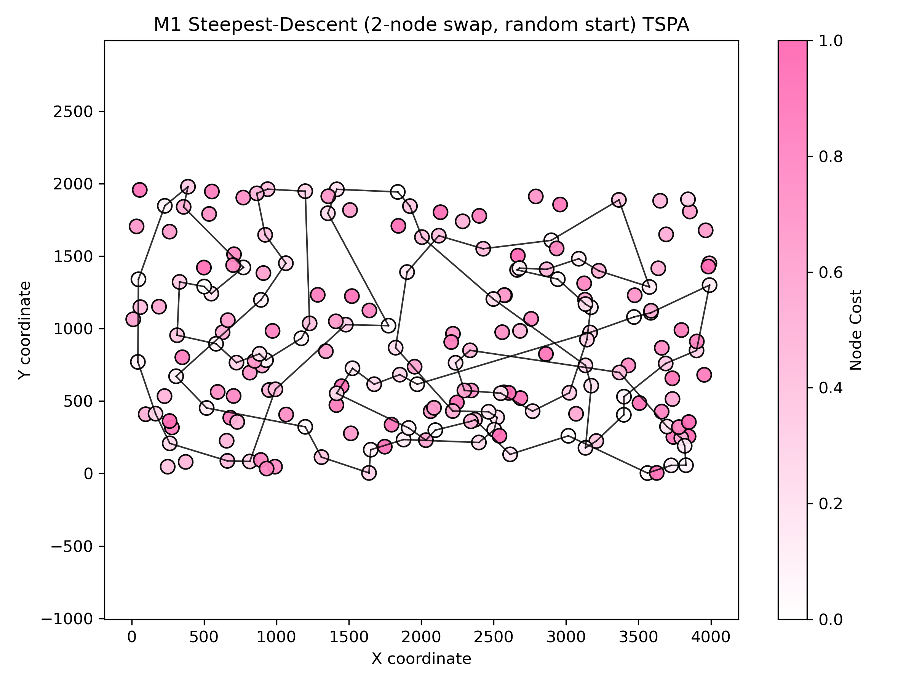

TSPB best cycle:
```
177 123 190 80 46 175 21 119 95 99 185 176 180 26 137 127 89 163 187 77 58 50 55 174 140 59 101 149 4 53 155 84 161 168 188 115 133 72 40 63 102 38 16 135 125 90 191 71 67 6 43 11 49 0 124 128 110 179 66 94 148 23 20 69 160 33 138 182 2 74 151 54 31 173 157 56 8 159 143 189 167 34 86 166 48 194 81 61 7 142 193 117 198 30 196 42 1 116 118 171 177 (back to start)
```
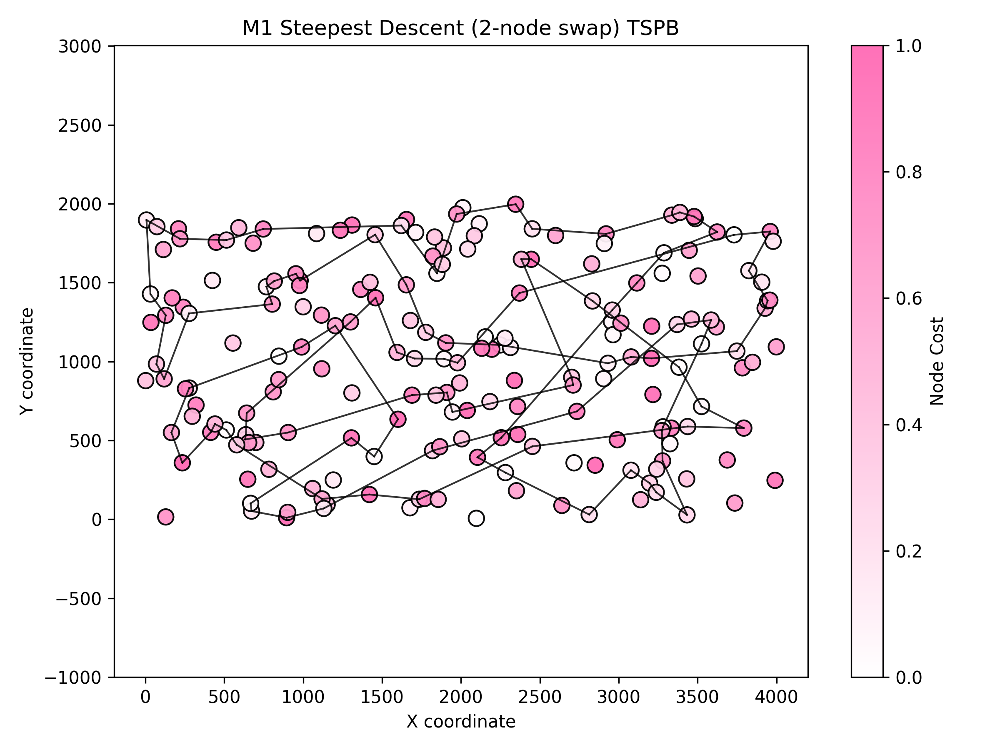

### M2

#### Description
Steepest-descent local search using 2-node exchange (swap) moves, started from a greedy constructed feasible solution. The greedy start is formed by best-position insertion (greedy insertion) with a randomly chosen start node. From that starting cycle the algorithm performs steepest-descent 2-node swaps until no improvement exists.

- Start: greedy feasible solution (best-insertion with random start node).
- Neighbourhood: all pairwise swaps of two nodes in the current cycle (intra-route 2-node exchange).
- Strategy: steepest descent — evaluate all candidate swaps, pick the best improving swap, apply, repeat until no improvement.

#### Pseudocode
``` pseudocode
startNode <- random_choice(nodes)
startSolution <- construct_greedy_insertion(startNode)
improved <- true
while improved:
  improved <- false
  bestMove <- null
  bestDelta <- 0
  for each unordered pair (i,j) of indices in startSolution:
    delta <- newCost - currentCost
    if delta < bestDelta:
      bestDelta <- delta
      bestMove <- (i,j)
  if bestMove != null:
    apply_swap(startSolution, bestMove)
    improved <- true
return startSolution
```

#### Results (summary)

TSPA best cycle:
```
190 10 177 104 147 54 30 48 160 192 181 195 103 146 22 159 193 41 142 110 191 139 115 198 46 60 118 141 66 176 80 122 94 130 12 124 19 189 99 121 97 152 74 125 87 2 1 101 150 75 86 26 100 53 158 154 6 70 135 194 173 180 136 182 63 79 133 161 162 45 151 51 109 72 59 197 96 5 42 43 28 184 4 112 156 29 126 84 35 11 166 77 47 105 116 65 131 149 24 123 190 (back to start)
```

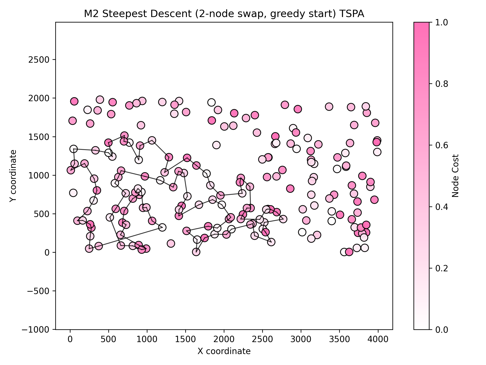

TSPB best cycle:
```
9 183 174 83 181 95 130 99 22 179 57 172 52 185 86 166 194 88 113 26 103 114 137 127 165 89 163 186 187 146 97 77 50 58 82 87 21 8 171 157 104 56 33 138 182 139 43 126 195 168 11 49 39 29 109 35 0 12 160 144 68 111 37 41 14 81 153 129 180 176 64 110 128 106 119 159 143 124 62 18 55 34 170 152 53 140 199 4 149 101 28 59 20 23 60 148 47 154 94 66 9 (back to start)
```
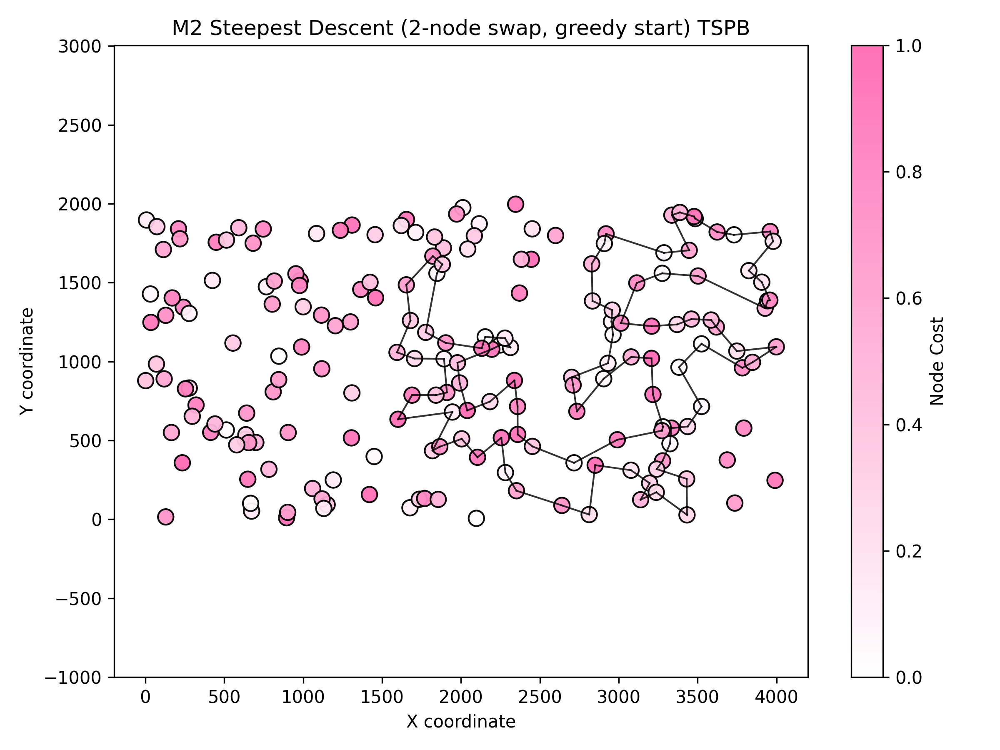

### M3

#### Description
Steepest-descent local search using 2-edge exchanges (2-opt). Starting from a random feasible solution, the method examines all possible 2-opt moves (remove two edges and reconnect to eliminate the crossing) and applies the single best improving 2-opt move (steepest descent). Repeat until no improving 2-opt exists.

- Start: random feasible solution.
- Neighbourhood: all 2-opt moves over the selected cycle (reverse subsequences between two indices).
- Strategy: steepest descent — evaluate all candidate 2-opt moves, pick the one with largest decrease and apply it; repeat until local optimum.

#### Pseudocode
``` pseudocode
startSolution <- random_permutation(nodes)
improved <- true
while improved:
  improved <- false
  bestMove <- null
  bestDelta <- 0
  for i in 0..len(startSolution)-2:
    for j in i+1..len(startSolution)-1:
      delta <- newCost - currentCost
      if delta < bestDelta:
        bestDelta <- delta
        bestMove <- (i,j)
  if bestMove != null:
    reverse(solution.begin() + bestI, solution.begin() + bestJ + 1)
    improved <- true
return startSolution
```

#### Results (summary)

TSPA best cycle:
```
13 85 157 38 168 78 92 57 179 91 196 40 39 95 7 165 185 52 106 178 3 32 138 14 49 102 155 132 73 9 33 128 111 12 94 122 63 133 80 176 186 15 64 114 83 89 183 153 0 117 140 108 69 191 139 193 159 103 34 192 160 48 30 54 147 10 24 131 65 105 28 42 96 115 118 72 45 162 6 180 158 53 121 99 19 152 97 26 86 101 150 75 120 82 16 88 171 175 113 56 13 (back to start)
```

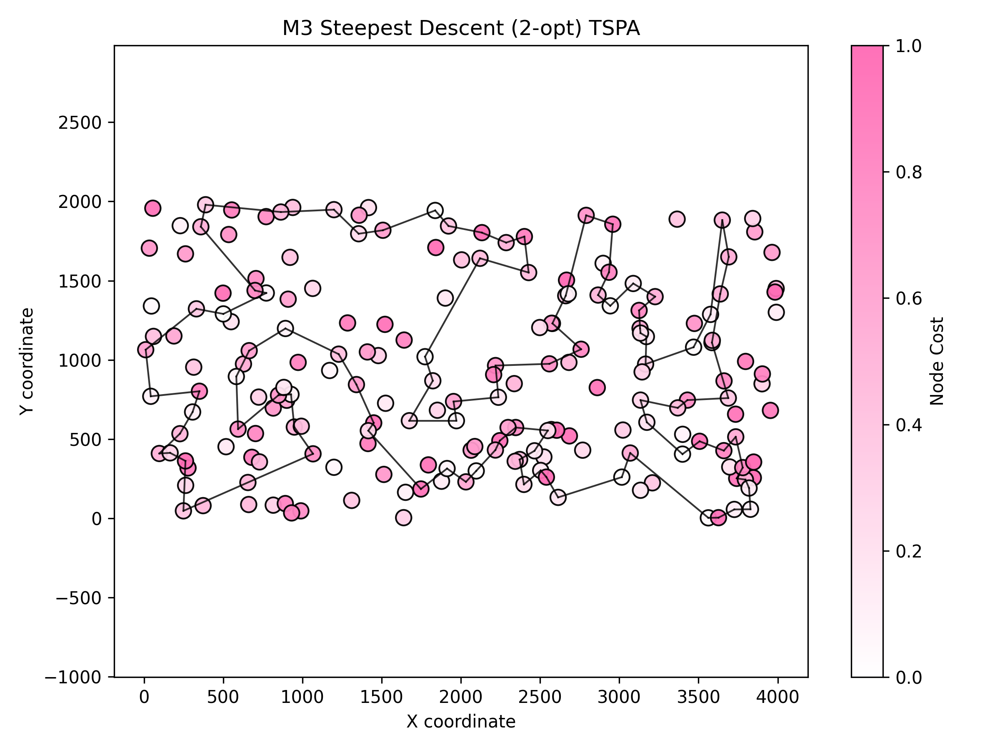

TSPB best cycle:
```
197 1 24 42 30 117 151 173 164 193 190 162 45 78 5 177 91 141 97 77 81 186 163 89 103 75 76 180 176 88 194 166 22 172 57 94 154 60 23 59 149 4 140 183 152 170 55 18 62 128 106 129 119 14 50 87 21 8 68 144 160 33 139 29 12 37 35 109 69 189 184 3 70 145 13 168 188 6 150 192 147 134 85 74 25 121 131 125 90 178 10 133 72 17 107 40 100 122 102 27 197 (back to start)
```
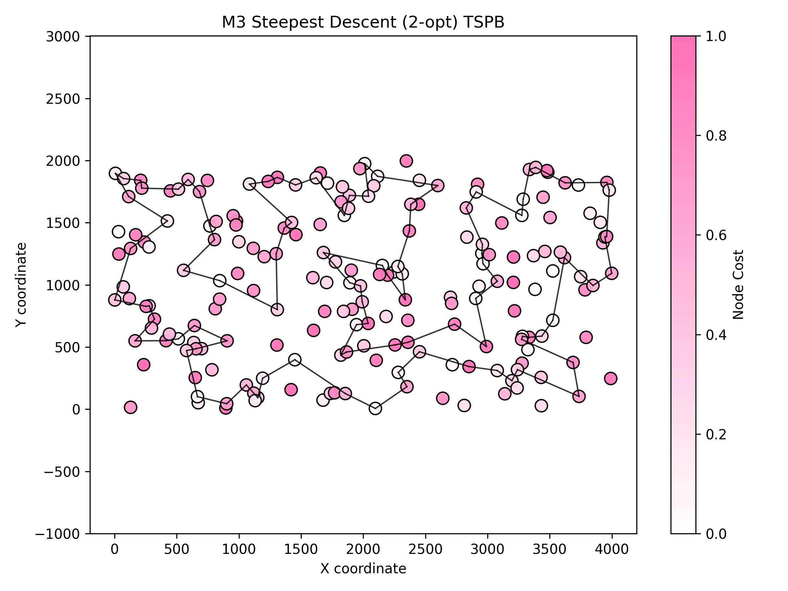

### M4

#### Description
Steepest-descent local search using 2-edge exchanges (2-opt), started from a greedy constructed feasible solution. The greedy start uses best-insertion with a random start node. From that initial tour the algorithm applies steepest-descent 2-opt moves until no improvement remains.

- Start: greedy feasible solution (best-insertion with random start node).
- Neighbourhood: all 2-opt moves over the selected cycle.
- Strategy: steepest descent — evaluate all candidate 2-opt moves, pick the best improving one and apply it; repeat until local optimum.

#### Pseudocode
``` pseudocode
startNode <- random_choice(nodes)
startSolution <- construct_greedy_insertion(startNode)
improved <- true
while improved:
  improved <- false
  bestMove <- null
  bestDelta <- 0
  for i in 0..len(startSolution)-2:
    for j in i+1..len(startSolution)-1:
      delta <- newCost - currentCost
      if delta < bestDelta:
        bestDelta <- delta
        bestMove <- (i,j)
  if bestMove != null:
    reverse(solution.begin() + bestI, solution.begin() + bestJ + 1)
    improved <- true
return startSolution
```

#### Results (summary)

TSPA best cycle:
```
48 30 54 147 104 177 10 190 84 4 112 126 156 29 123 24 149 131 65 116 105 47 77 166 35 11 184 28 43 42 5 96 197 59 72 51 151 45 162 161 133 79 63 182 136 180 173 194 135 70 6 154 158 53 86 75 150 101 1 2 87 125 74 152 97 26 100 121 99 189 19 124 12 130 94 122 80 176 66 141 109 118 115 46 198 139 191 110 142 41 193 159 22 146 103 195 181 192 160 34 48 (back to start)
```

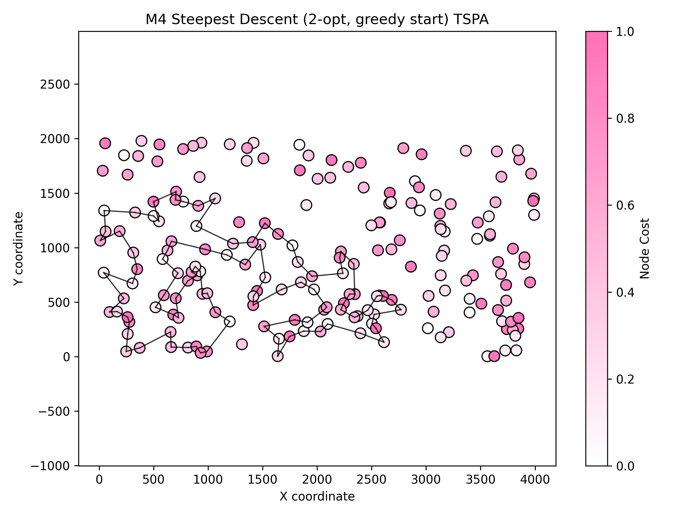

TSPB best cycle:
```
130 95 181 83 174 53 152 170 34 55 18 62 124 143 159 119 106 128 110 64 176 180 129 153 81 14 41 37 111 68 144 160 39 12 0 35 109 29 49 11 168 195 126 43 139 182 138 33 56 104 157 171 8 21 87 82 58 50 77 97 146 187 186 163 89 165 127 137 114 103 26 113 88 194 166 86 185 99 22 179 52 172 57 66 94 154 47 148 60 23 20 59 28 101 149 4 140 183 199 9 130 (back to start)
```
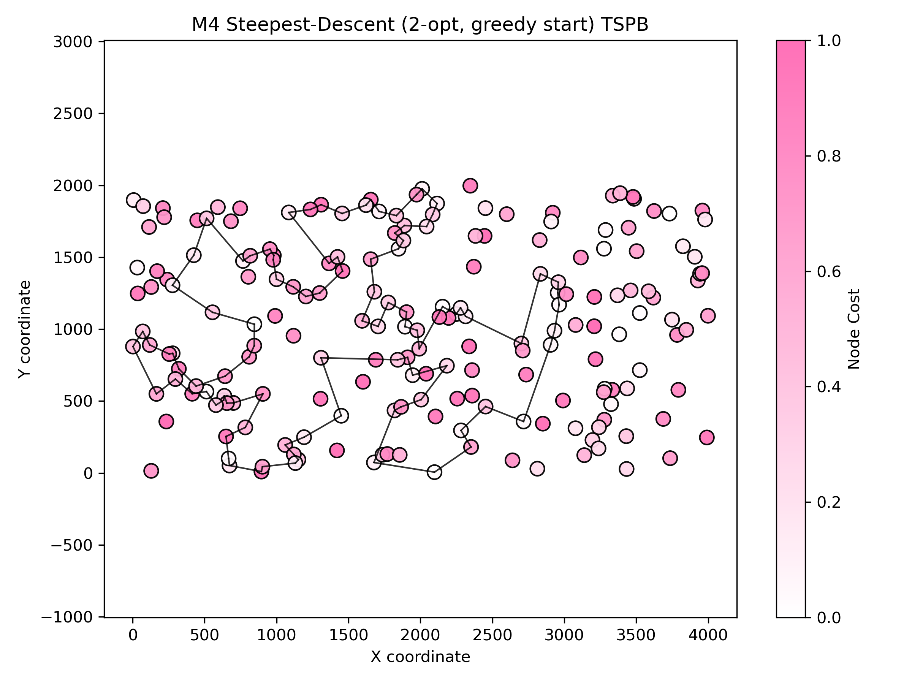

### M5

#### Description 
Description  
- Greedy (first‑improvement) local search that mixes intra‑route swaps and inter‑route selected↔not‑selected exchanges.  
- Start: random feasible solution.  
- Neighbourhood: inter‑route (selected ↔ not‑selected exchange) + intra‑route two‑nodes exchange (swap).  
- Strategy: inspect moves in random order and apply the first improving move; repeat until no improvement.

#### Pseudocode
``` pseudocode
startSolution <- random_permutation(nodes)          // random start visit set
improved <- true
while improved:
  improved <- false
  moves <- random_order( two_node_swaps(startSolution) ++ inter_route_replacements(startSolution) )
  for move in moves:
    if delta(move) < 0:
      apply(move)
      improved <- true
      break
return startSolution
```

#### Results (summary)

| Instance | runs | avg (min – max) | Execution time |
|---|---:|---:|---:|
| TSPA (../TSPA.csv) | 200 | 85731 (78963 – 92428) |	8.07472 s |
| TSPB (../TSPB.csv) | 200 | 60899.2 (54007 – 68549) |	5.15502 s |

Best found cycles (one example)

TSPA best cycle:
```
46 118 51 89 183 143 0 117 93 140 108 18 159 193 41 34 160 54 177 4 112 84 146 22 195 181 43 116 65 59 94 129 92 179 145 78 31 56 25 82 57 55 52 178 106 185 165 39 27 90 81 2 75 101 86 100 26 97 1 152 167 49 102 62 9 148 63 79 80 176 137 23 186 15 144 14 138 40 196 113 175 171 16 44 120 53 70 135 154 180 133 151 162 123 149 184 42 5 115 139 46 (back to start)
```
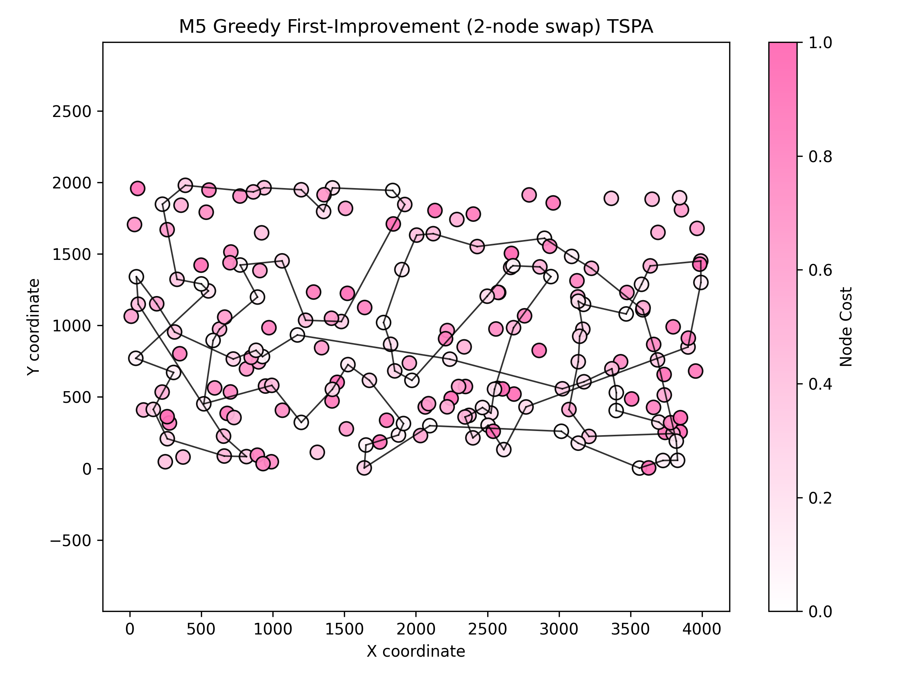
TSPB best cycle:
```
180 176 106 124 62 183 140 149 28 20 148 47 94 66 179 166 194 163 153 77 8 121 131 107 40 63 102 135 122 90 51 147 6 188 169 132 15 145 13 126 195 168 109 35 0 29 139 11 144 111 103 26 114 137 127 89 165 187 146 97 141 91 61 36 177 5 78 175 45 80 190 193 117 31 54 25 104 86 185 130 95 18 55 34 170 152 184 155 3 70 161 134 118 74 182 138 33 160 143 113 180 (back to start)
```

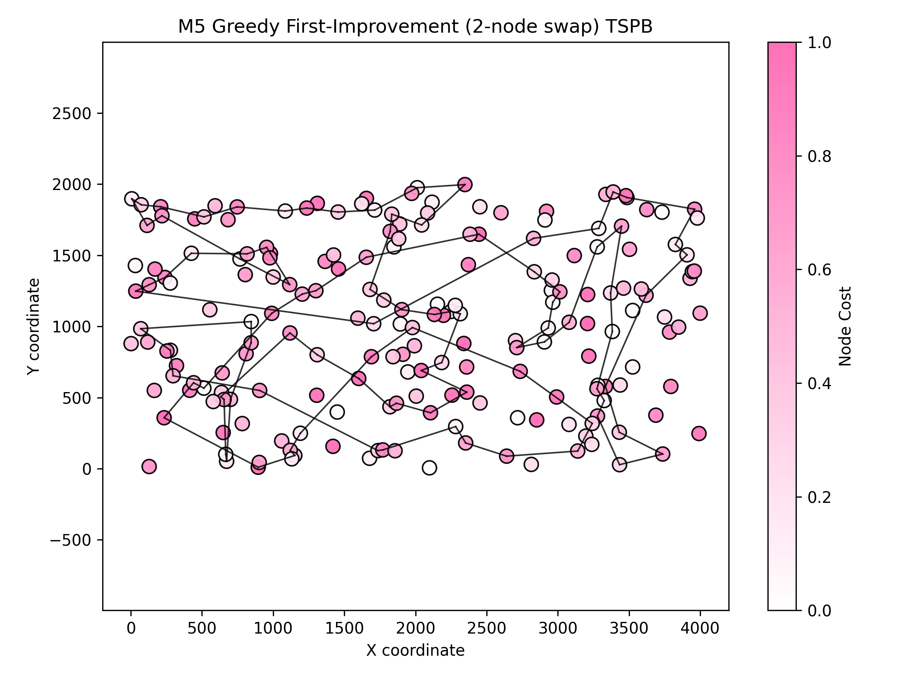

### M6

#### Description 
- Greedy (first‑improvement) local search using the same neighbourhood as M5 (intra‑route swaps + inter‑route selected↔not‑selected exchanges).  
- Start: greedy feasible solution constructed by insertion at best position with a random start node.  
- Neighbourhood: inter‑route (selected ↔ not‑selected exchange) + intra‑route two‑nodes exchange (swap).  
- Strategy: construct greedy start, inspect two‑node exchange moves in random order and apply the first improving move; repeat until no improvement.

#### Pseudocode
``` pseudocode
startNode <- random_choice(nodes)
startSolution <- construct_greedy_insertion(startNode)   // greedy construction
improved <- true
while improved:
  improved <- false
  moves <- random_order( two_node_swaps(startSolution) ++ inter_route_replacements(startSolution) )
  for move in moves:
    if delta(move) < 0:
      apply(move)
      improved <- true
      break
return startSolution
```

#### Results (summary)

| Instance | runs | avg (min – max) | Execution time |
|---|---:|---:|---:|
| TSPA (../TSPA.csv) | 200 | 91366.9 (84058 – 100296) | 3.36837 s |
| TSPB (../TSPB.csv) | 200 | 60717.1 (56993 – 64953) | 2.17246 s |

Best found cycles (one example)

TSPA best cycle:
```
0 46 65 47 72 162 149 131 166 28 184 35 123 127 29 156 112 4 84 77 43 96 41 193 181 192 160 48 104 177 190 10 54 30 34 103 146 195 159 22 18 108 140 68 139 115 5 42 105 116 59 118 51 176 151 133 79 80 122 63 94 26 100 121 53 180 135 70 154 158 86 97 152 1 101 75 2 120 44 25 16 171 175 78 145 185 40 165 106 178 14 49 62 148 137 23 89 183 143 117 0 (back to start)
```
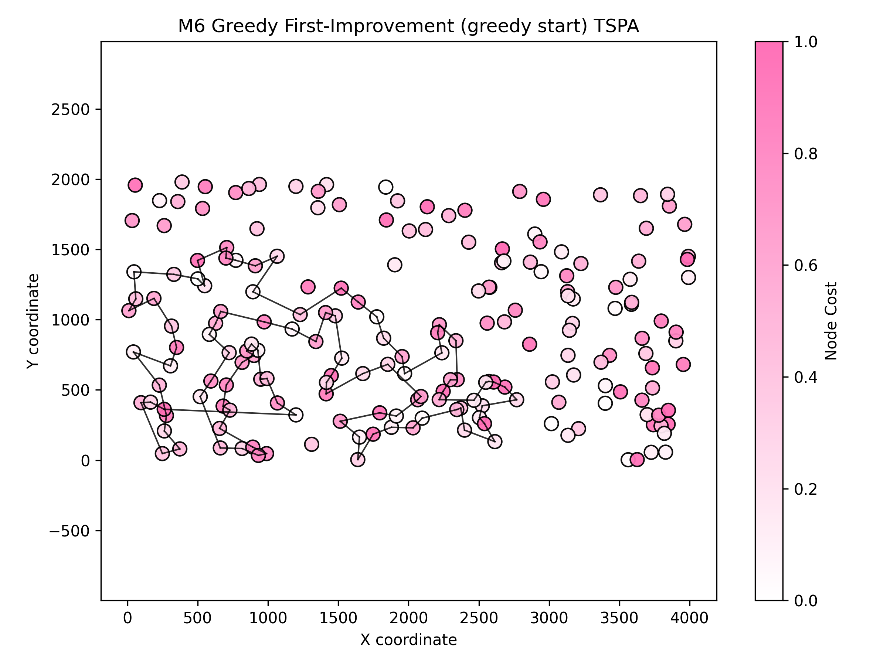
TSPB best cycle:
```
147 192 150 6 188 65 169 132 161 70 3 15 145 13 126 195 168 49 33 56 144 160 29 0 109 35 34 18 62 124 106 86 176 113 153 81 77 141 91 36 61 21 87 82 111 8 104 138 182 11 139 43 134 85 74 118 98 51 120 67 71 191 90 122 131 121 116 112 19 151 24 1 197 135 63 38 27 16 42 156 198 117 193 31 54 164 73 173 136 190 80 46 162 175 78 142 45 5 177 25 147 (back to start)
```

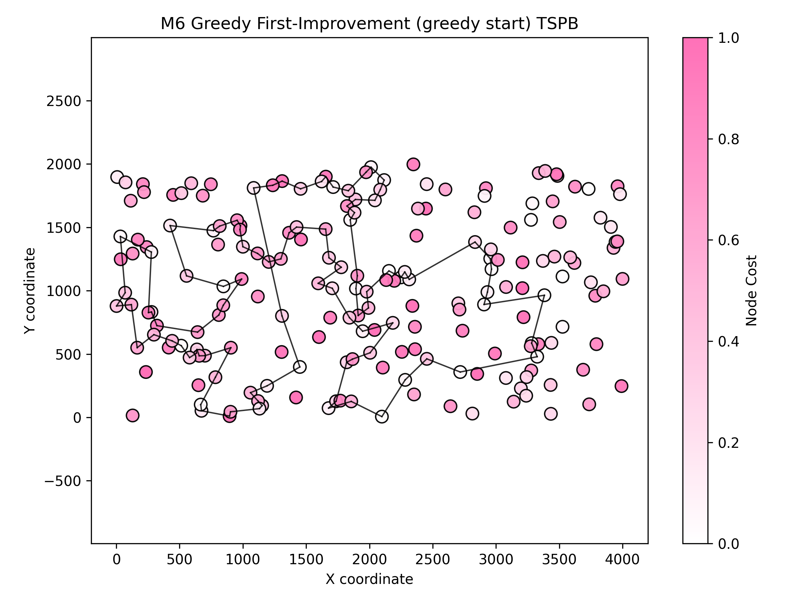

### M7

#### Description 
- Greedy (first‑improvement) local search using 2‑edge exchanges (2‑opt).  
- Start: random feasible solution.  
- Neighbourhood: intra‑route 2‑opt moves combined with inter‑route selected↔not‑selected exchanges.  
- Strategy: randomly shuffle candidate 2‑opt moves (and inter‑route exchanges), apply the first move that improves the objective, repeat until no improvement.

#### Pseudocode
``` pseudocode
startSolution <- random_permutation(nodes)
improved <- true
while improved:
  improved <- false
  moves <- random_order( two_opt_moves(startSolution) ++ inter_route_replacements(startSolution) )
  for move in moves:
    if delta(move) < 0:
      apply(move)            // for 2-opt: reverse subsequence; for inter-route: replace node
      improved <- true
      break
return startSolution
```

#### Results (summary)

| Instance | runs | avg (min – max) | Execution time |
|---|---:|---:|---:|
| TSPA (../TSPA.csv) | 200 | 73148.5 (71193 – 76253) | 6.69207 s |
| TSPB (../TSPB.csv) | 200 | 47868.2 (45039 – 51839) | 4.56621 s |

Best found cycle (example, TSPA):
```
62 144 14 49 3 178 106 185 40 119 165 90 81 196 31 56 113 175 171 16 78 145 179 52 55 57 92 129 25 44 120 2 152 1 75 86 101 97 26 100 53 158 180 154 135 70 127 123 35 84 112 4 190 10 177 54 184 160 34 181 146 22 41 193 18 108 140 68 46 0 117 143 183 89 186 23 137 176 51 118 59 115 139 42 43 116 65 131 149 162 151 133 79 80 122 63 94 124 148 9 62 (back to start)
```
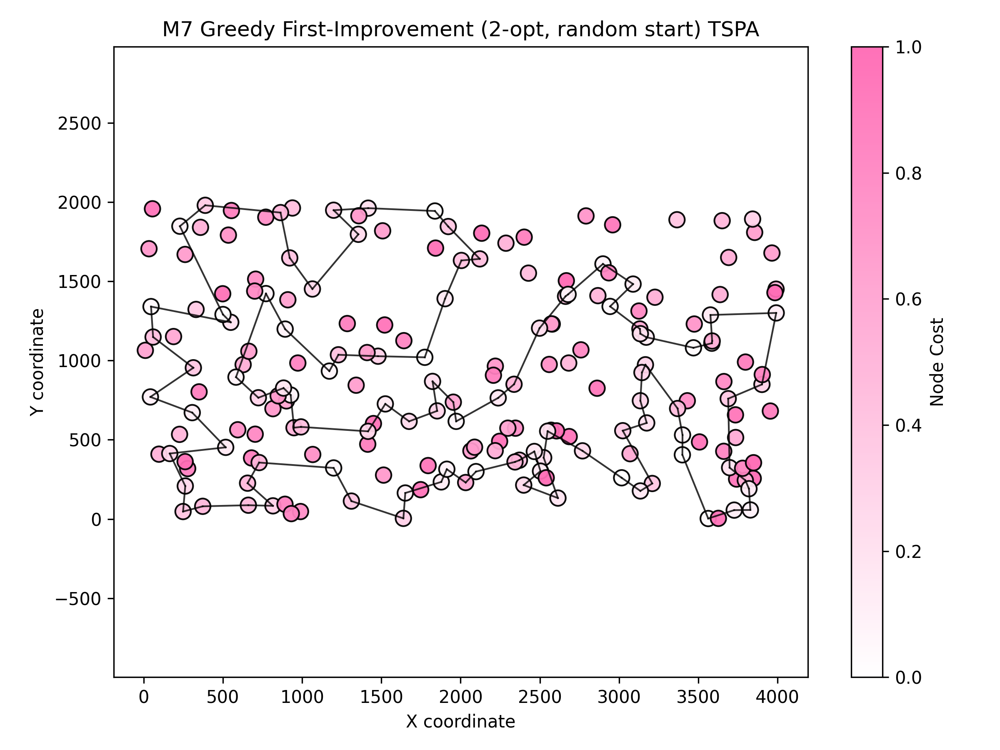

Best found cycle (example, TSPB):
```
113 26 103 114 137 127 165 89 163 153 77 141 91 79 61 36 177 5 78 175 142 45 162 80 190 136 73 164 54 31 193 117 198 1 135 63 40 107 122 131 121 51 90 191 147 188 169 132 70 3 15 145 13 195 168 139 11 138 33 160 104 21 82 8 111 144 29 0 109 35 143 159 106 124 62 18 55 34 152 183 140 4 149 28 20 60 148 47 94 66 179 22 99 95 185 86 166 194 176 180 113 (back to start)
```
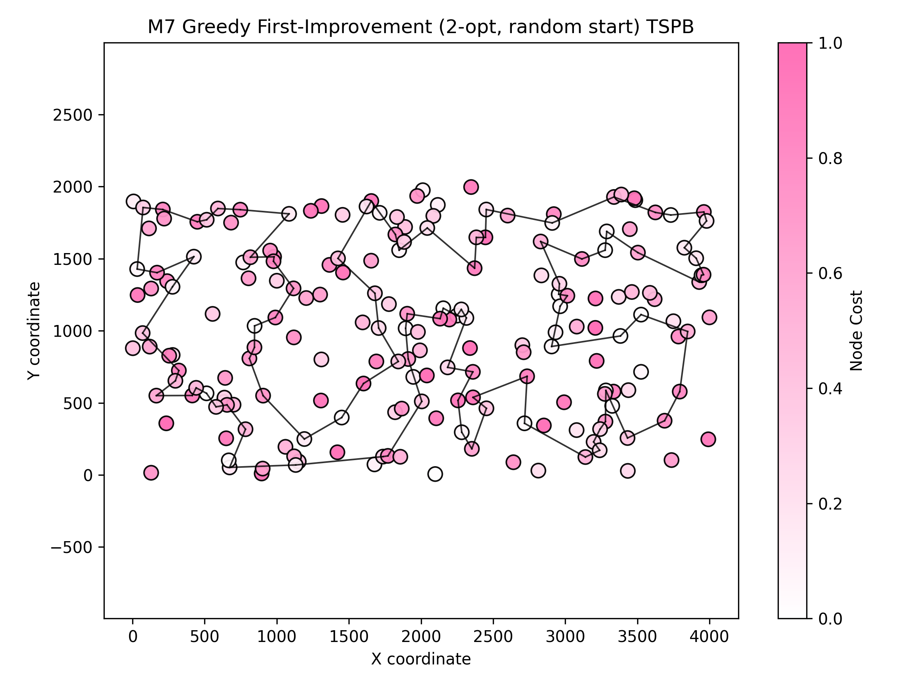

### M8

#### Description 
- Greedy (first‑improvement) local search using 2‑edge exchanges (2‑opt).  
- Start: greedy feasible solution constructed by best‑insertion with a random start node.  
- Neighbourhood and strategy: same as M7, but starting from the greedy insertion solution.

#### Pseudocode
``` pseudocode
startNode <- random_choice(nodes)
startSolution <- construct_greedy_insertion(startNode)
improved <- true
while improved:
  improved <- false
  moves <- random_order( two_opt_moves(startSolution) ++ inter_route_replacements(startSolution) )
  for move in moves:
    if delta(move) < 0:
      apply(move)
      improved <- true
      break
return startSolution
```

#### Results (summary)

| Instance | runs | avg (min – max) | Execution time |
|---|---:|---:|---:|
| TSPA (../TSPA.csv) | 200 | 88224.8 (79665 – 98684) | 4.25992 s |
| TSPB (../TSPB.csv) | 200 | 58988.7 (55836 – 62679) | 2.75454 s |

Best found cycle (example, TSPA):
```
198 115 96 5 42 160 48 54 30 177 10 190 4 112 84 35 184 28 43 105 116 65 47 131 149 24 123 162 151 72 59 118 51 176 80 79 133 194 127 70 135 154 158 53 180 63 94 124 152 1 97 26 100 86 101 75 2 120 44 16 78 145 40 185 55 52 106 178 49 14 144 62 9 148 137 23 89 183 143 170 0 117 93 140 36 108 69 18 22 146 34 181 195 159 193 41 139 110 68 46 198 (back to start)
```
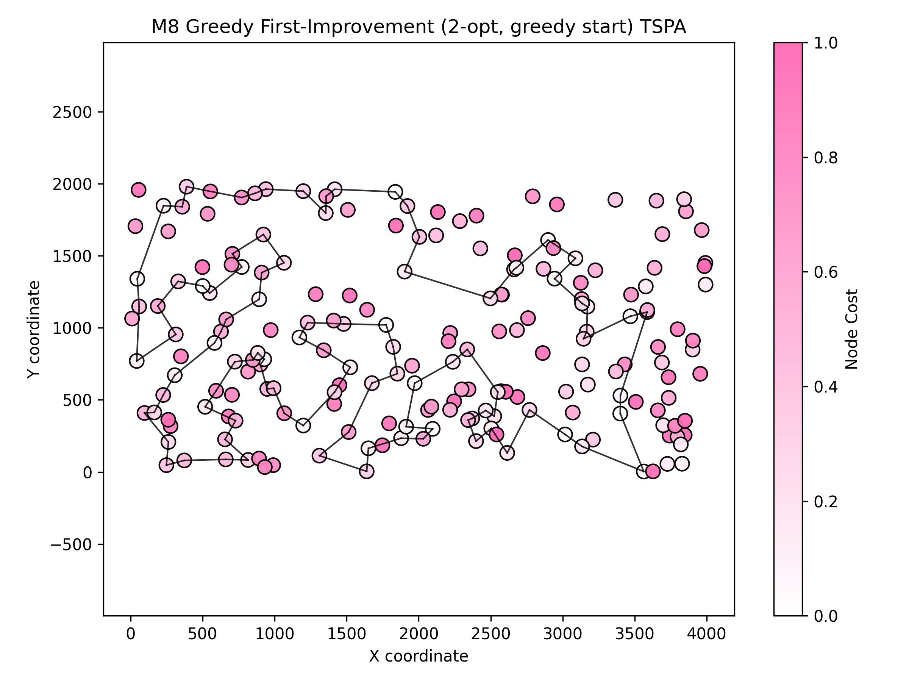

Best found cycle (example, TSPB):
```
141 61 36 175 5 177 21 87 82 8 104 182 138 33 49 11 139 168 195 169 188 70 3 145 29 109 35 0 160 144 56 111 41 81 119 159 143 106 124 62 18 55 34 170 152 53 140 4 149 101 28 59 20 23 60 154 94 66 47 148 9 199 183 174 83 181 95 130 99 22 179 57 172 52 185 86 110 128 64 166 194 88 176 180 113 114 137 127 165 89 103 26 163 129 186 153 187 146 97 77 141 (back to start)
```
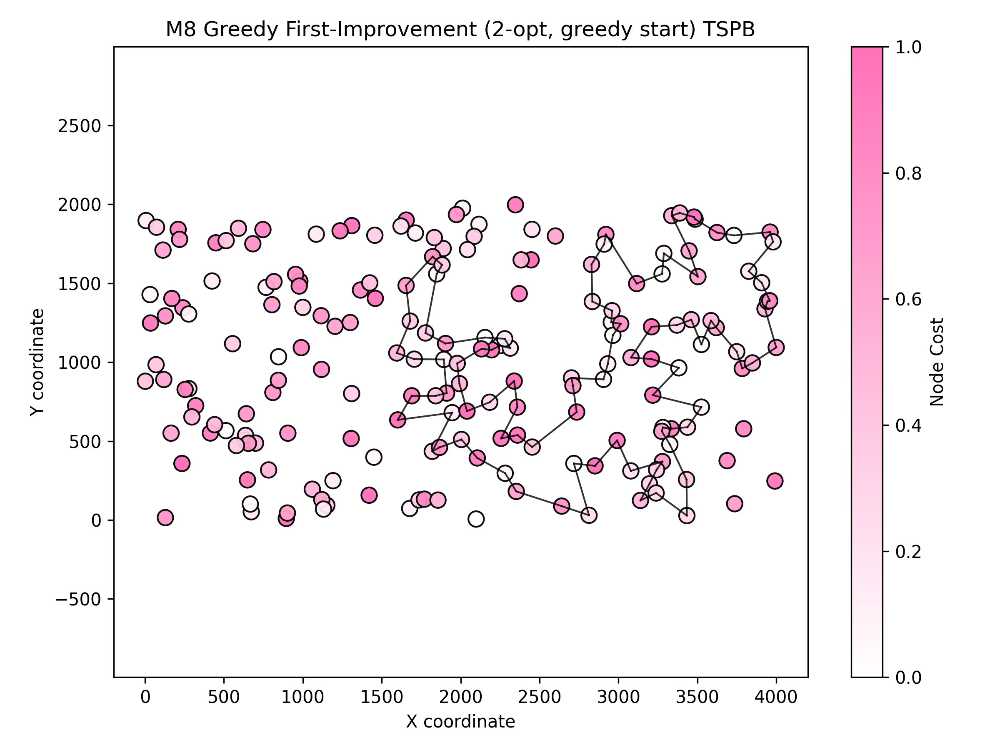

### Conclusions

This assignment implemented and compared several local-search strategies (2-node swap and 2-edge / 2-opt), each tested with two different starts: random and greedy insertion. The main conclusions from the experiments are:

- Greedy construction as a start point consistently improves final solution quality and reduces variance compared with random starts. Among the methods tested, the steepest-descent 2-edge exchange with greedy start (M4) gave the best average results on both instances.
- 2-edge exchanges (2-opt) are more powerful than simple 2-node swaps for this problem: they find shorter cycles and improve the objective more effectively, at the cost of slightly higher per-move evaluation in the random-start case.
- Running time trade-offs: random starts (M1, M3) require significantly more time because searches start from poor-quality solutions and perform more improving moves; greedy starts converge faster.

### Implementation insights

- Use cycle-aware insertion/evaluation throughout (wrap-around predecessor/successor) to simplify move evaluation and avoid special-case code when closing the tour.
- When searching for the two best insertion costs (for regret-based heuristics) scanning for the two smallest values in one pass is faster than sorting all positions.
- For local search, implementing efficient delta evaluations for 2-opt and 2-node swap moves reduces runtime substantially compared to recomputing full tour costs after each candidate move.

---

### Outcomes were checked with the solution checker

All methods were executed via `./main` and results recorded; the `out.txt` file contains the full program output used to populate the tables and example best routes.

### Link to the source code (Github repository - directory Assignment 3)

[Assignment 3](https://github.com/Strajkerr/EvolutionaryComputing/tree/main/Assignment_3)
---

