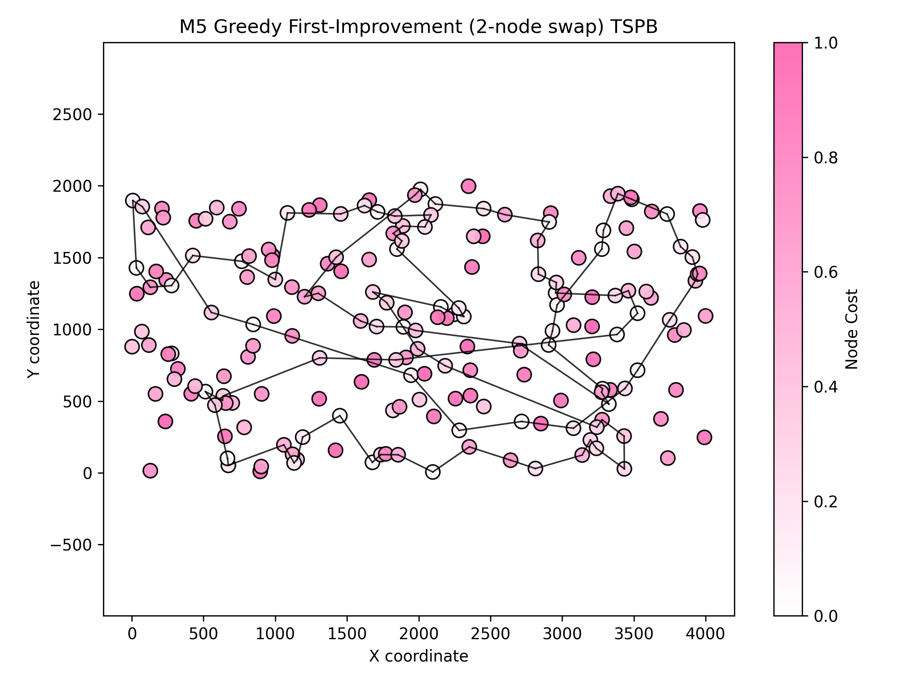

# Assignment 2 - Greedy regret heuristics

### Prepared by

- Marianna Myszkowska 156041
- Jakub Liszyński 156060

### Problem descirption
We are given three columns of integers with a row for each node. The first two columns contain x
and y coordinates of the node positions in a plane. The third column contains node costs. The goal is
to select exactly 50% of the nodes (if the number of nodes is odd we round the number of nodes to
be selected up) and form a Hamiltonian cycle (closed path) through this set of nodes such that the
sum of the total length of the path plus the total cost of the selected nodes is minimized.
The distances between nodes are calculated as Euclidean distances rounded mathematically to
integer values. The distance matrix should be calculated just after reading an instance and then only
the distance matrix (no nodes coordinates) should be accessed by optimization methods to allow
instances defined only by distance matrices.

## Methods

### Comparison table

### Objective function (avg (min – max))

| Method | Instance 1 (TSPA) | Instance 2 (TSPB) |
|---|---:|---:|
| Random solution | 263102 (231391 – 292542) | N/A |
| Nearest neighbour (append only) | 83,234.5 (81,598 – 88,112) | N/A |
| Nearest neighbour (insertion at best position) | 71,071.2 (69,941 – 73,650) | N/A |
| Greedy (fully greedy insertion) | 72,694.4 (70,285 – 76,228) | N/A |
| Greedy 2‑regret | 114,825 (105,864 – 123,334) | 72,370.8 (68,080 – 77,702) |
| Greedy 2‑regret weighted (α=0.5) | 72,096.1 (71,062 – 73,532) | 50,842.2 (47,367 – 54,016) |
| M1 — Steepest descent, 2-node exchange (random start) | N/A | N/A |
| M2 — Steepest descent, 2-node exchange (greedy start) | N/A | N/A |
| M3 — Steepest descent, 2-edge (random start) | N/A | N/A |
| M4 — Steepest descent, 2-edge (greedy start) | N/A | N/A |
| M5 — Greedy first‑improvement, 2-node exchange (random start) | 261,634 (249,552 – 272,843) | 164,982 (153,706 – 178,435) |
| M6 — Greedy first‑improvement, 2-node exchange (greedy start) | N/A | N/A |
| M7 — Greedy first‑improvement, 2-edge (random start) | N/A | N/A |
| M8 — Greedy first‑improvement, 2-edge (greedy start) | N/A | N/A |

### Running times (seconds)

| Method | Instance 1 (TSPA) | Instance 2 (TSPB) |
|---|---:|---:|
| Random solution | N/A | N/A |
| Nearest neighbour (append only) | N/A | N/A |
| Nearest neighbour (insertion) | N/A | N/A |
| Greedy (fully greedy insertion) | N/A | N/A |
| Greedy 2‑regret | 31.55 s | 31.67 s |
| Greedy 2‑regret weighted (α=0.5) | 34.16 s | 34.35 s |
| M1 — Steepest descent, 2-node exchange (random start) | N/A | N/A |
| M2 — Steepest descent, 2-node exchange (greedy start) | N/A | N/A |
| M3 — Steepest descent, 2-edge (random start) | N/A | N/A |
| M4 — Steepest descent, 2-edge (greedy start) | N/A | N/A |
| M5 — Greedy first‑improvement, 2-node exchange (random start) | 33.0805 s | 32.7337 s |
| M6 — Greedy first‑improvement, 2-node exchange (greedy start) | N/A | N/A |
| M7 — Greedy first‑improvement, 2-edge (random start) | N/A | N/A |
| M8 — Greedy first‑improvement, 2-edge (greedy start) | N/A | N/A |

**Key observations:**
TODO
---

### Greedy 2-regret heuristics

#### Description 
Description  
- Greedy (first‑improvement) local search that mixes intra‑route swaps and inter‑route selected↔not‑selected exchanges.  
- Start: random feasible solution.  
- Neighbourhood: inter‑route (selected ↔ not‑selected exchange) + intra‑route two‑nodes exchange (swap).  
- Strategy: inspect moves in random order and apply the first improving move; repeat until no improvement.

#### Pseudocode
``` pseudocode
    startSolution <- generate_random_solution()
improved <- true
while improved:
  improved <- false
  for move in random_order(neighbourhood_of(startSolution)):
    if delta(move) < 0:
      apply move
      improved <- true
      break
return startSolution
```

#### Results (summary)

| Instance | runs | avg (min – max) | Execution time |
|---|---:|---:|---:|
| TSPA (../TSPA.csv) | 200 | 261,634 (249,552 – 272,843) | 33.0805 s |
| TSPB (../TSPB.csv) | 200 | 164,982 (153,706 – 178,435) | 32.7337 s |

Best found cycles (one example)

TSPA best cycle:
```
171 88 16 75 180 173 72 59 197 115 46 0 153 143 170 117 93 140 36 68 110 193 41 147 54 30 34 103 146 22 195 181 192 160 48 43 105 118 51 176 80 97 78 157 98 81 187 91 179 92 57 33 37 111 152 74 125 167 128 3 32 138 14 155 144 64 15 124 189 19 172 95 71 58 164 7 21 94 63 79 151 149 131 35 84 4 112 24 66 186 114 83 89 183 73 132 61 148 99 121 182 136 65 116 96 5 42 28 166 11 126 156 29 127 194 161 162 45 133 122 130 12 137 23 76 141 109 60 198 139 191 142 199 20 134 18 69 108 67 163 159 104 177 10 190 184 77 47 123 70 135 6 154 158 53 86 100 26 1 101 150 44 25 13 31 38 168 145 169 174 90 107 27 39 165 8 119 40 185 52 55 129 82 120 2 87 9 62 102 49 178 (back to start)
```

TSPB best cycle:
```
56 62 18 83 128 64 166 194 88 176 129 153 97 36 175 46 162 105 136 123 12 55 47 154 94 66 57 172 52 119 81 77 58 21 87 82 170 152 183 22 179 48 114 103 163 186 14 111 68 144 160 33 49 39 109 34 174 140 4 149 101 28 59 20 23 60 148 130 95 181 110 86 185 99 9 199 53 184 69 143 159 106 124 76 93 75 137 127 26 113 180 89 165 187 146 141 80 190 108 196 42 156 151 19 112 121 116 125 90 191 178 115 71 104 8 61 7 45 164 31 193 117 30 198 131 40 107 17 72 100 63 96 102 92 38 27 16 24 54 73 173 25 157 138 182 74 118 158 1 197 135 32 122 44 133 10 147 192 150 6 188 65 161 70 15 145 43 134 85 67 120 51 98 2 139 11 189 167 155 84 3 13 132 169 126 195 168 29 0 35 37 41 50 91 79 78 142 5 177 171 56 (back to start)
```




## Conclusions


This assignment explored greedy regret-based heuristics for the TSP with node selection, comparing standard 2-regret against a weighted variant that combines regret with greedy objective minimization.

### Key Findings

TODO


### Implementation insights

TODO
---

### Outcomes were checked with the solution checker

### Link to the source code (Github repository - directory Assignment 3)

[Assignment 2](https://github.com/Strajkerr/EvolutionaryComputing/tree/main/Assignment_3)