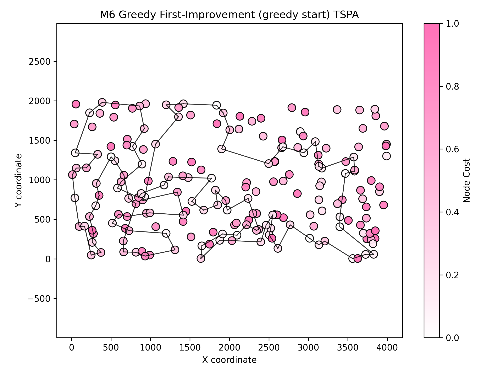
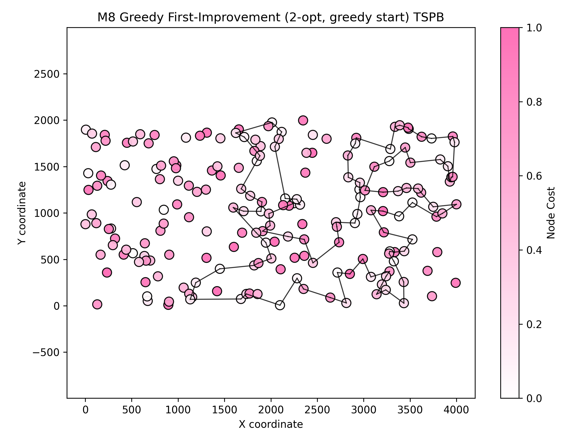

# Assignment 2 - Local search

### Prepared by

- Marianna Myszkowska 156041
- Jakub Liszyński 156060

### Problem descirption
We are given three columns of integers with a row for each node. The first two columns contain x
and y coordinates of the node positions in a plane. The third column contains node costs. The goal is
to select exactly 50% of the nodes (if the number of nodes is odd we round the number of nodes to
be selected up) and form a Hamiltonian cycle (closed path) through this set of nodes such that the
sum of the total length of the path plus the total cost of the selected nodes is minimized.
The distances between nodes are calculated as Euclidean distances rounded mathematically to
integer values. The distance matrix should be calculated just after reading an instance and then only
the distance matrix (no nodes coordinates) should be accessed by optimization methods to allow
instances defined only by distance matrices.

## Methods

### Comparison table

### Objective function (avg (min – max))

| Method | Instance 1 (TSPA) | Instance 2 (TSPB) |
|---|---:|---:| 
| Random solution | 263102 (231391 – 292542) | 212245 (194822 – 234932) |
| Nearest neighbour (append only) | 83234.5 (81598 – 88112) | 52662 (51037 – 56570) |
| Nearest neighbour (insertion at best position) | 71071.2 (69941 – 73650) | 44649.9 (43163 – 51497) |
| Greedy (fully greedy insertion) | 72694.4 (70285 – 76228) | 50345.1 (46166 – 58032) |
| Greedy 2‑regret | 72370.8 (68080 – 77702) | 114825 (105864 – 123334) |
| Greedy 2‑regret weighted (α=0.5) | 50842.2 (47367 – 54016) | 72096.1 (71062 – 73532) |
| M1 — Steepest descent, 2-node exchange (random start) | 88008.9 (80261 – 97609) | 62910.1 (56293 – 69558) |
| M2 — Steepest descent, 2-node exchange (greedy start) | 94771.5 (87362 – 101867) | 60280.5 (59303 – 63062) |
| M3 — Steepest descent, 2-edge (random start) | 73932.8 (70795 – 79370) | 48209.6 (45521 – 51880) |
| M4 — Steepest descent, 2-edge (greedy start) | 93879.3 (86202 – 99484) | 59034.7 (57620 – 61810) |
| M5 — Greedy first‑improvement, 2-node exchange (random start) | 85731 (78963 – 92428) | 60899.2 (54007 – 68549) |
| M6 — Greedy first‑improvement, 2-node exchange (greedy start) | 91366.9 (84058 – 100296) | 60717.1 (56993 – 64953) |
| M7 — Greedy first‑improvement, 2-edge (random start) | 73148.5 (71193 – 76253) | 47868.2 (45039 – 51839) |
| M8 — Greedy first‑improvement, 2-edge (greedy start) | 88224.8 (79665 – 98684) | 58988.7 (55836 – 62679) |

### Running times (seconds)

| Method | Instance 1 (TSPA) | Instance 2 (TSPB) |
|---|---:|---:|
| Random solution | 0.012564 s | 0.0098 s |
| Nearest neighbour (append only) | 0.014616 s | 0.0120 s |
| Nearest neighbour (insertion) | 49.8077 s | 50.0508 s |
| Greedy (fully greedy insertion) | 52.5566 s | 52.7421 s |
| Greedy 2‑regret | 31.67 s | 31.55 s |
| Greedy 2‑regret weighted (α=0.5) | 34.35 s | 34.16 s |
| M1 — Steepest descent, 2-node exchange (random start) | 382.404 s | 366.994 s |
| M2 — Steepest descent, 2-node exchange (greedy start) | 141.461 s | 82.1686 s |
| M3 — Steepest descent, 2-edge (random start) | 414.305 s | 416.109 s |
| M4 — Steepest descent, 2-edge (greedy start) | 177.373 s | 124.25 s |
| M5 — Greedy first‑improvement, 2-node exchange (random start) | 8.07472 s | 5.15502 s |
| M6 — Greedy first‑improvement, 2-node exchange (greedy start) | 3.36837 s | 2.17246 s |
| M7 — Greedy first‑improvement, 2-edge (random start) | 6.69207 s | 4.56621 s |
| M8 — Greedy first‑improvement, 2-edge (greedy start) | 4.25992 s | 2.75454 s |

---

### M1

#### Description
- Steepest-descent local search using 2-node exchanges (swap of two selected nodes) starting from a random feasible solution.
- Neighbourhood: all pairwise swaps of two nodes in the selected set (and inter-route selected↔not‑selected exchanges where implemented).
- Strategy: evaluate all candidate moves and apply the best (steepest) improvement; repeat until no improving move exists.

#### Pseudocode
``` pseudocode
startSolution <- random_permutation(nodes)
currentCost <- evaluate(startSolution)
improved <- true
while improved:
  improved <- false
  bestDelta <- 0
  bestMove <- null

  for i in 0..|startSolution|-2:
    for j in i+1..|startSolution|-1:
      swap(startSolution[i], startSolution[j])
      newCost <- evaluate(startSolution)
      delta <- newCost - currentCost
      if delta < bestDelta:
        bestDelta <- delta; bestMove <- (type=INTRA_SWAP,i,j)
      swap(startSolution[i], startSolution[j])

  used <- boolean vector marking nodes in startSolution
  for i in 0..|startSolution|-1:
    old <- startSolution[i]
    for newNode in 0..n-1:
      if used[newNode] then continue
      startSolution[i] <- newNode
      newCost <- evaluate(startSolution)
      delta <- newCost - currentCost
      if delta < bestDelta:
        bestDelta <- delta; bestMove <- (type=INTER_EXCHANGE,i,newNode)
    startSolution[i] <- old

  if bestDelta < 0:
    apply bestMove to startSolution (swap or replace)
    currentCost <- currentCost + bestDelta
    improved <- true
```

#### Results (summary)

| Instance | runs | avg (min – max) | Execution time |
|---|---:|---:|---:|
| TSPA | 200 | 88008.9 (80261 – 97609) | 382.404 s |
| TSPB | 200 | 62910.1 (56293 – 69558) | 366.994 s |

Best found cycle (example, TSPA):
```
193 159 181 42 43 116 65 59 118 117 93 140 68 46 115 160 184 123 127 70 135 154 86 101 1 97 121 80 137 186 15 144 21 165 138 14 102 62 9 49 178 106 55 129 2 152 189 94 124 179 31 56 113 175 171 16 120 75 26 100 53 158 180 162 151 133 79 63 52 185 40 90 81 196 145 78 25 44 92 57 148 23 89 183 143 0 176 51 149 112 4 177 54 34 22 18 108 69 139 41 193 (back to start)
```


Best found cycle (example, TSPB):
```
163 103 194 166 86 95 130 60 20 28 149 4 152 140 183 148 47 94 66 179 185 55 18 62 104 5 142 175 78 177 8 82 21 61 36 45 80 190 117 1 63 40 107 133 10 191 90 122 135 131 51 134 34 170 184 155 15 145 139 11 29 0 35 111 141 77 81 153 159 143 3 70 188 169 132 13 195 168 160 33 138 25 73 164 193 31 54 121 125 71 147 6 109 124 106 176 113 114 127 89 163 (back to start)
```


### M2

#### Description
- Steepest-descent local search using 2-node exchanges but starting from a greedy feasible solution (best-insertion construction).

#### Pseudocode
``` pseudocode
startSolution <- construct_greedy_insertion(random_start_node)
currentCost <- evaluate(startSolution)
improved <- true
while improved:
  improved <- false
  bestDelta <- 0
  bestMove <- null

  for i in 0..|startSolution|-2:
    for j in i+1..|startSolution|-1:
      swap(startSolution[i], startSolution[j])
      newCost <- evaluate(startSolution)
      delta <- newCost - currentCost
      if delta < bestDelta:
        bestDelta <- delta; bestMove <- (INTRA_SWAP,i,j)
      swap(startSolution[i], startSolution[j])

  used <- boolean vector marking nodes in startSolution
  for i in 0..|startSolution|-1:
    old <- startSolution[i]
    for newNode in 0..n-1:
      if used[newNode] then continue
      startSolution[i] <- newNode
      newCost <- evaluate(startSolution)
      delta <- newCost - currentCost
      if delta < bestDelta:
        bestDelta <- delta; bestMove <- (INTER_EXCHANGE,i,newNode)
    startSolution[i] <- old

  if bestDelta < 0:
    apply bestMove
    currentCost <- currentCost + bestDelta
    improved <- true
```

#### Results (summary)

| Instance | runs | avg (min – max) | Execution time |
|---|---:|---:|---:|
| TSPA | 200 | 94771.5 (87362 – 101867) | 141.461 s |
| TSPB | 200 | 60280.5 (59303 – 63062) | 82.1686 s |

Best found cycle (example, TSPA):
```
153 0 170 143 117 93 140 36 68 46 198 139 115 96 5 42 43 77 118 109 51 137 23 94 124 148 62 49 178 106 185 40 145 78 44 120 2 152 97 1 101 75 86 26 100 53 158 154 70 127 194 135 180 136 121 63 122 79 133 162 45 151 80 176 72 59 116 105 65 47 131 149 123 48 54 30 177 10 190 4 112 84 35 184 160 34 181 41 193 159 146 22 199 18 69 108 186 114 89 183 153 (back to start)
```


Best found cycle (example, TSPB):
```
9 183 174 83 181 95 130 99 22 179 57 172 52 185 86 166 194 88 113 26 103 114 137 127 165 89 163 186 187 146 97 77 141 91 36 61 82 21 177 25 104 56 33 138 182 139 188 169 195 168 11 49 39 29 109 35 0 12 160 144 8 111 37 41 14 81 153 129 180 176 64 110 128 106 119 159 143 124 62 18 55 34 170 152 53 140 199 4 149 101 28 59 20 23 60 148 47 154 94 66 9 (back to start)
```


### M3

#### Description
- Steepest-descent local search using 2-edge (2-opt) exchanges starting from a random feasible solution.

#### Pseudocode
``` pseudocode
startSolution <- random_permutation(nodes)
currentCost <- evaluate(startSolution)
improved <- true
while improved:
  improved <- false
  bestDelta <- 0
  bestMove <- null

  for i in 0..|startSolution|-2:
    for j in i+1..|startSolution|-1:
      reverse segment startSolution[i..j]
      newCost <- evaluate(startSolution)
      delta <- newCost - currentCost
      if delta < bestDelta:
        bestDelta <- delta; bestMove <- (type=2OPT,i,j)
      reverse segment startSolution[i..j]

  used <- boolean vector marking nodes in startSolution
  for i in 0..|startSolution|-1:
    old <- startSolution[i]
    for newNode in 0..n-1:
      if used[newNode] then continue
      startSolution[i] <- newNode
      newCost <- evaluate(startSolution)
      delta <- newCost - currentCost
      if delta < bestDelta:
        bestDelta <- delta; bestMove <- (INTER_EXCHANGE,i,newNode)
    startSolution[i] <- old

  if bestDelta < 0:
    apply bestMove (reverse or replace)
    currentCost <- currentCost + bestDelta
    improved <- true
```

#### Results (summary)

| Instance | runs | avg (min – max) | Execution time |
|---|---:|---:|---:|
| TSPA | 200 | 73932.8 (70795 – 79370) | 414.305 s |
| TSPB | 200 | 48209.6 (45521 – 51880) | 416.109 s |

Best found cycle (example, TSPA):
```
157 31 56 113 175 171 16 44 120 25 78 145 179 57 92 129 2 75 86 101 1 152 97 26 100 53 158 180 154 135 70 127 123 112 4 190 10 177 54 184 160 34 146 22 159 193 41 181 42 5 43 65 116 115 46 68 139 18 108 140 93 117 0 170 143 183 89 23 137 176 80 51 59 162 151 133 79 122 63 94 124 148 9 62 102 144 14 49 3 178 106 52 55 185 40 119 165 90 81 196 157 (back to start)
```


Best found cycle (example, TSPB):
```
141 61 36 177 5 45 142 78 175 80 190 136 73 54 31 193 117 198 1 16 27 38 135 63 100 40 107 133 122 90 121 51 147 6 188 169 132 13 70 3 15 145 168 139 11 182 138 33 160 144 104 8 21 82 111 29 0 109 35 143 106 124 128 62 18 55 34 183 140 4 149 28 59 20 60 148 47 94 66 57 172 179 22 99 95 185 86 166 194 88 176 180 113 103 89 163 153 81 77 97 141 (back to start)
```


### M4

#### Description
- Steepest-descent local search using 2-edge (2-opt) exchanges starting from a greedy feasible solution.

#### Pseudocode
``` pseudocode
startSolution <- construct_greedy_insertion(random_start_node)
currentCost <- evaluate(startSolution)
improved <- true
while improved:
  improved <- false
  bestDelta <- 0
  bestMove <- null

  for i in 0..|startSolution|-2:
    for j in i+1..|startSolution|-1:
      reverse startSolution[i..j]
      newCost <- evaluate(startSolution)
      delta <- newCost - currentCost
      if delta < bestDelta:
        bestDelta <- delta; bestMove <- (2OPT,i,j)
      reverse startSolution[i..j]

  used <- boolean vector marking nodes in startSolution
  for i in 0..|startSolution|-1:
    old <- startSolution[i]
    for newNode in 0..n-1:
      if used[newNode] then continue
      startSolution[i] <- newNode
      newCost <- evaluate(startSolution)
      delta <- newCost - currentCost
      if delta < bestDelta:
        bestDelta <- delta; bestMove <- (INTER_EXCHANGE,i,newNode)
    startSolution[i] <- old

  if bestDelta < 0:
    apply bestMove
    currentCost <- currentCost + bestDelta
    improved <- true
```

#### Results (summary)

| Instance | runs | avg (min – max) | Execution time |
|---|---:|---:|---:|
| TSPA | 200 | 93879.3 (86202 – 99484) | 177.373 s |
| TSPB | 200 | 59034.7 (57620 – 61810) | 124.25 s |

Best found cycle (example, TSPA):
```
153 0 170 143 117 93 140 36 108 69 18 199 22 146 181 34 160 48 54 177 10 190 4 112 84 184 35 123 24 149 131 47 65 116 105 43 42 5 96 41 193 159 139 68 46 198 115 197 59 118 109 51 72 151 45 162 133 79 122 63 136 180 135 194 127 70 6 154 158 53 121 100 26 86 75 101 1 97 152 2 120 44 78 145 185 106 178 49 62 148 124 94 80 176 66 137 23 186 89 183 153 (back to start)
```


Best found cycle (example, TSPB):
```
25 104 56 8 111 82 87 21 36 141 97 77 81 153 106 124 62 18 55 34 143 35 109 0 29 144 160 33 49 11 138 182 139 43 168 195 126 13 145 15 3 70 161 132 169 65 188 6 150 192 147 85 134 2 74 118 98 51 120 67 71 191 90 133 122 135 131 121 112 19 151 198 24 1 197 16 38 27 42 156 30 117 193 31 54 164 73 173 136 105 190 80 46 162 175 78 142 45 5 177 25 (back to start)
```


### M5

#### Description 
Description  
- Greedy (first‑improvement) local search that mixes intra‑route swaps and inter‑route selected↔not‑selected exchanges.  
- Start: random feasible solution.  
- Neighbourhood: inter‑route (selected ↔ not‑selected exchange) + intra‑route two‑nodes exchange (swap).  
- Strategy: inspect moves in random order and apply the first improving move; repeat until no improvement.

#### Pseudocode
``` pseudocode
startSolution <- random_permutation(nodes)          // random start visit set
improved <- true
while improved:
  improved <- false
  moves <- random_order( two_node_swaps(startSolution) ++ inter_route_replacements(startSolution) )
  for move in moves:
    if delta(move) < 0:
      apply(move)
      improved <- true
      break
return startSolution
```

#### Results (summary)

| Instance | runs | avg (min – max) | Execution time |
|---|---:|---:|---:|
| TSPA (../TSPA.csv) | 200 | 85731 (78963 – 92428) |	8.07472 s |
| TSPB (../TSPB.csv) | 200 | 60899.2 (54007 – 68549) |	5.15502 s |

Best found cycles (one example)

TSPA best cycle:
```
46 118 51 89 183 143 0 117 93 140 108 18 159 193 41 34 160 54 177 4 112 84 146 22 195 181 43 116 65 59 94 129 92 179 145 78 31 56 25 82 57 55 52 178 106 185 165 39 27 90 81 2 75 101 86 100 26 97 1 152 167 49 102 62 9 148 63 79 80 176 137 23 186 15 144 14 138 40 196 113 175 171 16 44 120 53 70 135 154 180 133 151 162 123 149 184 42 5 115 139 46 (back to start)
```

TSPB best cycle:
```
180 176 106 124 62 183 140 149 28 20 148 47 94 66 179 166 194 163 153 77 8 121 131 107 40 63 102 135 122 90 51 147 6 188 169 132 15 145 13 126 195 168 109 35 0 29 139 11 144 111 103 26 114 137 127 89 165 187 146 97 141 91 61 36 177 5 78 175 45 80 190 193 117 31 54 25 104 86 185 130 95 18 55 34 170 152 184 155 3 70 161 134 118 74 182 138 33 160 143 113 180 (back to start)
```


### M6

#### Description 
- Greedy (first‑improvement) local search using the same neighbourhood as M5 (intra‑route swaps + inter‑route selected↔not‑selected exchanges).  
- Start: greedy feasible solution constructed by insertion at best position with a random start node.  
- Neighbourhood: inter‑route (selected ↔ not‑selected exchange) + intra‑route two‑nodes exchange (swap).  
- Strategy: construct greedy start, inspect two‑node exchange moves in random order and apply the first improving move; repeat until no improvement.

#### Pseudocode
``` pseudocode
startNode <- random_choice(nodes)
startSolution <- construct_greedy_insertion(startNode)   // greedy construction
improved <- true
while improved:
  improved <- false
  moves <- random_order( two_node_swaps(startSolution) ++ inter_route_replacements(startSolution) )
  for move in moves:
    if delta(move) < 0:
      apply(move)
      improved <- true
      break
return startSolution
```

#### Results (summary)

| Instance | runs | avg (min – max) | Execution time |
|---|---:|---:|---:|
| TSPA (../TSPA.csv) | 200 | 91366.9 (84058 – 100296) | 3.36837 s |
| TSPB (../TSPB.csv) | 200 | 60717.1 (56993 – 64953) | 2.17246 s |

Best found cycles (one example)

TSPA best cycle:
```
0 46 65 47 72 162 149 131 166 28 184 35 123 127 29 156 112 4 84 77 43 96 41 193 181 192 160 48 104 177 190 10 54 30 34 103 146 195 159 22 18 108 140 68 139 115 5 42 105 116 59 118 51 176 151 133 79 80 122 63 94 26 100 121 53 180 135 70 154 158 86 97 152 1 101 75 2 120 44 25 16 171 175 78 145 185 40 165 106 178 14 49 62 148 137 23 89 183 143 117 0 (back to start)
```

TSPB best cycle:
```
147 192 150 6 188 65 169 132 161 70 3 15 145 13 126 195 168 49 33 56 144 160 29 0 109 35 34 18 62 124 106 86 176 113 153 81 77 141 91 36 61 21 87 82 111 8 104 138 182 11 139 43 134 85 74 118 98 51 120 67 71 191 90 122 131 121 116 112 19 151 24 1 197 135 63 38 27 16 42 156 198 117 193 31 54 164 73 173 136 190 80 46 162 175 78 142 45 5 177 25 147 (back to start)
```


### M7

#### Description 
- Greedy (first‑improvement) local search using 2‑edge exchanges (2‑opt).  
- Start: random feasible solution.  
- Neighbourhood: intra‑route 2‑opt moves combined with inter‑route selected↔not‑selected exchanges.  
- Strategy: randomly shuffle candidate 2‑opt moves (and inter‑route exchanges), apply the first move that improves the objective, repeat until no improvement.

#### Pseudocode
``` pseudocode
startSolution <- random_permutation(nodes)
improved <- true
while improved:
  improved <- false
  moves <- random_order( two_opt_moves(startSolution) ++ inter_route_replacements(startSolution) )
  for move in moves:
    if delta(move) < 0:
      apply(move)            // for 2-opt: reverse subsequence; for inter-route: replace node
      improved <- true
      break
return startSolution
```

#### Results (summary)

| Instance | runs | avg (min – max) | Execution time |
|---|---:|---:|---:|
| TSPA (../TSPA.csv) | 200 | 73148.5 (71193 – 76253) | 6.69207 s |
| TSPB (../TSPB.csv) | 200 | 47868.2 (45039 – 51839) | 4.56621 s |

Best found cycle (example, TSPA):
```
62 144 14 49 3 178 106 185 40 119 165 90 81 196 31 56 113 175 171 16 78 145 179 52 55 57 92 129 25 44 120 2 152 1 75 86 101 97 26 100 53 158 180 154 135 70 127 123 35 84 112 4 190 10 177 54 184 160 34 181 146 22 41 193 18 108 140 68 46 0 117 143 183 89 186 23 137 176 51 118 59 115 139 42 43 116 65 131 149 162 151 133 79 80 122 63 94 124 148 9 62 (back to start)
```


Best found cycle (example, TSPB):
```
113 26 103 114 137 127 165 89 163 153 77 141 91 79 61 36 177 5 78 175 142 45 162 80 190 136 73 164 54 31 193 117 198 1 135 63 40 107 122 131 121 51 90 191 147 188 169 132 70 3 15 145 13 195 168 139 11 138 33 160 104 21 82 8 111 144 29 0 109 35 143 159 106 124 62 18 55 34 152 183 140 4 149 28 20 60 148 47 94 66 179 22 99 95 185 86 166 194 176 180 113 (back to start)
```


### M8

#### Description 
- Greedy (first‑improvement) local search using 2‑edge exchanges (2‑opt).  
- Start: greedy feasible solution constructed by best‑insertion with a random start node.  
- Neighbourhood and strategy: same as M7, but starting from the greedy insertion solution.

#### Pseudocode
``` pseudocode
startNode <- random_choice(nodes)
startSolution <- construct_greedy_insertion(startNode)
improved <- true
while improved:
  improved <- false
  moves <- random_order( two_opt_moves(startSolution) ++ inter_route_replacements(startSolution) )
  for move in moves:
    if delta(move) < 0:
      apply(move)
      improved <- true
      break
return startSolution
```

#### Results (summary)

| Instance | runs | avg (min – max) | Execution time |
|---|---:|---:|---:|
| TSPA (../TSPA.csv) | 200 | 88224.8 (79665 – 98684) | 4.25992 s |
| TSPB (../TSPB.csv) | 200 | 58988.7 (55836 – 62679) | 2.75454 s |

Best found cycle (example, TSPA):
```
198 115 96 5 42 160 48 54 30 177 10 190 4 112 84 35 184 28 43 105 116 65 47 131 149 24 123 162 151 72 59 118 51 176 80 79 133 194 127 70 135 154 158 53 180 63 94 124 152 1 97 26 100 86 101 75 2 120 44 16 78 145 40 185 55 52 106 178 49 14 144 62 9 148 137 23 89 183 143 170 0 117 93 140 36 108 69 18 22 146 34 181 195 159 193 41 139 110 68 46 198 (back to start)
```


Best found cycle (example, TSPB):
```
141 61 36 175 5 177 21 87 82 8 104 182 138 33 49 11 139 168 195 169 188 70 3 145 29 109 35 0 160 144 56 111 41 81 119 159 143 106 124 62 18 55 34 170 152 53 140 4 149 101 28 59 20 23 60 154 94 66 47 148 9 199 183 174 83 181 95 130 99 22 179 57 172 52 185 86 110 128 64 166 194 88 176 180 113 114 137 127 165 89 103 26 163 129 186 153 187 146 97 77 141 (back to start)
```


## Conclusions

This assignment explored greedy regret-based heuristics for the TSP with node selection, comparing standard 2-regret against a weighted variant that combines regret with greedy objective minimization.

---

### Outcomes were checked with the solution checker

### Link to the source code (Github repository - directory Assignment 3)

[Assignment 3](https://github.com/Strajkerr/EvolutionaryComputing/tree/main/Assignment_3)
