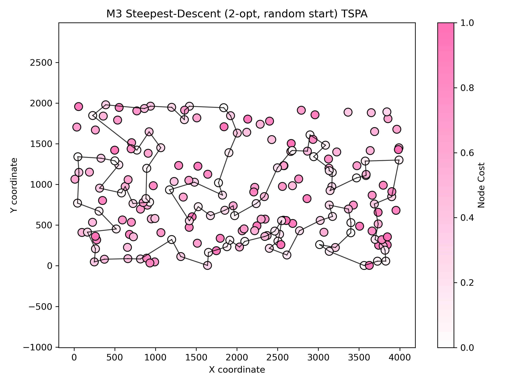
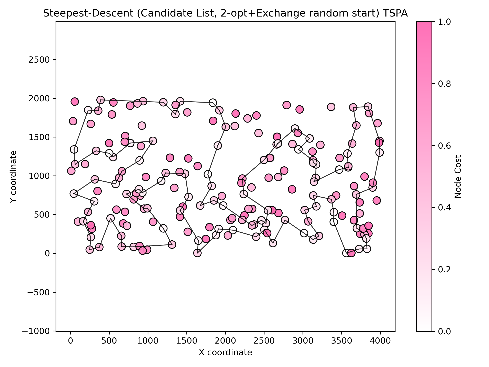
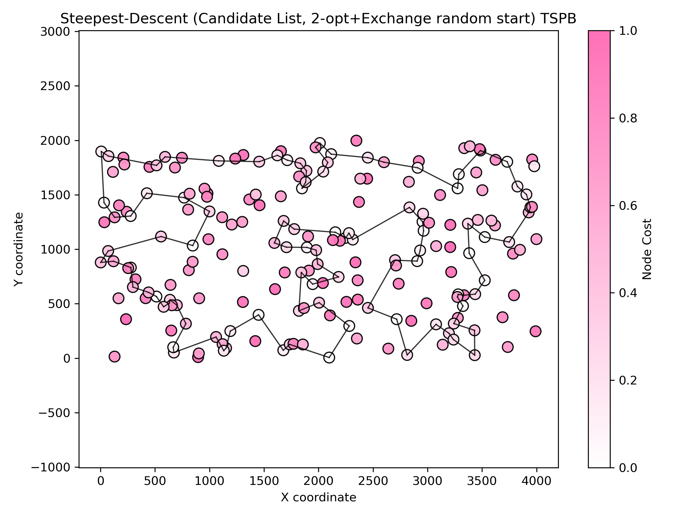

# Assignment 4 - Local search with candidate list

### Prepared by

- Marianna Myszkowska 156041
- Jakub Liszyński 156060

### Problem descirption
We are given three columns of integers with a row for each node. The first two columns contain x
and y coordinates of the node positions in a plane. The third column contains node costs. The goal is
to select exactly 50% of the nodes (if the number of nodes is odd we round the number of nodes to
be selected up) and form a Hamiltonian cycle (closed path) through this set of nodes such that the
sum of the total length of the path plus the total cost of the selected nodes is minimized.
The distances between nodes are calculated as Euclidean distances rounded mathematically to
integer values. The distance matrix should be calculated just after reading an instance and then only
the distance matrix (no nodes coordinates) should be accessed by optimization methods to allow
instances defined only by distance matrices.

## Methods

### Comparison table

### Objective function (avg (min – max))

| Method | Instance 1 (TSPA) | Instance 2 (TSPB) |
|---|---:|---:| 
| Random solution | 263102 (231391 – 292542) | 212245 (194822 – 234932) |
| Nearest neighbour (append only) | 83234.5 (81598 – 88112) | 52662 (51037 – 56570) |
| Nearest neighbour (insertion at best position) | 71071.2 (69941 – 73650) | 44649.9 (43163 – 51497) |
| Greedy (fully greedy insertion) | 72694.4 (70285 – 76228) | 50345.1 (46166 – 58032) |
| Greedy 2‑regret | 72370.8 (68080 – 77702) | 114825 (105864 – 123334) |
| Greedy 2‑regret weighted (α=0.5) | 50842.2 (47367 – 54016) | 72096.1 (71062 – 73532) |
| M1 — Steepest descent, 2-node exchange (random start) | 88008.9 (80261 – 97609) | 62910.1 (56293 – 69558) |
| M2 — Steepest descent, 2-node exchange (greedy start) | 94771.5 (87362 – 101867) | 60280.5 (59303 – 63062) |
| M3 — Steepest descent, 2-edge (random start) | 73932.8 (70795 – 79370) | 48209.6 (45521 – 51880) |
| M4 — Steepest descent, 2-edge (greedy start) | 93879.3 (86202 – 99484) | 59034.7 (57620 – 61810) |
| M5 — Greedy first‑improvement, 2-node exchange (random start) | 85731 (78963 – 92428) | 60899.2 (54007 – 68549) |
| M6 — Greedy first‑improvement, 2-node exchange (greedy start) | 91366.9 (84058 – 100296) | 60717.1 (56993 – 64953) |
| M7 — Greedy first‑improvement, 2-edge (random start) | 73148.5 (71193 – 76253) | 47868.2 (45039 – 51839) |
| M8 — Greedy first‑improvement, 2-edge (greedy start) | 88224.8 (79665 – 98684) | 58988.7 (55836 – 62679) |
| Candidate List Steepest descent | 77528.3 (73143 - 84209) | 48340.6 (45340 - 51885) |

### Running times (seconds)

| Method | Instance 1 (TSPA) | Instance 2 (TSPB) |
|---|---:|---:|
| Random solution | 0.012564 s | 0.0098 s |
| Nearest neighbour (append only) | 0.014616 s | 0.0120 s |
| Nearest neighbour (insertion) | 49.8077 s | 50.0508 s |
| Greedy (fully greedy insertion) | 52.5566 s | 52.7421 s |
| Greedy 2‑regret | 31.67 s | 31.55 s |
| Greedy 2‑regret weighted (α=0.5) | 34.35 s | 34.16 s |
| M1 — Steepest descent, 2-node exchange (random start) | 382.404 s | 366.994 s |
| M2 — Steepest descent, 2-node exchange (greedy start) | 141.461 s | 82.1686 s |
| M3 — Steepest descent, 2-edge (random start) | 414.305 s | 416.109 s |
| M4 — Steepest descent, 2-edge (greedy start) | 177.373 s | 124.25 s |
| M5 — Greedy first‑improvement, 2-node exchange (random start) | 8.07472 s | 5.15502 s |
| M6 — Greedy first‑improvement, 2-node exchange (greedy start) | 3.36837 s | 2.17246 s |
| M7 — Greedy first‑improvement, 2-edge (random start) | 6.69207 s | 4.56621 s |
| M8 — Greedy first‑improvement, 2-edge (greedy start) | 4.25992 s | 2.75454 s |
| Candidate List Steepest descent | 0.82824 s | 0.899243 s |

---

## Steepest Descent with 2-edges exchange

#### Description
- Steepest-descent local search using 2-edge (2-opt) exchanges starting from a random feasible solution.

#### Pseudocode
``` pseudocode
startSolution <- random_permutation(nodes)
currentCost <- evaluate(startSolution)
improved <- true
while improved:
  improved <- false
  bestDelta <- 0
  bestMove <- null

  for i in 0..|startSolution|-2:
    for j in i+1..|startSolution|-1:
      reverse segment startSolution[i..j]
      newCost <- evaluate(startSolution)
      delta <- newCost - currentCost
      if delta < bestDelta:
        bestDelta <- delta; bestMove <- (type=2OPT,i,j)
      reverse segment startSolution[i..j]

  used <- boolean vector marking nodes in startSolution
  for i in 0..|startSolution|-1:
    old <- startSolution[i]
    for newNode in 0..n-1:
      if used[newNode] then continue
      startSolution[i] <- newNode
      newCost <- evaluate(startSolution)
      delta <- newCost - currentCost
      if delta < bestDelta:
        bestDelta <- delta; bestMove <- (INTER_EXCHANGE,i,newNode)
    startSolution[i] <- old

  if bestDelta < 0:
    apply bestMove (reverse or replace)
    currentCost <- currentCost + bestDelta
    improved <- true
```

#### Results (summary)

| Instance | runs | avg (min – max) | Execution time |
|---|---:|---:|---:|
| TSPA | 200 | 73932.8 (70795 – 79370) | 414.305 s |
| TSPB | 200 | 48209.6 (45521 – 51880) | 416.109 s |

Best found cycle (example, TSPA):
```
157 31 56 113 175 171 16 44 120 25 78 145 179 57 92 129 2 75 86 101 1 152 97 26 100 53 158 180 154 135 70 127 123 112 4 190 10 177 54 184 160 34 146 22 159 193 41 181 42 5 43 65 116 115 46 68 139 18 108 140 93 117 0 170 143 183 89 23 137 176 80 51 59 162 151 133 79 122 63 94 124 148 9 62 102 144 14 49 3 178 106 52 55 185 40 119 165 90 81 196 157 (back to start)
```



Best found cycle (example, TSPB):
```
141 61 36 177 5 45 142 78 175 80 190 136 73 54 31 193 117 198 1 16 27 38 135 63 100 40 107 133 122 90 121 51 147 6 188 169 132 13 70 3 15 145 168 139 11 182 138 33 160 144 104 8 21 82 111 29 0 109 35 143 106 124 128 62 18 55 34 183 140 4 149 28 59 20 60 148 47 94 66 57 172 179 22 99 95 185 86 166 194 88 176 180 113 103 89 163 153 81 77 97 141 (back to start)
```


## Steepes Descent with candidate list

### Pseudocode

#### Candidate list generation

```
Function Create_Candidate_List(distanceMatrix, costVector, total_size, K):
    // Initialize an empty list of neighbors for each node
    candidateList = new List[total_size]
    
    For u from 0 to total_size - 1:
        neighbor_metrics = new List()
        
        For v from 0 to total_size - 1:
            If u == v:
                continue
            
            // Define the "nearness" metric as per the task
            metric = distanceMatrix[u][v] + costVector[v]
            Add (metric, v) to neighbor_metrics
        
        // Sort neighbors by the metric, from smallest to largest
        Sort(neighbor_metrics)
        
        // Add the K nearest neighbors to the candidate list for node u
        For i from 0 to K - 1:
            If i >= size of neighbor_metrics:
                break
            v = neighbor_metrics[i].node_id
            Add v to candidateList[u]
            
    Return candidateList
```
#### Method

```
    improved = true
    While improved == true:
        improved = false
        bestDelta = 0
        bestMove = null
        
        used_nodes_map = Create_Map_From_Solution(solution)
        node_position_map = Create_Position_Map_From_Solution(solution)
        
        For u_pos from 0 to solution.size - 1:
            u = solution[u_pos]
            
            For v in candidateList[u]:
                If u == v:
                    continue
                    
                If used_nodes_map.contains(v):
                    v_pos = node_position_map[v]
                    If u and v are already adjacent in the solution cycle:
                        continue

                    delta1 = Calculate_Delta_For_2_Opt_Move_1(u, v, u_pos, v_pos, solution)
                    If delta1 < bestDelta:
                        bestDelta = delta1
                        bestMove = ("INTRA_2-OPT", u_pos, v_pos_prev)

                    delta2 = Calculate_Delta_For_2_Opt_Move_2(u, v, u_pos, v_pos, solution)
                    If delta2 < bestDelta:
                        bestDelta = delta2
                        bestMove = ("INTRA_2-OPT", u_pos_next, v_pos)
                        
                Else:
                    w_pos = (u_pos + 1) % solution.size
                    delta3 = Calculate_Delta_For_Exchange_Move(u, v, w_pos, solution)
                    If delta3 < bestDelta:
                        bestDelta = delta3
                        bestMove = ("INTER_EXCHANGE", w_pos, v)

                    w_pos = (u_pos - 1 + solution.size) % solution.size
                    delta4 = Calculate_Delta_For_Exchange_Move(u, v, w_pos, solution)
                    If delta4 < bestDelta:
                        bestDelta = delta4
                        bestMove = ("INTER_EXCHANGE", w_pos, v)
        
        If bestDelta < 0:
            improved = true
            currentCost += bestDelta
            Apply_Move(solution, bestMove)
        
```

#### Results (summary)

| Instance | runs | avg (min – max) | Execution time |
|---|---:|---:|---:|
| TSPA | 200 | 77528.3 (73143 - 84209) | 0.82824 s | 
| TSPB | 200 | 48340.6 (45340 - 51885) | 0.89924 s |

Best found cycle (example, TSPA):
```
101 75 2 120 44 25 82 129 92 57 179 145 78 16 171 175 113 56 31 196 81 90 27 164 7 95 165 40 185 55 52 106 178 3 49 14 144 62 148 12 94 152 1 97 100 63 79 133 80 176 137 23 89 183 143 0 117 108 69 18 22 146 159 193 41 139 46 115 96 42 181 34 160 48 54 177 10 190 184 84 4 112 127 123 149 131 43 116 65 59 118 51 151 162 135 70 154 180 53 86 101
```



Best found cycle (example, TSPB):
```
139 11 29 0 109 35 34 18 62 124 106 143 81 153 187 163 89 127 137 114 103 113 180 176 88 194 166 86 95 185 179 66 94 47 148 20 28 140 183 152 184 155 3 70 161 15 145 168 195 13 132 169 188 6 147 10 133 107 40 63 102 135 122 90 51 121 131 38 27 16 1 156 198 117 193 31 54 73 136 190 80 45 175 78 5 177 36 61 141 77 82 21 104 8 111 144 160 33 138 182 139
```



## Conclusions

The experiments show a clear trade-off between solution quality and running time across the tested methods.

- Quality: the steepest‑descent methods that use full evaluation (M1–M4) can produce good-quality solutions (M3 produced the best averages among full-eval steepest variants), but they are very expensive in wall-clock time because the code recomputes the full objective for every candidate move.

- Speed vs. quality: the Candidate‑List steepest descent achieves nearly the same or better solution quality than most full-eval steepest‑descent runs. This demonstrates that restricting the neighbourhood to a small, well-chosen candidate set is an effective way to keep high-quality moves while dramatically reducing evaluation cost.

- Greedy heuristics: the regret-based greedy variants (including the weighted 2‑regret) produce competitive solutions with moderate running time and remain good options when very fast, simple construction is needed.


### Outcomes were checked with the solution checker

### Link to the source code (Github repository - directory Assignment 4)

[Assignment 4](https://github.com/Strajkerr/EvolutionaryComputing)
