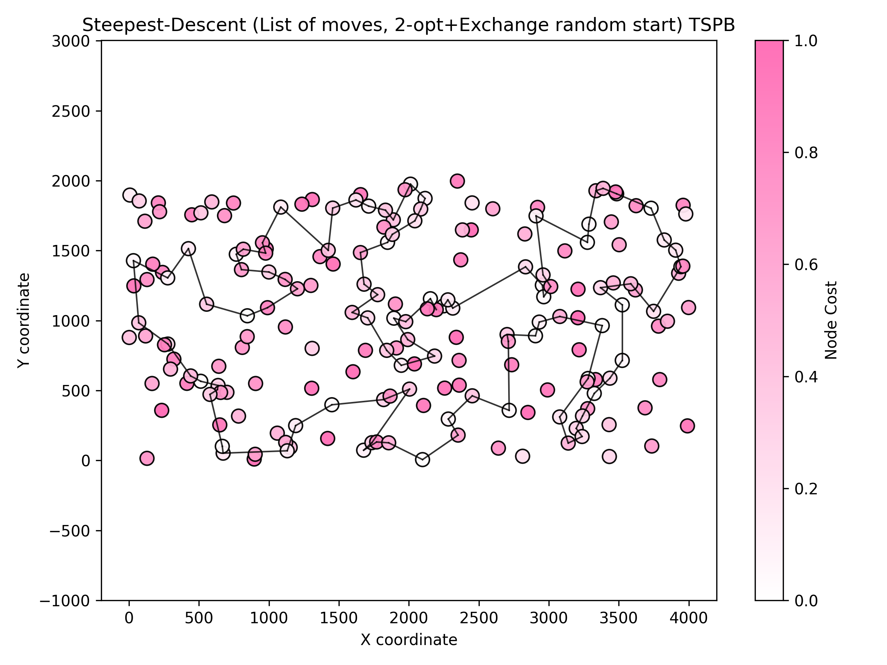

# Assignment 5 - Local search with list of moves

### Prepared by

- Marianna Myszkowska 156041
- Jakub Liszyński 156060

### Problem descirption
We are given three columns of integers with a row for each node. The first two columns contain x
and y coordinates of the node positions in a plane. The third column contains node costs. The goal is
to select exactly 50% of the nodes (if the number of nodes is odd we round the number of nodes to
be selected up) and form a Hamiltonian cycle (closed path) through this set of nodes such that the
sum of the total length of the path plus the total cost of the selected nodes is minimized.
The distances between nodes are calculated as Euclidean distances rounded mathematically to
integer values. The distance matrix should be calculated just after reading an instance and then only
the distance matrix (no nodes coordinates) should be accessed by optimization methods to allow
instances defined only by distance matrices.

## Methods

### Comparison table

### Objective function (avg (min – max))

| Method | Instance 1 (TSPA) | Instance 2 (TSPB) |
|---|---:|---:| 
| Random solution | 263102 (231391 – 292542) | 212245 (194822 – 234932) |
| Nearest neighbour (append only) | 83234.5 (81598 – 88112) | 52662 (51037 – 56570) |
| Nearest neighbour (insertion at best position) | 71071.2 (69941 – 73650) | 44649.9 (43163 – 51497) |
| Greedy (fully greedy insertion) | 72694.4 (70285 – 76228) | 50345.1 (46166 – 58032) |
| Greedy 2‑regret | 72370.8 (68080 – 77702) | 114825 (105864 – 123334) |
| Greedy 2‑regret weighted (α=0.5) | 50842.2 (47367 – 54016) | 72096.1 (71062 – 73532) |
| M1 — Steepest descent, 2-node exchange (random start) | 88008.9 (80261 – 97609) | 62910.1 (56293 – 69558) |
| M2 — Steepest descent, 2-node exchange (greedy start) | 94771.5 (87362 – 101867) | 60280.5 (59303 – 63062) |
| M3 — Steepest descent, 2-edge (random start) | 73932.8 (70795 – 79370) | 48209.6 (45521 – 51880) |
| M4 — Steepest descent, 2-edge (greedy start) | 93879.3 (86202 – 99484) | 59034.7 (57620 – 61810) |
| M5 — Greedy first‑improvement, 2-node exchange (random start) | 85731 (78963 – 92428) | 60899.2 (54007 – 68549) |
| M6 — Greedy first‑improvement, 2-node exchange (greedy start) | 91366.9 (84058 – 100296) | 60717.1 (56993 – 64953) |
| M7 — Greedy first‑improvement, 2-edge (random start) | 73148.5 (71193 – 76253) | 47868.2 (45039 – 51839) |
| M8 — Greedy first‑improvement, 2-edge (greedy start) | 88224.8 (79665 – 98684) | 58988.7 (55836 – 62679) |
| Candidate List Steepest descent | 77528.3 (73143 - 84209) | 48340.6 (45340 - 51885) |
| List of moves Steepest descent | 74444.5 (70453 - 79976) | 49121.1 (45898 - 52188) |

### Running times (seconds)

| Method | Instance 1 (TSPA) | Instance 2 (TSPB) |
|---|---:|---:|
| Random solution | 0.012564 s | 0.0098 s |
| Nearest neighbour (append only) | 0.014616 s | 0.0120 s |
| Nearest neighbour (insertion) | 49.8077 s | 50.0508 s |
| Greedy (fully greedy insertion) | 52.5566 s | 52.7421 s |
| Greedy 2‑regret | 31.67 s | 31.55 s |
| Greedy 2‑regret weighted (α=0.5) | 34.35 s | 34.16 s |
| M1 — Steepest descent, 2-node exchange (random start) | 382.404 s | 366.994 s |
| M2 — Steepest descent, 2-node exchange (greedy start) | 141.461 s | 82.1686 s |
| M3 — Steepest descent, 2-edge (random start) | 414.305 s | 416.109 s |
| M4 — Steepest descent, 2-edge (greedy start) | 177.373 s | 124.25 s |
| M5 — Greedy first‑improvement, 2-node exchange (random start) | 8.07472 s | 5.15502 s |
| M6 — Greedy first‑improvement, 2-node exchange (greedy start) | 3.36837 s | 2.17246 s |
| M7 — Greedy first‑improvement, 2-edge (random start) | 6.69207 s | 4.56621 s |
| M8 — Greedy first‑improvement, 2-edge (greedy start) | 4.25992 s | 2.75454 s |
| Candidate List Steepest descent | 0.82824 s | 0.899243 s |
| List of moves Steepest descent | 16.4443 s | 16.6364 s |

---

## Steepest Descent with 2-edges exchange

#### Description
- Steepest-descent local search using 2-edge (2-opt) exchanges starting from a random feasible solution.

#### Pseudocode
``` pseudocode
startSolution <- random_permutation(nodes)
currentCost <- evaluate(startSolution)
improved <- true
while improved:
  improved <- false
  bestDelta <- 0
  bestMove <- null

  for i in 0..|startSolution|-2:
    for j in i+1..|startSolution|-1:
      reverse segment startSolution[i..j]
      newCost <- evaluate(startSolution)
      delta <- newCost - currentCost
      if delta < bestDelta:
        bestDelta <- delta; bestMove <- (type=2OPT,i,j)
      reverse segment startSolution[i..j]

  used <- boolean vector marking nodes in startSolution
  for i in 0..|startSolution|-1:
    old <- startSolution[i]
    for newNode in 0..n-1:
      if used[newNode] then continue
      startSolution[i] <- newNode
      newCost <- evaluate(startSolution)
      delta <- newCost - currentCost
      if delta < bestDelta:
        bestDelta <- delta; bestMove <- (INTER_EXCHANGE,i,newNode)
    startSolution[i] <- old

  if bestDelta < 0:
    apply bestMove (reverse or replace)
    currentCost <- currentCost + bestDelta
    improved <- true
```

#### Results (summary)

| Instance | runs | avg (min – max) | Execution time |
|---|---:|---:|---:|
| TSPA | 200 | 73932.8 (70795 – 79370) | 414.305 s |
| TSPB | 200 | 48209.6 (45521 – 51880) | 416.109 s |

Best found cycle (example, TSPA):
```
157 31 56 113 175 171 16 44 120 25 78 145 179 57 92 129 2 75 86 101 1 152 97 26 100 53 158 180 154 135 70 127 123 112 4 190 10 177 54 184 160 34 146 22 159 193 41 181 42 5 43 65 116 115 46 68 139 18 108 140 93 117 0 170 143 183 89 23 137 176 80 51 59 162 151 133 79 122 63 94 124 148 9 62 102 144 14 49 3 178 106 52 55 185 40 119 165 90 81 196 157 (back to start)
```


Best found cycle (example, TSPB):
```
141 61 36 177 5 45 142 78 175 80 190 136 73 54 31 193 117 198 1 16 27 38 135 63 100 40 107 133 122 90 121 51 147 6 188 169 132 13 70 3 15 145 168 139 11 182 138 33 160 144 104 8 21 82 111 29 0 109 35 143 106 124 128 62 18 55 34 183 140 4 149 28 59 20 60 148 47 94 66 57 172 179 22 99 95 185 86 166 194 88 176 180 113 103 89 163 153 81 77 97 141 (back to start)
```


## Steepes Descent with list of moves

### Pseudocode

```
// Iterate through the list (Lazy Evaluation)
For each move m in LM:

    // --- A. Validity Check ---
    If m.Type is 2-Opt:
        Edge1 <- Check if edge (m.u, m.u_next) exists in Solution
        Edge2 <- Check if edge (m.v, m.v_next) exists in Solution

        If Edge1 is Broken OR Edge2 is Broken:
            Remove m from LM, Continue
        If Edge1 direction != Edge2 direction (Mismatch):
            Skip m (leave in LM), Continue

    Else If m.Type is Exchange:
        If m.u is not in Solution OR m.v is in Solution:
            Remove m from LM, Continue
        CurrentDelta <- Re-calculate delta (neighbors might have changed)
        If CurrentDelta >= 0:
            Remove m from LM, Continue

    // --- B. Apply Move ---
    Apply move m to Solution (Reverse segment OR Swap nodes)
    Update Pos array
    Remove m from LM
    MoveApplied <- True

    // --- C. Incremental Update ---
    ChangedNodes <- List of nodes involved in move and their immediate neighbors
    NewMoves <- Empty List

    For each node k in ChangedNodes:
        Generate all valid 2-Opt and Exchange moves involving k
        If move improves: Add to NewMoves

    Merge NewMoves into LM
    Sort LM by Delta

    // Restart scan from top of list (Steepest Descent requirement)
    Break inner loop

If MoveApplied is False:
    LocalOptimum <- True
```

#### Results (summary)

| Instance | runs | avg (min – max) | Execution time |
|---|---:|---:|---:|
| TSPA | 200 | 74444.5 (70453 - 79976) | 16.4443 s | 
| TSPB | 200 | 49121.1 (45898 - 52188) | 16.6364 s |

Best found cycle (example, TSPA):
```
178 3 14 144 49 102 62 9 15 148 167 124 94 63 79 133 80 176 137 23 186 114 89 183 143 0 117 68 46 115 139 69 108 18 22 159 193 41 5 42 181 34 160 54 177 10 4 112 84 184 43 116 65 59 118 51 151 162 123 127 70 135 154 180 53 100 26 86 75 101 1 97 152 2 129 120 44 25 16 171 175 113 56 31 78 145 92 57 55 52 179 196 81 90 27 165 119 40 185 106
```


Best found cycle (example, TSPB):
```
12 29 160 33 144 111 8 104 138 182 11 139 43 168 195 145 15 3 70 13 132 169 188 6 134 147 71 120 191 90 125 51 98 118 116 121 131 122 135 63 38 1 198 117 54 31 193 190 80 175 5 177 21 82 61 36 79 91 141 97 77 81 153 159 143 106 124 128 86 176 163 165 127 89 103 113 194 166 185 95 99 179 94 47 148 20 28 149 4 140 183 152 55 83 62 18 34 35 109 0
```



## Conclusions

* **Significant Improvement in Time Efficiency:** The primary goal of implementing the List of Moves (LM) with lazy evaluation was to reduce the computational overhead of the standard Steepest Descent (M3). The results confirm a massive success in this regard. The execution time dropped from approximately **414 seconds (M3)** to **16.4 seconds (LM)** for instance TSPA. This represents a speedup of roughly **25x**. By avoiding the re-calculation of all possible deltas in every iteration and instead caching improving moves, the algorithm eliminates the most expensive part of the local search.

* **Solution Quality Consistency:** The quality of the solutions found by the List of Moves strategy is comparable to the standard Steepest Descent (M3), though slightly lower on average (e.g., TSPA avg: 74,444 for LM vs. 73,933 for M3). This slight degradation (~0.7%) might be attributed to the mechanics of lazy evaluation—specifically, moves that are skipped due to temporary direction mismatches or the specific order in which the list is processed might lead the search to converge to a different local optimum. However, the solution quality remains competitive and is generally better than the Greedy construction heuristics.

* **Effectiveness of Lazy Evaluation:** The experiment demonstrates that the "Lazy Evaluation" mechanism is a viable strategy for TSP-like problems. The vast majority of moves stored in the list become invalid after a few iterations. By checking edge existence ($O(1)$ with a position array) rather than re-evaluating the delta immediately, the algorithm efficiently discards invalid moves without incurring the cost of distance calculations.

### Outcomes were checked with the solution checker

### Link to the source code (Github repository - directory Assignment 5)

[Assignment 5](https://github.com/Strajkerr/EvolutionaryComputing)
