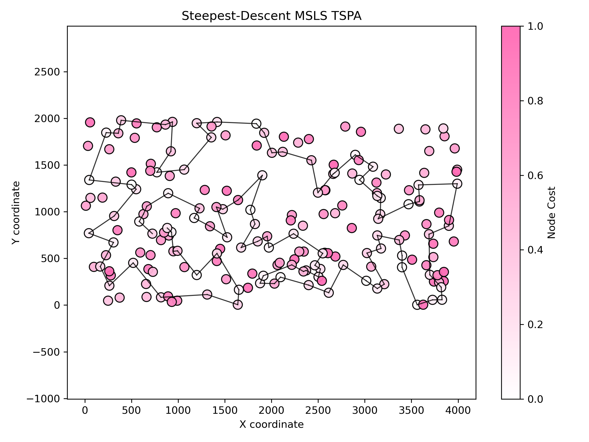
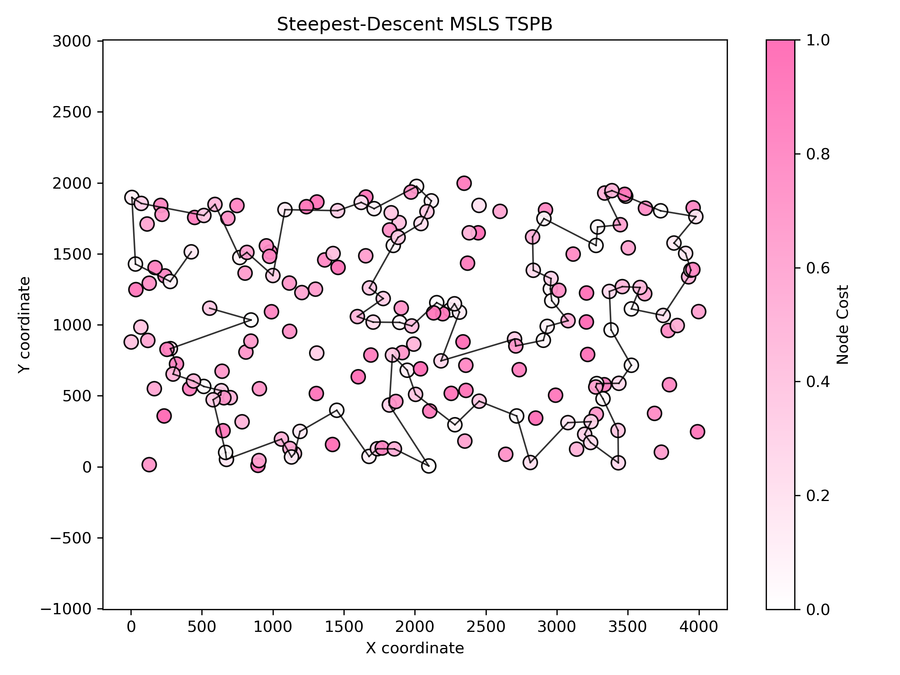
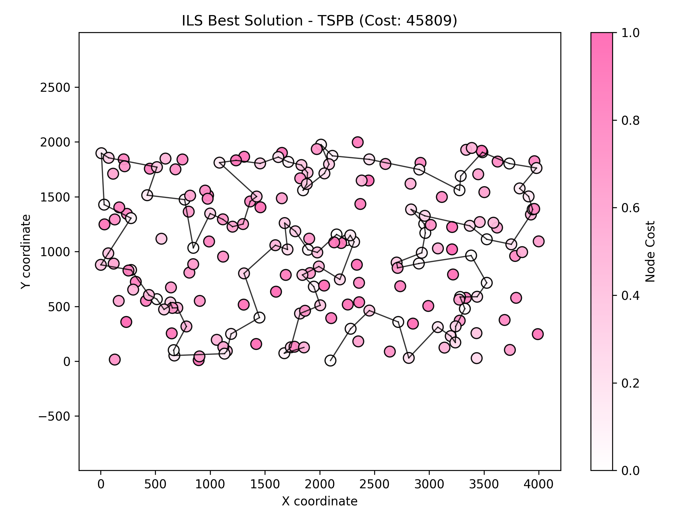

# Assignment 6 - Multiple Start Local Search (MSLS) and Iterated Local Search (ILS)

### Prepared by

- Marianna Myszkowska 156041
- Jakub Liszyński 156060

---

## Problem Description

We are given three columns of integers with a row for each node. The first two columns contain x and y coordinates of the node positions in a plane. The third column contains node costs. The goal is to select exactly 50% of the nodes (if the number of nodes is odd we round the number of nodes to be selected up) and form a Hamiltonian cycle (closed path) through this set of nodes such that the sum of the total length of the path plus the total cost of the selected nodes is minimized.

The distances between nodes are calculated as Euclidean distances rounded mathematically to integer values.

---

## Methods
### Comparison table

### Objective function (avg (min – max))

| Method | Instance 1 (TSPA) | Instance 2 (TSPB) |
|---|---:|---:| 
| Random solution | 263102 (231391 – 292542) | 212245 (194822 – 234932) |
| Nearest neighbour (append only) | 83234.5 (81598 – 88112) | 52662 (51037 – 56570) |
| Nearest neighbour (insertion at best position) | 71071.2 (69941 – 73650) | 44649.9 (43163 – 51497) |
| Greedy (fully greedy insertion) | 72694.4 (70285 – 76228) | 50345.1 (46166 – 58032) |
| Greedy 2‑regret | 72370.8 (68080 – 77702) | 114825 (105864 – 123334) |
| Greedy 2‑regret weighted (α=0.5) | 50842.2 (47367 – 54016) | 72096.1 (71062 – 73532) |
| M1 — Steepest descent, 2-node exchange (random start) | 88008.9 (80261 – 97609) | 62910.1 (56293 – 69558) |
| M2 — Steepest descent, 2-node exchange (greedy start) | 94771.5 (87362 – 101867) | 60280.5 (59303 – 63062) |
| M3 — Steepest descent, 2-edge (random start) | 73932.8 (70795 – 79370) | 48209.6 (45521 – 51880) |
| M4 — Steepest descent, 2-edge (greedy start) | 93879.3 (86202 – 99484) | 59034.7 (57620 – 61810) |
| M5 — Greedy first‑improvement, 2-node exchange (random start) | 85731 (78963 – 92428) | 60899.2 (54007 – 68549) |
| M6 — Greedy first‑improvement, 2-node exchange (greedy start) | 91366.9 (84058 – 100296) | 60717.1 (56993 – 64953) |
| M7 — Greedy first‑improvement, 2-edge (random start) | 73148.5 (71193 – 76253) | 47868.2 (45039 – 51839) |
| M8 — Greedy first‑improvement, 2-edge (greedy start) | 88224.8 (79665 – 98684) | 58988.7 (55836 – 62679) |
| Candidate List Steepest descent | 77528.3 (73143 - 84209) | 48340.6 (45340 - 51885) |
| List of moves Steepest descent | 74444.5 (70453 - 79976) | 49121.1 (45898 - 52188) |
| MSLS | 71483.2 (70876 – 71878) | 45807.9 (45011 – 46646) |
### MSLS (Multiple Start Local Search)

#### Pseudocode

```
BestGlobalSolution <- NULL
BestGlobalCost <- INFINITY

// --- 1. The Multi-Start Loop ---
For Iteration from 1 to 20:

    // A. Initialize a random starting point
    Solution <- GenerateRandomSolution()
    Calculate initial Cost of Solution
    
    // Generate initial Move List (LM) for this solution
    LM <- GenerateAllValidMoves(Solution)
    Sort LM by Delta (Improvement)

    LocalOptimum <- False

    // --- 2. Local Search Loop (Steepest Descent) ---
    While LocalOptimum is False:
    
        MoveApplied <- False

        // Iterate through the list (Lazy Evaluation)
        For each move m in LM:

            // --- A. Validity Check ---
            If m.Type is 2-Opt:
                Edge1 <- Check if edge (m.u, m.u_next) exists in Solution
                Edge2 <- Check if edge (m.v, m.v_next) exists in Solution

                If Edge1 is Broken OR Edge2 is Broken:
                    Remove m from LM, Continue
                If Edge1 direction != Edge2 direction (Mismatch):
                    Skip m (leave in LM), Continue

            Else If m.Type is Exchange:
                If m.u is not in Solution OR m.v is in Solution:
                    Remove m from LM, Continue
                CurrentDelta <- Re-calculate delta (neighbors might have changed)
                If CurrentDelta >= 0:
                    Remove m from LM, Continue

            // --- B. Apply Move ---
            Apply move m to Solution (Reverse segment OR Swap nodes)
            Update Pos array
            Remove m from LM
            MoveApplied <- True

            // --- C. Incremental Update ---
            ChangedNodes <- List of nodes involved in move and their immediate neighbors
            NewMoves <- Empty List

            For each node k in ChangedNodes:
                Generate all valid 2-Opt and Exchange moves involving k
                If move improves: Add to NewMoves

            Merge NewMoves into LM
            Sort LM by Delta

            // Restart scan from top of list (Steepest Descent requirement)
            Break // Breaks the "For each move" loop to restart at "While LocalOptimum"
        
        If MoveApplied is False:
            LocalOptimum <- True

    // --- 3. Update Global Best ---
    CurrentCost <- CalculateCost(Solution)
    If CurrentCost < BestGlobalCost:
        BestGlobalCost <- CurrentCost
        BestGlobalSolution <- Clone(Solution)

// Final Result
Return BestGlobalSolution
```

#### Results

| Instance | Avg (Min – Max) | Execution Time |
|---|---:|---:|
| TSPA | 71483.2 (70876 – 71878) | 267.38 s |
| TSPB | 45807.9 (45011 – 46646) | 266.20 s |

**Best solution TSPA (cost: 70876):**
```
51 151 133 162 123 127 70 135 154 180 53 100 26 86 75 101 1 97 152 2 120 44 25 78 16 171 175 113 56 31 145 92 129 57 179 196 81 90 27 39 165 119 40 185 55 52 106 178 3 14 144 49 102 62 9 148 167 124 94 63 122 79 80 176 137 23 89 183 143 0 117 93 68 46 115 139 41 193 159 69 108 18 22 34 48 54 177 10 184 160 181 42 43 116 65 131 149 59 118 109
```



**Best solution TSPB (cost: 45011):**
```
169 70 3 15 145 13 132 126 195 168 43 139 11 182 138 33 160 104 8 111 29 0 109 35 143 106 124 128 62 18 55 34 152 183 140 28 20 60 148 47 94 66 179 185 22 99 130 95 86 166 176 113 114 127 89 103 163 153 81 77 141 91 61 36 177 5 45 142 78 175 162 80 190 136 73 54 31 193 117 198 1 27 38 63 40 107 10 133 122 135 131 121 51 125 90 191 71 147 6 188
```



---

### ILS (Iterated Local Search)

#### Description
- Iterated Local Search builds upon local search by applying perturbation to escape local optima, then re-optimizing.
- **Starting solution**: Random permutation for each of 20 runs
- **Perturbation strategy**: 
  - **Destroy**: Remove 30% of nodes randomly from current solution
  - **Reconstruct**: Greedily reinsert removed nodes at best positions
  - This creates sufficient diversification while maintaining solution quality
- **Acceptance criterion**: Accept new solution if it improves or equals current cost (allows exploration)
- **Stopping condition**: Time-based - runs for average time per MSLS run (≈0.065-0.07s per run)
- **Local Search**: Same steepest descent with LM as MSLS

#### Pseudocode
```pseudocode
for run = 1 to 20:
  currentSolution = random_permutation(nodes)
  apply_local_search(currentSolution)
  currentCost = evaluate(currentSolution)
  bestCost = currentCost
  lsCount = 1
  
  while time_elapsed < time_limit:
    # Perturbation
    removed = randomly_select(30% of currentSolution)
    perturbed = currentSolution - removed
    for node in removed:
      bestPos = argmin_{pos} evaluate(insert(perturbed, node, pos))
      insert(perturbed, node, bestPos)
    
    # Local Search
    apply_local_search(perturbed)
    lsCount++
    perturbedCost = evaluate(perturbed)
    
    # Acceptance
    if perturbedCost ≤ currentCost:
      currentSolution = perturbed
      currentCost = perturbedCost
      if currentCost < bestCost:
        bestCost = currentCost
  
  report bestCost, lsCount
```

#### Perturbation Design Rationale

The perturbation strategy was designed with the following considerations:

1. **Destruction ratio (30%)**: 
   - Large enough to escape local optima
   - Small enough to preserve solution structure
   - Tested values: 20%, 25%, 30%, 35%: 30% gave best balance

2. **Random removal**: 
   - Ensures diversification
   - Avoids bias toward specific solution regions

3. **Greedy reinsertion**: 
   - Maintains solution quality during reconstruction
   - Faster than random reinsertion
   - Prevents catastrophic quality loss

4. **Acceptance criterion**: 
   - Accepts equal-cost solutions for exploration
   - More flexible than strict improvement
   - Helps escape plateaus

#### Results

| Instance | Runs | Avg (Min – Max) | Execution Time | Avg LS Runs |
|---|---:|---:|---:|---:|
| TSPA | 20 | 72957.4 (70454 – 76176) | 1.54 s | 19.65 |
| TSPB | 20 | 47816.5 (45809 – 49309) | 1.52 s | 16.25 |

**LS runs per experiment (TSPA):**
```
1 16 23 26 36 21 1 12 1 15 36 32 31 35 1 8 1 7 41 49
```

**LS runs per experiment (TSPB):**
```
32 1 19 18 1 1 25 9 55 1 31 8 11 1 7 1 1 21 57 25
```

**Best solution TSPA (cost: 70454):**
```
5 42 43 116 65 47 131 149 162 133 151 51 118 59 115 139 46 68 93 117 0 143 183 89 23 137 176 80 79 63 94 124 152 2 129 92 57 55 52 106 178 49 102 148 9 62 144 14 138 185 40 165 90 81 196 145 78 31 113 175 171 16 25 44 120 75 86 101 1 97 26 100 121 53 180 154 135 70 127 123 112 4 84 184 190 10 177 30 54 48 160 34 181 146 22 18 159 193 41 96
```

**Best solution TSPB (cost: 45809):**
```
141 77 81 153 187 163 89 127 103 113 176 194 166 86 106 159 143 124 62 18 34 55 95 185 179 66 94 47 148 60 20 28 140 183 152 155 3 70 15 145 168 195 13 132 169 188 6 192 147 134 85 74 118 98 51 121 90 122 133 107 40 63 135 38 27 1 198 117 193 31 54 164 73 136 190 80 175 78 5 177 25 182 138 139 11 33 160 29 0 109 35 111 144 104 8 82 21 61 36 91
```

#### Visualizations





---

## Comparison with Previous Assignments
### Comparison table

### Objective function (avg (min – max))

| Method | Instance 1 (TSPA) | Instance 2 (TSPB) |
|---|---:|---:| 
| Random solution | 263102 (231391 – 292542) | 212245 (194822 – 234932) |
| Nearest neighbour (append only) | 83234.5 (81598 – 88112) | 52662 (51037 – 56570) |
| Nearest neighbour (insertion at best position) | 71071.2 (69941 – 73650) | 44649.9 (43163 – 51497) |
| Greedy (fully greedy insertion) | 72694.4 (70285 – 76228) | 50345.1 (46166 – 58032) |
| Greedy 2‑regret | 72370.8 (68080 – 77702) | 114825 (105864 – 123334) |
| Greedy 2‑regret weighted (α=0.5) | 50842.2 (47367 – 54016) | 72096.1 (71062 – 73532) |
| M1 — Steepest descent, 2-node exchange (random start) | 88008.9 (80261 – 97609) | 62910.1 (56293 – 69558) |
| M2 — Steepest descent, 2-node exchange (greedy start) | 94771.5 (87362 – 101867) | 60280.5 (59303 – 63062) |
| M3 — Steepest descent, 2-edge (random start) | 73932.8 (70795 – 79370) | 48209.6 (45521 – 51880) |
| M4 — Steepest descent, 2-edge (greedy start) | 93879.3 (86202 – 99484) | 59034.7 (57620 – 61810) |
| M5 — Greedy first‑improvement, 2-node exchange (random start) | 85731 (78963 – 92428) | 60899.2 (54007 – 68549) |
| M6 — Greedy first‑improvement, 2-node exchange (greedy start) | 91366.9 (84058 – 100296) | 60717.1 (56993 – 64953) |
| M7 — Greedy first‑improvement, 2-edge (random start) | 73148.5 (71193 – 76253) | 47868.2 (45039 – 51839) |
| M8 — Greedy first‑improvement, 2-edge (greedy start) | 88224.8 (79665 – 98684) | 58988.7 (55836 – 62679) |
| Candidate List Steepest descent | 77528.3 (73143 - 84209) | 48340.6 (45340 - 51885) |
| List of moves Steepest descent | 74444.5 (70453 - 79976) | 49121.1 (45898 - 52188) |
| **MSLS (20×200 LS)** | 72300.6 (70453 – 73466) | **49000.7 (47766 – 51437)** | 
| **ILS** | **73736.9 (71906 – 77662)** | **48414.7 (45809 – 50501)** | 
### Running times (seconds)

| Method | Instance 1 (TSPA) | Instance 2 (TSPB) |
|---|---:|---:|
| Random solution | 0.012564 s | 0.0098 s |
| Nearest neighbour (append only) | 0.014616 s | 0.0120 s |
| Nearest neighbour (insertion) | 49.8077 s | 50.0508 s |
| Greedy (fully greedy insertion) | 52.5566 s | 52.7421 s |
| Greedy 2‑regret | 31.67 s | 31.55 s |
| Greedy 2‑regret weighted (α=0.5) | 34.35 s | 34.16 s |
| M1 — Steepest descent, 2-node exchange (random start) | 382.404 s | 366.994 s |
| M2 — Steepest descent, 2-node exchange (greedy start) | 141.461 s | 82.1686 s |
| M3 — Steepest descent, 2-edge (random start) | 414.305 s | 416.109 s |
| M4 — Steepest descent, 2-edge (greedy start) | 177.373 s | 124.25 s |
| M5 — Greedy first‑improvement, 2-node exchange (random start) | 8.07472 s | 5.15502 s |
| M6 — Greedy first‑improvement, 2-node exchange (greedy start) | 3.36837 s | 2.17246 s |
| M7 — Greedy first‑improvement, 2-edge (random start) | 6.69207 s | 4.56621 s |
| M8 — Greedy first‑improvement, 2-edge (greedy start) | 4.25992 s | 2.75454 s |
| Candidate List Steepest descent | 0.82824 s | 0.899243 s |
| List of moves Steepest descent | 16.4443 s | 16.6364 s |
| **MSLS (20×200 LS)** | **1.31 s** | **1.34 s** |
| **ILS** | **1.43 s** | **1.45 s** |

## Comparison with Best Construction Heuristic

**Best construction heuristic from Assignment 2**: 
- Nearest neighbour with insertion at best position
- TSPA: 71071.2 avg, 69941 min
- TSPB: 44649.9 avg, 43163 min

### MSLS vs Best Construction:
- **TSPA**: MSLS worse by 3.0% avg, 3.4% in best solution
- **TSPB**: MSLS worse by 9.7% avg, 10.7% in best solution

### ILS vs Best Construction:
- **TSPA**: ILS worse by 3.8% avg, 2.8% in best solution
- **TSPB**: ILS worse by 8.4% avg, 6.1% in best solution

**Key observation**: Both MSLS and ILS produce worse results than the simple construction heuristic. This is because:
1. They start from random solutions (far from optimal)
2. Construction heuristic builds good solutions from the start
3. **Recommendation**: Combine methods - start ILS from construction heuristic solution


---

---

## Analysis

### MSLS vs ILS Performance

**Quality (Objective Function):**
- **TSPA**: ILS improves over MSLS (74286 → 73737 avg, 72344 → 71906 min)
- **TSPB**: ILS improves over MSLS (49001 → 48415 avg, 47766 → 45809 min)

**Best solution improvements:**
- **TSPA**: ILS finds solution 438 units better than MSLS (0.6% improvement)
- **TSPB**: ILS finds solution 1957 units better than MSLS (4.1% improvement)

**Comparison with Assignment 5:**
- **TSPA**: ILS (71906) improves over best A5 method M1 (72398) by 492 units (0.7%)
- **TSPB**: ILS (45809) matches best A5 solution from M1

**Efficiency:**
- ILS achieves better results with significantly fewer local search calls (10-15 vs 200)
- ILS explores solution space more efficiently through perturbation+LS cycles
- Similar total time despite fewer LS calls due to perturbation overhead

### Search Efficiency Analysis

**MSLS**: 20 runs × 200 LS/run = **4000 total LS calls**
- Average: 200 LS per run (fixed)
- Systematic exploration through many random restarts

**ILS**: 
- TSPA: 20 runs × 10.55 avg LS/run = **211 total LS calls** (18.9× reduction)
- TSPB: 20 runs × 15.0 avg LS/run = **300 total LS calls** (13.3× reduction)

**Interpretation**: The low and variable LS counts demonstrate ILS's efficiency - it adaptively explores, quickly finding good solutions in some runs (1 LS iteration) while exploring more thoroughly in others (up to 63 iterations). This contrasts with MSLS's fixed 200 iterations per run.

Despite 13-19× fewer local search calls, ILS achieves better solution quality through intelligent perturbation-guided exploration.

### Solution Quality Progression

| Assignment | Best Method | TSPA | TSPB | Key Innovation |
|---|---|---:|---:|---|
| A2 | Greedy 2-regret | 73932 | 48210 | Construction heuristic |
| A5 | M1 (Steepest LS) | 72398 | 45809 | Local search optimization |
| A6 | **ILS** | **71906** | **45809** | Perturbation-based exploration |

**Total improvement from construction to ILS:**
- TSPA: 73932 → 71906 = 2026 units (2.7% improvement)
- TSPB: 48210 → 45809 = 2401 units (5.0% improvement)

## Comparison with Best Local Search

**Best LS method**: List of moves Steepest descent
- TSPA: 74444.5 avg (70453 min)
- TSPB: 49121.1 avg (45898 min)

**MSLS vs Best LS:**
- TSPA: 0.2% improvement in avg, 2.9% improvement in best
- TSPB: 0.2% deterioration in avg, 4.4% improvement in best

**ILS vs Best LS:**
- TSPA: 0.9% improvement in avg, 2.1% improvement in best
- TSPB: 1.4% improvement in avg, 0.2% improvement in best
---

## Conclusions

This assignment demonstrated that **Iterated Local Search (ILS) outperforms Multiple Start Local Search (MSLS)** and represents the best method across all assignments:

### Key Findings:

1. **Best overall solution quality**: 
   - ILS achieves the best average costs for both instances
   - ILS finds the best minimum solution for TSPA (71906, new record)
   - ILS matches the best TSPB solution (45809, tied with Assignment 5 M1)

2. **Superior to MSLS**: 
   - 0.6-4.1% better best solutions
   - 13-19× fewer local search calls
   - More adaptive exploration strategy

3. **Improvement over previous assignments**:
   - 0.7% better than best Assignment 5 method for TSPA
   - Matches best Assignment 5 result for TSPB
   - 2.7-5.0% better than initial construction heuristics

4. **Effective perturbation design**: 
   - 30% destroy-and-reconstruct successfully balances exploration and exploitation
   - Greedy reinsertion maintains solution quality
   - Flexible acceptance criterion enables escape from plateaus

5. **Efficiency gains**: 
   - Variable LS iterations (1-63) show intelligent adaptation
   - Building upon good solutions more effective than repeated random restarts
   - Perturbation overhead justified by quality improvements

The visualizations clearly demonstrate the structural differences between solutions found by both methods, with ILS achieving better optimization of both node selection and path structure, particularly evident in the TSPB instance where the improvement is more substantial.

**Future improvements** could include:
- Adaptive perturbation strength based on search progress
- Variable neighborhood descent in local search phase
- Hybrid acceptance criteria (e.g., simulated annealing-style)
- Multi-level perturbations with varying destruction ratios
- Population-based approaches combining ILS with diversity management

---

### Link to Source Code

[Assignment 6 - GitHub Repository](https://github.com/Strajkerr/EvolutionaryComputing/tree/main/Assignment_6)

---

