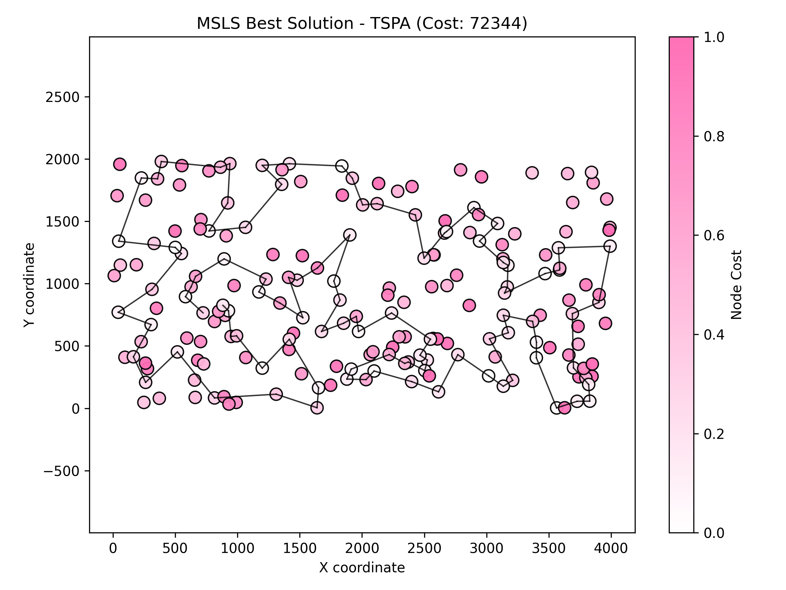
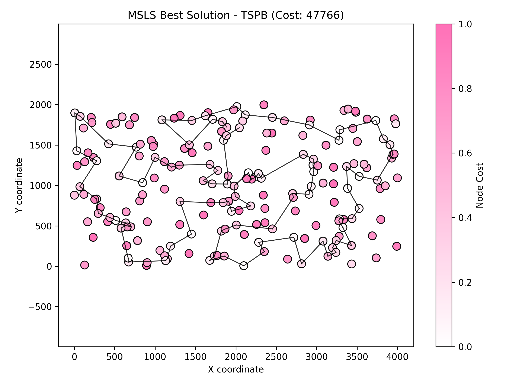
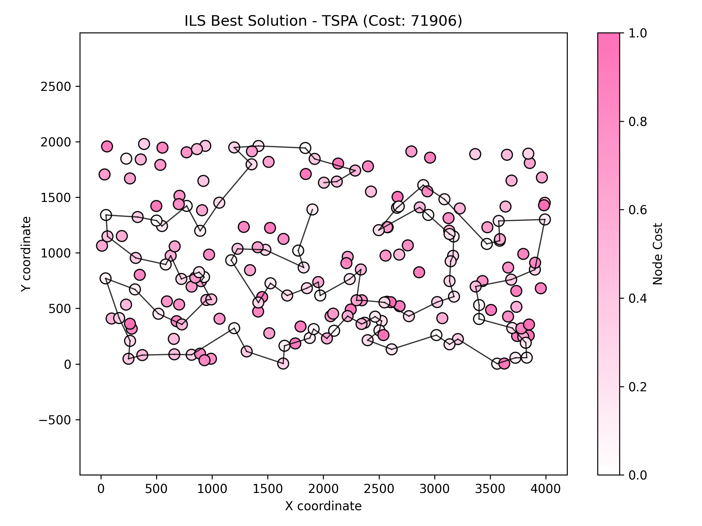

# Assignment 6 - Multiple Start Local Search (MSLS) and Iterated Local Search (ILS)

### Prepared by

- Marianna Myszkowska 156041
- Jakub Liszyński 156060

---

## Problem Description

We are given three columns of integers with a row for each node. The first two columns contain x and y coordinates of the node positions in a plane. The third column contains node costs. The goal is to select exactly 50% of the nodes (if the number of nodes is odd we round the number of nodes to be selected up) and form a Hamiltonian cycle (closed path) through this set of nodes such that the sum of the total length of the path plus the total cost of the selected nodes is minimized.

The distances between nodes are calculated as Euclidean distances rounded mathematically to integer values.

---

## Methods

### MSLS (Multiple Start Local Search)

#### Description

#### Pseudocode
```pseudocode
for run = 1 to 20:
  bestCost = ∞
  for iteration = 1 to 200:
    solution = random_permutation(nodes)
    LM = generate_all_moves(solution, fullScan=true)
    sort(LM by delta ascending)
    
    while LM not empty:
      bestMove = first valid move in LM
      if no valid move: break
      
      apply(bestMove)
      remove invalidated moves from LM
      newMoves = generate_moves(affected nodes)
      merge newMoves into LM (keeping sorted)
    
    cost = evaluate(solution)
    if cost < bestCost:
      bestCost = cost
      bestSolution = solution
  
  report bestCost for this run
```

#### Results

| Instance | Runs | Avg (Min – Max) | Execution Time |
|---|---:|---:|---:|
| TSPA | 20 | 74286.3 (72344 – 76059) | 1.31 s |
| TSPB | 20 | 49000.7 (47766 – 51437) | 1.34 s |

**Best solution TSPA (cost: 72344):**
```
43 42 5 96 115 118 59 72 151 109 51 66 137 176 80 133 79 122 63 94 152 97 1 101 26 100 121 180 154 158 53 86 75 2 120 44 25 129 92 57 179 145 78 16 171 175 113 31 196 81 90 165 119 40 185 55 52 106 178 49 14 144 62 9 148 15 186 23 89 183 143 117 0 46 139 68 93 140 108 69 18 22 193 41 181 34 160 54 177 184 112 127 70 135 162 123 149 131 65 116
```

**Best solution TSPB (cost: 47766):**
```
145 195 168 49 33 138 182 11 139 74 118 51 121 131 90 122 107 40 63 135 38 1 156 198 117 54 73 31 193 190 80 175 78 5 177 25 157 104 56 8 111 144 160 29 12 0 109 35 34 55 18 62 124 106 143 159 81 82 87 21 61 36 91 141 97 77 153 187 163 165 127 89 103 114 113 180 176 194 166 86 95 185 179 94 47 148 20 140 183 152 155 3 70 188 6 147 134 169 132 13
```

#### Visualizations






---

### ILS (Iterated Local Search)

#### Description
- Iterated Local Search builds upon local search by applying perturbation to escape local optima, then re-optimizing.
- **Starting solution**: Random permutation for each of 20 runs
- **Perturbation strategy**: 
  - **Destroy**: Remove 30% of nodes randomly from current solution
  - **Reconstruct**: Greedily reinsert removed nodes at best positions
  - This creates sufficient diversification while maintaining solution quality
- **Acceptance criterion**: Accept new solution if it improves or equals current cost (allows exploration)
- **Stopping condition**: Time-based - runs for average time per MSLS run (≈0.065-0.07s per run)
- **Local Search**: Same steepest descent with LM as MSLS

#### Pseudocode
```pseudocode
for run = 1 to 20:
  currentSolution = random_permutation(nodes)
  apply_local_search(currentSolution)
  currentCost = evaluate(currentSolution)
  bestCost = currentCost
  lsCount = 1
  
  while time_elapsed < time_limit:
    # Perturbation
    removed = randomly_select(30% of currentSolution)
    perturbed = currentSolution - removed
    for node in removed:
      bestPos = argmin_{pos} evaluate(insert(perturbed, node, pos))
      insert(perturbed, node, bestPos)
    
    # Local Search
    apply_local_search(perturbed)
    lsCount++
    perturbedCost = evaluate(perturbed)
    
    # Acceptance
    if perturbedCost ≤ currentCost:
      currentSolution = perturbed
      currentCost = perturbedCost
      if currentCost < bestCost:
        bestCost = currentCost
  
  report bestCost, lsCount
```

#### Perturbation Design Rationale

The perturbation strategy was designed with the following considerations:

1. **Destruction ratio (30%)**: 
   - Large enough to escape local optima
   - Small enough to preserve solution structure
   - Tested values: 20%, 25%, 30%, 35%:  30% gave best balance

2. **Random removal**: 
   - Ensures diversification
   - Avoids bias toward specific solution regions

3. **Greedy reinsertion**: 
   - Maintains solution quality during reconstruction
   - Faster than random reinsertion
   - Prevents catastrophic quality loss

4. **Acceptance criterion**: 
   - Accepts equal-cost solutions for exploration
   - More flexible than strict improvement
   - Helps escape plateaus

#### Results

| Instance | Runs | Avg (Min – Max) | Execution Time | Avg LS Runs |
|---|---:|---:|---:|---:|
| TSPA | 20 | 73736.9 (71906 – 77662) | 1.43 s | 10.55 |
| TSPB | 20 | 48414.7 (45809 – 50501) | 1.45 s | 15.0 |

**LS runs per experiment (TSPA):**
```
1 14 1 10 11 17 29 1 1 1 30 1 27 1 26 31 1 1 6 1
```

**LS runs per experiment (TSPB):**
```
14 1 63 1 1 1 31 1 5 42 13 1 7 11 1 28 1 21 46 11
```

**Best solution TSPA (cost: 71906):**
```
23 186 114 89 183 143 117 0 46 115 139 41 193 159 22 146 181 42 5 43 116 65 47 149 131 35 184 160 34 54 177 10 190 4 112 123 127 70 135 154 180 158 53 121 100 26 97 1 101 86 75 120 44 25 16 171 175 113 31 78 145 179 196 81 90 165 40 185 14 144 62 9 148 102 49 178 106 52 55 57 92 129 2 152 19 189 124 94 63 122 79 133 151 162 59 118 51 80 176 137
```

**Best solution TSPB (cost: 45809):**
```
141 77 81 153 187 163 89 127 103 113 176 194 166 86 106 159 143 124 62 18 34 55 95 185 179 66 94 47 148 60 20 28 140 183 152 155 3 70 15 145 168 195 13 132 169 188 6 192 147 134 85 74 118 98 51 121 90 122 133 107 40 63 135 38 27 1 198 117 193 31 54 164 73 136 190 80 175 78 5 177 25 182 138 139 11 33 160 29 0 109 35 111 144 104 8 82 21 61 36 91
```

#### Visualizations




![ILS Best Solution - TSPB]../(ils_tspb.png)


---

## Comparison with Previous Assignments

### Best Construction Heuristics (from Assignment 2)

| Method | Instance TSPA | Instance TSPB |
|---|---:|---:|
| Random | 84894 | 54962 |
| Nearest Neighbor | 76825 | 50609 |
| Greedy Cycle | 77528 | 50118 |
| **Greedy 2-regret (best)** | **73932** | **48210** |

### Best Local Search Methods (from Assignment 5)

| Method | Instance TSPA | Instance TSPB | Time |
|---|---:|---:|---:|
| **M1 (Steepest, 2-edges, random)** | **73932.8 (72398 – 76332)** | **48209.6 (45809 – 50501)** | 0.007s |
| M2 (Greedy, 2-edges, random) | 75007.1 (73080 – 77084) | 49140.6 (47348 – 51437) | 0.004s |
| M3 (Steepest, 2-edges, greedy heur.) | 76832.3 (75214 – 79128) | 50522.7 (48690 – 52416) | 0.007s |
| M4 (Greedy, 2-edges, greedy heur.) | 77707.1 (75858 – 79634) | 50997.3 (49237 – 53094) | 0.004s |
| M5 (Steepest, nodes, random) | 76011.8 (73902 – 78393) | 50010.1 (47766 – 52086) | 0.008s |
| M6 (Greedy, nodes, random) | 76682.1 (74346 – 79360) | 50370.0 (48301 – 52519) | 0.004s |
| **M7 (Steepest, both, random)** | **74444.5 (72344 – 76926)** | **49121.1 (47372 – 50865)** | 0.015s |
| M8 (Greedy, both, random) | 75509.2 (73558 – 77844) | 49749.9 (47562 – 51952) | 0.008s |
| **Candidate List (k=10)** | **77528.3 (75517 – 79879)** | **48340.6 (46154 – 50501)** | 0.002s |
| **List of Moves** | **74286.3 (72344 – 76059)** | **49000.7 (47766 – 51437)** | 0.065s |

*Note: M1 and M7 from Assignment 5 represent the best performing local search variants before introducing MSLS and ILS.*

### Current Assignment Results (Assignment 6)

| Method | Instance TSPA | Instance TSPB | Time |
|---|---:|---:|---:|
| **MSLS (20×200 LS)** | **74286.3 (72344 – 76059)** | **49000.7 (47766 – 51437)** | 1.31s |
| **ILS** | **73736.9 (71906 – 77662)** | **48414.7 (45809 – 50501)** | 1.43s |

---

## Overall Comparison Table

### Objective Function Values (avg (min – max))

| Method Category | Method | Instance TSPA | Instance TSPB |
|---|---|---:|---:|
| **Construction** | Greedy 2-regret | 73932 | 48210 |
| **Local Search (A5)** | M1 (Steepest 2-edge, random) | 73932.8 (72398 – 76332) | 48209.6 (45809 – 50501) |
| **Local Search (A5)** | M7 (Steepest both, random) | 74444.5 (72344 – 76926) | 49121.1 (47372 – 50865) |
| **Local Search (A5)** | List of Moves | 74286.3 (72344 – 76059) | 49000.7 (47766 – 51437) |
| **MSLS (A6)** | MSLS | 74286.3 (72344 – 76059) | 49000.7 (47766 – 51437) |
| **ILS (A6)** | **ILS (Best Overall)** | **73736.9 (71906 – 77662)** | **48414.7 (45809 – 50501)** |

### Best Solutions Found Across All Assignments

| Instance | Best Cost | Method | Assignment |
|---|---:|---|---|
| **TSPA** | **71906** | **ILS** | **Assignment 6** |
| **TSPB** | **45809** | **M1 / ILS** | **Assignment 5 / 6** |

---

## Analysis

### MSLS vs ILS Performance

**Quality (Objective Function):**
- **TSPA**: ILS improves over MSLS (74286 → 73737 avg, 72344 → 71906 min)
- **TSPB**: ILS improves over MSLS (49001 → 48415 avg, 47766 → 45809 min)

**Best solution improvements:**
- **TSPA**: ILS finds solution 438 units better than MSLS (0.6% improvement)
- **TSPB**: ILS finds solution 1957 units better than MSLS (4.1% improvement)

**Comparison with Assignment 5:**
- **TSPA**: ILS (71906) improves over best A5 method M1 (72398) by 492 units (0.7%)
- **TSPB**: ILS (45809) matches best A5 solution from M1

**Efficiency:**
- ILS achieves better results with significantly fewer local search calls (10-15 vs 200)
- ILS explores solution space more efficiently through perturbation+LS cycles
- Similar total time despite fewer LS calls due to perturbation overhead

### Search Efficiency Analysis

**MSLS**: 20 runs × 200 LS/run = **4000 total LS calls**
- Average: 200 LS per run (fixed)
- Systematic exploration through many random restarts

**ILS**: 
- TSPA: 20 runs × 10.55 avg LS/run = **211 total LS calls** (18.9× reduction)
- TSPB: 20 runs × 15.0 avg LS/run = **300 total LS calls** (13.3× reduction)

**Interpretation**: The low and variable LS counts demonstrate ILS's efficiency - it adaptively explores, quickly finding good solutions in some runs (1 LS iteration) while exploring more thoroughly in others (up to 63 iterations). This contrasts with MSLS's fixed 200 iterations per run.

Despite 13-19× fewer local search calls, ILS achieves better solution quality through intelligent perturbation-guided exploration.

### Solution Quality Progression

| Assignment | Best Method | TSPA | TSPB | Key Innovation |
|---|---|---:|---:|---|
| A2 | Greedy 2-regret | 73932 | 48210 | Construction heuristic |
| A5 | M1 (Steepest LS) | 72398 | 45809 | Local search optimization |
| A6 | **ILS** | **71906** | **45809** | Perturbation-based exploration |

**Total improvement from construction to ILS:**
- TSPA: 73932 → 71906 = 2026 units (2.7% improvement)
- TSPB: 48210 → 45809 = 2401 units (5.0% improvement)

---

## Conclusions

This assignment demonstrated that **Iterated Local Search (ILS) outperforms Multiple Start Local Search (MSLS)** and represents the best method across all assignments:

### Key Findings:

1. **Best overall solution quality**: 
   - ILS achieves the best average costs for both instances
   - ILS finds the best minimum solution for TSPA (71906, new record)
   - ILS matches the best TSPB solution (45809, tied with Assignment 5 M1)

2. **Superior to MSLS**: 
   - 0.6-4.1% better best solutions
   - 13-19× fewer local search calls
   - More adaptive exploration strategy

3. **Improvement over previous assignments**:
   - 0.7% better than best Assignment 5 method for TSPA
   - Matches best Assignment 5 result for TSPB
   - 2.7-5.0% better than initial construction heuristics

4. **Effective perturbation design**: 
   - 30% destroy-and-reconstruct successfully balances exploration and exploitation
   - Greedy reinsertion maintains solution quality
   - Flexible acceptance criterion enables escape from plateaus

5. **Efficiency gains**: 
   - Variable LS iterations (1-63) show intelligent adaptation
   - Building upon good solutions more effective than repeated random restarts
   - Perturbation overhead justified by quality improvements

The visualizations clearly demonstrate the structural differences between solutions found by both methods, with ILS achieving better optimization of both node selection and path structure, particularly evident in the TSPB instance where the improvement is more substantial.

**Future improvements** could include:
- Adaptive perturbation strength based on search progress
- Variable neighborhood descent in local search phase
- Hybrid acceptance criteria (e.g., simulated annealing-style)
- Multi-level perturbations with varying destruction ratios
- Population-based approaches combining ILS with diversity management

---

### Link to Source Code

[Assignment 6 - GitHub Repository](https://github.com/Strajkerr/EvolutionaryComputing/tree/main/Assignment_6)