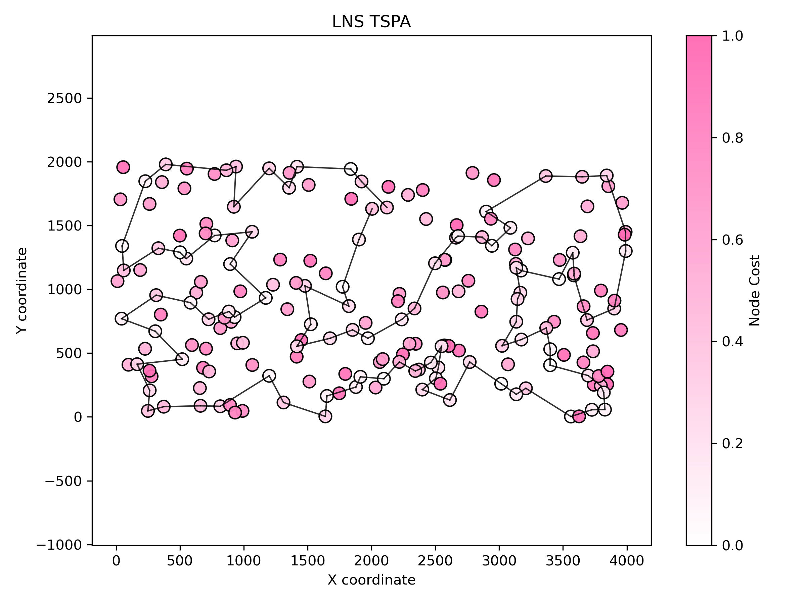
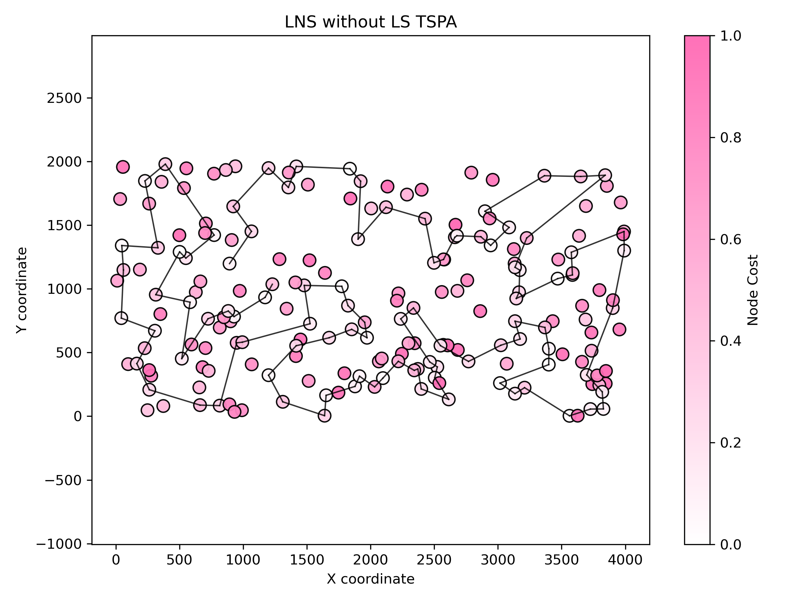
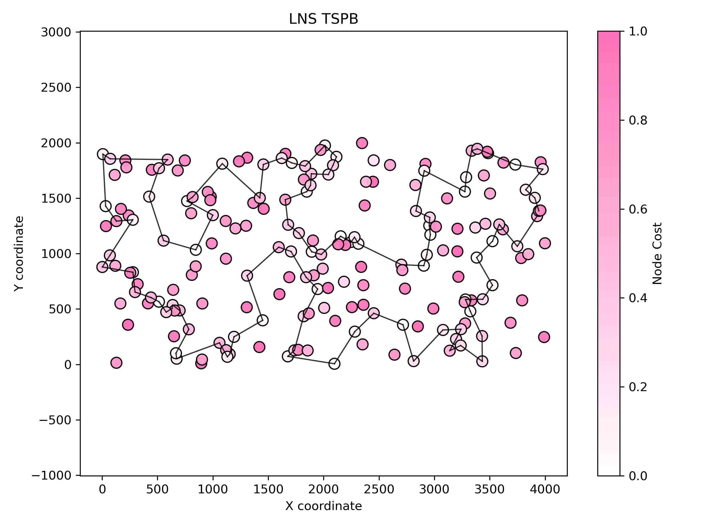
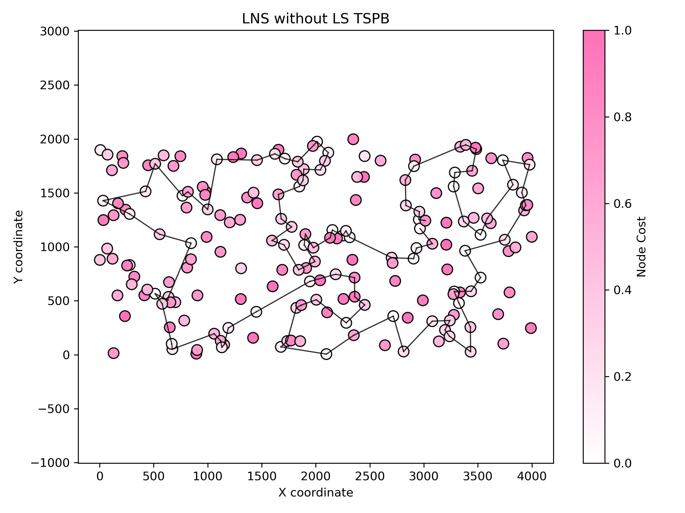

# Assignment 7 - Large Neighborhood Search (LNS)

### Prepared by

- Marianna Myszkowska 156041
- Jakub Liszyński 156060

---

## Important Note

In Assignment 6, we corrected the ILS implementation to use simple perturbation (random 2-opt kicks) instead of destroy-repair. The destroy-repair mechanism is now properly used here in Assignment 7 for Large Neighborhood Search.

### Assignment 6 Results (Corrected Implementation)

After fixing the ILS implementation to use simple perturbation:

**MSLS Results:**
- TSPA: 71483.2 avg (70876 – 71878), Time: 273.77s
- TSPB: 45807.9 avg (45011 – 46646), Time: 287.41s

**ILS Results (with simple 2-opt perturbation):**
- TSPA: 73626.9 avg (70998 – 75350), Time: 1.63s, Avg LS runs: 8.45
- TSPB: 47171.2 avg (44392 – 50455), Time: 1.39s, Avg LS runs: 23.1

**Key Observation:** ILS with simple perturbation found best TSPB solution (44392) across all methods!

---

## Problem Description

We are given three columns of integers with a row for each node. The first two columns contain x and y coordinates of the node positions in a plane. The third column contains node costs. The goal is to select exactly 50% of the nodes (if the number of nodes is odd we round the number of nodes to be selected up) and form a Hamiltonian cycle (closed path) through this set of nodes such that the sum of the total length of the path plus the total cost of the selected nodes is minimized.

The distances between nodes are calculated as Euclidean distances rounded mathematically to integer values.

---

## Methods

### Large Neighborhood Search (LNS)

#### Destroy Operator

**Description**: Random destruction with 30% removal rate
- Randomly removes 30% of nodes from the current solution
- Selection is completely random (uniform distribution)
- Minimum 2 nodes are always removed
- Creates a partial solution requiring reconstruction

**Pseudocode**:
```
numToRemove = max(2, floor(solutionSize * 0.3))
destroyed = copy(currentSolution)

For i from 1 to numToRemove:
    randomIndex = uniform_random(0, destroyed.size() - 1)
    Remove node at randomIndex from destroyed
    
Return destroyed (partial solution)
```

#### Repair Operator

**Description**: Greedy best-position insertion
- Uses the best construction heuristic approach
- For each missing node, evaluates all insertion positions
- Selects the node and position that minimizes total cost
- Iteratively builds complete solution

**Pseudocode**:
```
repaired = copy(partialSolution)
inSolution = boolean array marking which nodes are present

While repaired.size() < targetSize:
    bestNode = NULL
    bestPosition = -1
    bestCost = INFINITY
    
    For each node NOT in solution:
        For each position (0 to repaired.size()):
            Insert node at position
            cost = evaluateSolution(repaired)
            
            If cost < bestCost:
                bestCost = cost
                bestNode = node
                bestPosition = position
            
            Remove node from position
    
    Permanently insert bestNode at bestPosition
    Mark bestNode as in solution
    
Return repaired (complete solution)
```

#### LNS Algorithm

**Two Versions Implemented:**

**1. LNS with Local Search**
```pseudocode
For run = 1 to 20:
    currentSolution = random_permutation()
    apply_local_search(currentSolution)  // Always apply to initial
    currentCost = evaluate(currentSolution)
    iterations = 0
    
    While time_elapsed < timeLimit:
        iterations++
        
        // Destroy phase
        destroyed = destroy(currentSolution, 0.3)
        
        // Repair phase
        repaired = repair(destroyed, targetSize)
        
        // Local Search phase
        apply_local_search(repaired)
        repairedCost = evaluate(repaired)
        
        // Acceptance
        If repairedCost < currentCost:
            currentSolution = repaired
            currentCost = repairedCost
    
    Report best solution found in this run
```

**2. LNS without Local Search**
```pseudocode
For run = 1 to 20:
    currentSolution = random_permutation()
    apply_local_search(currentSolution)  // Always apply to initial solution 
    currentCost = evaluate(currentSolution)
    iterations = 0
    
    While time_elapsed < timeLimit:
        iterations++
        
        // Destroy phase
        destroyed = destroy(currentSolution, 0.3)
        
        // Repair phase
        repaired = repair(destroyed, targetSize)
        
        // NO Local Search inside the loop for this version
        repairedCost = evaluate(repaired)
        
        // Acceptance
        If repairedCost < currentCost:
            currentSolution = repaired
            currentCost = repairedCost
    
    Report best solution found in this run
```


---

## Results

### LNS with Local Search

| Instance | Runs | Avg (Min – Max) | Execution Time | Avg Iterations |
|---|---:|---:|---:|---:|
| TSPA | 20 | 70421.3 (69838 - 71291) | 13.6921 s | 3933.4 |
| TSPB | 20 | 45217.9 (44747 - 45802) | 14.3721 s | 3864.05 |


### LNS without Local Search

| Instance | Runs | Avg (Min – Max) | Execution Time | Avg Iterations |
|---|---:|---:|---:|---:|
| TSPA | 20 | 74375.2 (73178 - 76452) | 13.6915 s | 4954.7 |
| TSPB | 20 | 49238.4 (47678 - 51419) | 14.3714 s | 5118.45 |









---

## Comparison with Previous Methods

| Method | TSPA Avg (Min – Max) | TSPB Avg (Min – Max) |
|---|---:|---:|
| **Best Construction (NN Insertion)** | 71071.2 (69941 – 73650) | 44649.9 (43163 – 51497) |
| **Best Local Search (List of Moves)** | 74444.5 (70453 - 79976) | 49121.1 (45898 - 52188) |
| **MSLS** | 71483.2 (70876 – 71878) | 45807.9 (45011 – 46646) |
| **ILS (A6 corrected)** | 73626.9 (70998 – 75350) | 47171.2 (44392 – 50455) |
| **LNS with LS** | 70421.3 (69838 - 71291) | 45217.9 (44747 - 45802) |
| **LNS without LS** | 74375.2 (73178 - 76452) | 49238.4 (47678 - 51419) |

### Best Solutions Comparison

| Method | TSPA Best | TSPB Best |
|---|---:|---:|
| **Construction** | 69941 | 43163 |
| **Local Search** | 70453 | 45898 |
| **MSLS** | 70876 | 45011 |
| **ILS (corrected)** | 70998 | 44392 |
| **LNS with LS** | 69838 | 44747 |
| **LNS without LS** | 73178 | 47678 |


---


## Conclusions

1. The Critical Role of Local Search in LNS

    The most significant finding is the drastic performance gap between LNS with Local Search and LNS without it.

    LNS with LS yielded our best average results for TSPA (70421), significantly outperforming the version without LS (74375).

    Reasoning: While the Greedy Repair operator constructs a feasible and reasonable path, it is not guaranteed to be locally optimal. It often leaves "crossing edges" or suboptimal sequences that the repair heuristic cannot foresee. The subsequent Steepest Local Search step is essential to "polish" the repaired solution, effectively combining the exploration of LNS with the exploitation of LS.

    Trade-off: Although LNS without LS ran more iterations (approx. 5000 vs. 3900), the quality of each iteration in the LS version was vastly superior. Fewer, high-quality steps proved more effective than many lower-quality steps.

2. Comparison with MSLS (Memory vs. Randomness)

    LNS with LS outperformed MSLS on average for both instances (TSPA: 70421 vs 71483; TSPB: 45217 vs 45807).

    MSLS relies on random restarts, meaning it has no "memory" of previous good structures; it searches blindly in different areas of the solution space.

    LNS employs a "partial restart" strategy. By destroying only 30% of the solution, it preserves the high-quality subsequences found in previous iterations while modifying enough of the structure to escape local optima. This balance allows LNS to dig deeper into promising regions of the search space (intensification) rather than constantly starting over (diversification).

3. Comparison with ILS

    LNS functions similarly to Iterated Local Search (ILS), where the "Destroy-Repair" phase acts as a complex perturbation mechanism.

    TSPA: LNS with LS provided a better average (70421) and best solution (69838) compared to the corrected ILS (Avg: 73626). This suggests that for the uniform distribution of TSPA, reconstructing a significant portion of the path is more effective than small 2-opt kicks.

    TSPB: ILS with simple perturbation remains extremely competitive, finding the overall best solution (44392). However, LNS offers a better average (45217) than ILS (47171), indicating that LNS is a more stable and consistent method, even if ILS occasionally hits a "lucky" better minimum on clustered data.

4. Effectiveness of the Destroy/Repair Operators

    The Random Destroy (30%) coupled with Greedy Repair proved to be a robust mechanism.

    Removing 30% of the nodes provided a sufficient "kick" to escape local optima without destroying the solution so thoroughly that the search reverted to a random restart.

    The Greedy Repair operator ensures that the reconstruction is intelligent (minimizing immediate cost) rather than random, which helps the algorithm converge toward high-quality solutions faster than random insertion would.

5. Summary

    LNS with Local Search has proven to be the most robust metaheuristic implemented so far for TSPA, achieving the lowest average costs and the new personal best minimum (69838). While the simple Construction Heuristics from earlier assignments remain surprisingly hard to beat regarding their absolute "best" found values on TSPB, LNS offers superior consistency and average performance across runs.


### Solutions were checked with Soultion Checker

### Link to repository

[Assignment 7 - GitHub Repository](https://github.com/Strajkerr/EvolutionaryComputing/tree/main/Assignment_7)