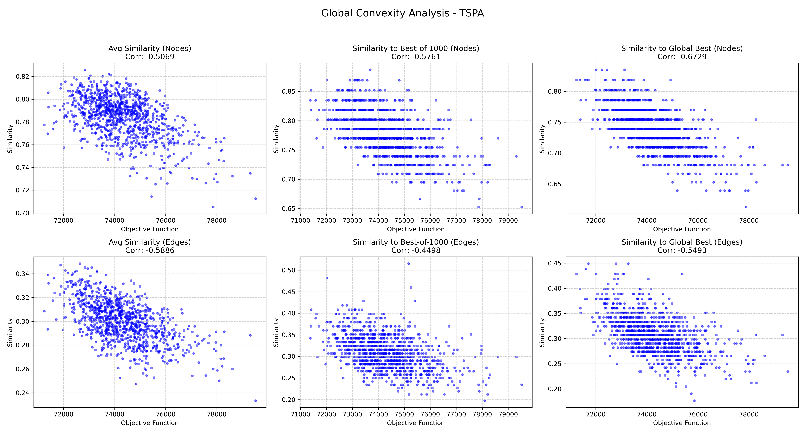
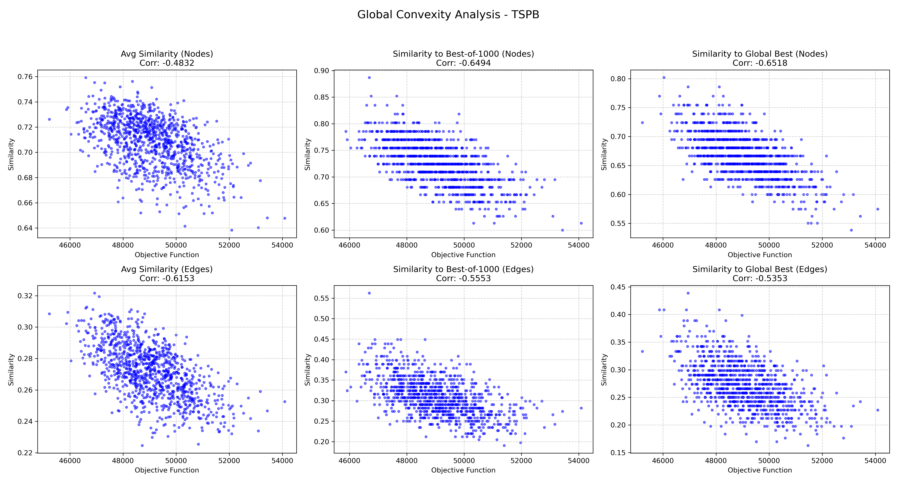

# Assignment 8

### Prepared by

- Marianna Myszkowska 156041
- Jakub Liszyński 156060

---

## Problem Description

We are given three columns of integers with a row for each node. The first two columns contain x and y coordinates of the node positions in a plane. The third column contains node costs. The goal is to select exactly 50% of the nodes (if the number of nodes is odd we round the number of nodes to be selected up) and form a Hamiltonian cycle (closed path) through this set of nodes such that the sum of the total length of the path plus the total cost of the selected nodes is minimized.

The distances between nodes are calculated as Euclidean distances rounded mathematically to integer values.

---

## Global Convexity Analysis

### Methodology

We analyzed the global structure of the solution space by examining 1000 random local optima for each instance. For each local optimum, we calculated its similarity using two measures:

**Similarity Measures:**
1. **Node-based (Jaccard)**: Number of common selected nodes divided by total unique nodes
   - Formula: `|A ∩ B| / |A ∪ B|`
2. **Edge-based**: Number of common edges divided by total unique edges
   - Formula: `|E_A ∩ E_B| / |E_A ∪ E_B|`

**Reference Solutions:**
1. **Average similarity**: Mean similarity to all other 999 local optima
2. **Best of 1000**: Similarity to the best solution found among the 1000 local optima (excluding itself)
3. **Reference solution**: Similarity to a high-quality solution generated by the best construction method

### Results

#### Correlation Coefficients

| Instance | Analysis Type | Node-based | Edge-based |
|---|---|---:|---:|
| **TSPA** | Avg to Others | -0.5069 | -0.5886 |
| **TSPA** | To Best of 1000 | -0.5761 | -0.4498 |
| **TSPA** | To LNS | -0.6729 | -0.5493 |
| **TSPB** | Avg to Others | -0.4832 | -0.6153 |
| **TSPB** | To Best of 1000 | -0.6494 | -0.5553 |
| **TSPB** | To LNS | -0.6518 | -0.5353 |

**Interpretation of Correlation:**
A value of -1.0 would mean a perfect line (impossible in complex problems).

Values around -0.5 to -0.7 indicate a strong guide for the search process. It means that if your algorithm makes a solution more similar to the best known one, it is highly likely to improve its cost.

#### Charts

### Observations

Confirmation of Global Convexity: Across all metrics for both TSPA and TSPB, we observe substantial negative correlations (ranging from -0.45 to -0.67). This statistically confirms the "Big Valley" structure: better local optima are not randomly distributed but are structurally closer to the global optimum and to each other.

Node vs. Edge Importance: When measuring similarity against the Global Best solution, Node-based similarity consistently showed a stronger correlation (-0.67 for TSPA, -0.65 for TSPB) compared to Edge-based similarity (-0.55, -0.54). This suggests that identifying the correct subset of nodes is the primary driver of solution quality in this specific variant of the TSP.

Average Similarity: Interestingly, when measuring the Average Similarity to Others, the Edge-based metric often showed a stronger correlation than the Node-based metric (e.g., -0.61 vs -0.48 for TSPB). This implies that while the specific node composition defines the "peak" of the valley, the broader basin of attraction shares many common edges.

### Conclusions

The analysis provides strong evidence that the fitness landscapes for TSPA and TSPB are globally convex.

The strong negative correlations indicate that search algorithms that combine features from high-quality solutions (such as Memetic Algorithms or LNS with history) are theoretically well-suited for this problem. The data specifically suggests that an effective solver must prioritize converging on the correct subset of nodes (high node correlation) while optimizing the edges connecting them. The success of LNS in this assignment can be attributed to its ability to preserve the "good parts" (high similarity) of a solution while locally optimizing the rest.

